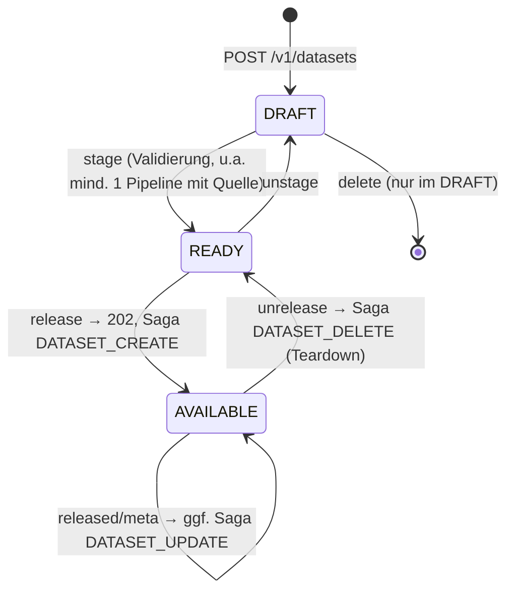
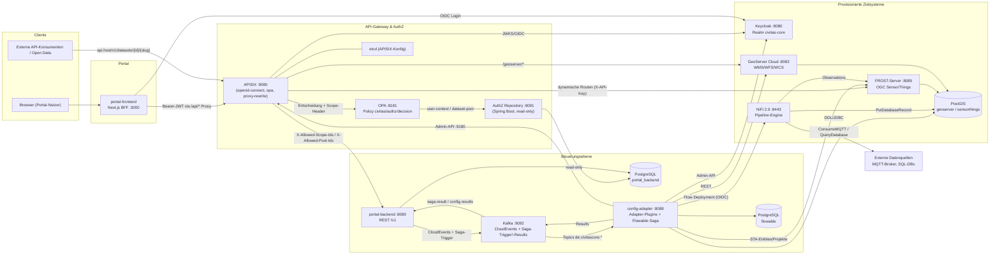
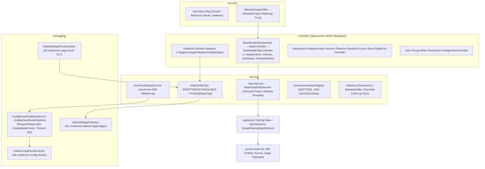
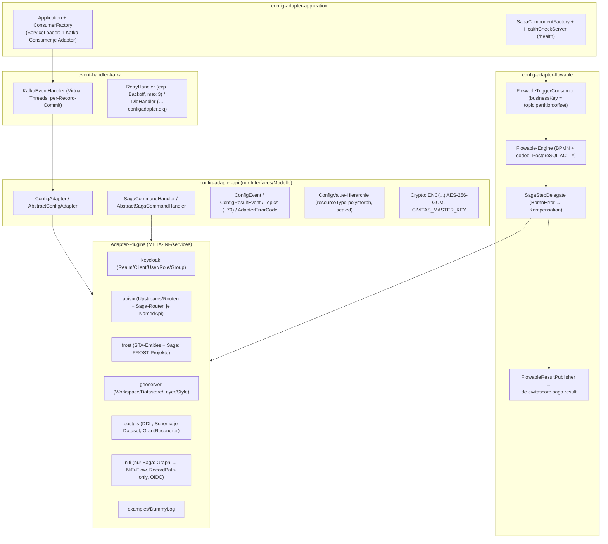
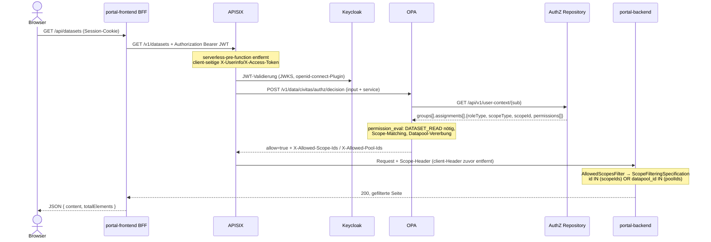
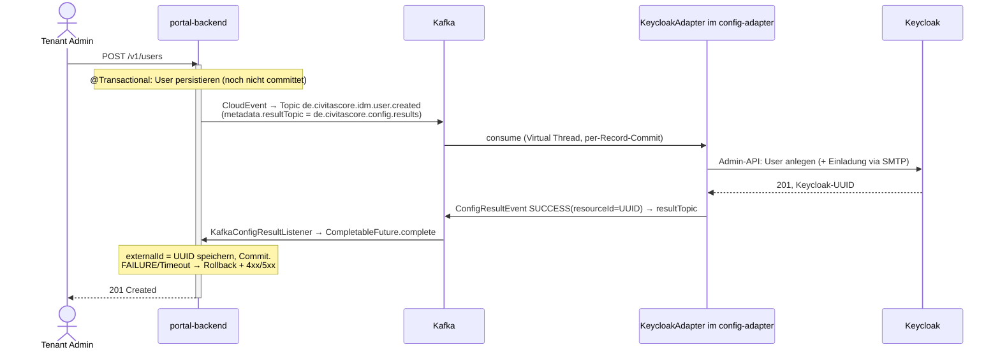
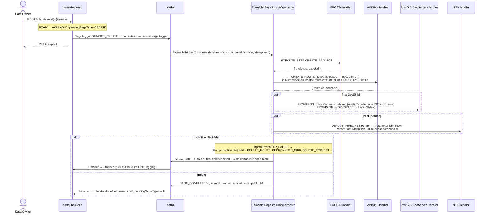
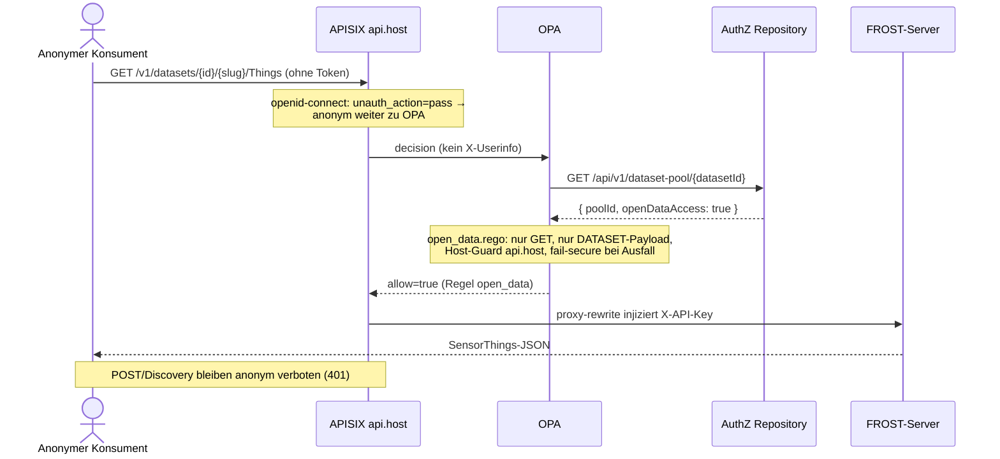

# CIVITAS/CORE v2 — Codebase-Analyse

> Analyse-Stand: 2026-07-19, bezogen auf `main` @ `bc06eea4489dec3b25a6b671e7cae1a1057de94f`.

## 1. Letzter Commit auf `main`

```
bc06eea4489dec3b25a6b671e7cae1a1057de94f
Datum:   2026-07-09 18:30:55 +0200
Subject: Merge branch 'develop' into 'main'
```

---

## 2. Was ist die CIVITAS/CORE-v2-Codebase?

CIVITAS/CORE ist eine **urbane Datenplattform** (Open Source, EUPL 1.2), die von deutschen Städten, Regionen und kommunalen Unternehmen über den Verein Civitas Connect e.V. gemeinschaftlich entwickelt wird („Public Money – Public Code“). Version 2 ist eine grundlegende Neuentwicklung mit **modellzentrierter Architektur**: Ein versioniertes Datenmodell (JSON Schema) ist die Single Source of Truth, aus der Ingestion, Speicherung und Veröffentlichung von Daten abgeleitet werden. Die Plattform ist nicht mehr auf IoT beschränkt, sondern für beliebige Datentypen ausgelegt.

Das Repository ist ein **Monorepo** mit sieben Top-Level-Modulen (~2 270 Commits seit Aug 2025; 854 Java-, 405 TSX-, 241 TS-, 364 Bruno-, 24 Rego-Dateien):

| Modul | Technologie | Rolle |
|---|---|---|
| `portal-frontend` | Next.js 15 (App Router), React 19, TypeScript, Tailwind 4, shadcn/ui, TanStack Query 5, React Flow, NextAuth v5 | Self-Service-Portal (BFF-Pattern): Datasets, Datasources, Datenstrukturen (UML-Editor), Pipeline-Editor, IAM-Verwaltung |
| `portal-backend` | Java 25, Spring Boot 4.1, JPA/Hibernate, Flyway, Kafka, MapStruct | REST-API (`/v1`, Port 8089), Steuerungsebene („Control Plane“), Lebenszyklus-Logik, Event-/Saga-Publisher |
| `portal-model` | Java 25, JPA | Geteilte Entity-Bibliothek (21 Entities + Enums + Saga-Payloads), genutzt von Backend, AuthZ-Repository und Config-Adapter |
| `config-adapter` | Java 25 **ohne** Spring (ServiceLoader-Plugins), Kafka/CloudEvents, Flowable, Jersey, HikariCP | Event-getriebenes Provisionierungs-Framework: setzt Konfigurationsabsichten in Keycloak, APISIX, FROST, GeoServer, PostGIS und NiFi um |
| `authz` | OPA 1.14 (Rego) + Spring-Boot-„AuthZ Repository“ | Zentrale Autorisierung: OPA als Policy Decision Point hinter dem Gateway |
| `api` | OpenAPI 3.1 + Bruno-Collections | API-Vertrag (53 Pfade) + ausführbare API-/Saga-/Security-Tests |
| `dev-environment` | Docker Compose, Shell, GitLab CI | Komplette lokale Laufzeitumgebung (Kafka, Keycloak, APISIX, OPA, FROST, GeoServer Cloud, NiFi, PostGIS, Mailpit …) |

**Fachliches Domänenmodell** (in `portal-model`):

- **`DataStructure` → `DataStructureVersion`**: versioniertes Schema; die Spalte `model` (JSONB) enthält ein **JSON-Schema-Dokument**, das im Frontend per UML-Klassendiagramm-Editor modelliert oder als `.uml`/`.xmi` importiert wird. Lifecycle `DRAFT → AVAILABLE`.
- **`DataSource`**: Anbindung externer Quellen über Konnektoren (**MQTT**, **SQL/Postgres**), Konfiguration als JSONB mit **AES-verschlüsselten** Secrets; referenziert eine `DataStructureVersion`.
- **`DataSet`**: das zentrale Aggregat (Datenprodukt) mit `Pipeline`s (engine-neutraler React-Flow-Graph), `DataSink`s (FROST/POSTGIS), `NamedApi`s (STA/OWS mit Slug), `Layer`/`Style` (WMS/WFS + SLD), Open-Data-Flag und den von der Provisionierung zurückgeschriebenen Infrastrukturfeldern (`projectId`, `serviceId`, `routeId`s, `pipelineIds`, `publicUrl`). Lifecycle `DRAFT → READY → AVAILABLE` plus `PendingSagaType` (CREATE/UPDATE/DELETE) als In-Flight-Marker.
- **`DataPool`**: Governance-Grenze, die Datasets bündelt; Berechtigungen auf Pool-Ebene vererben sich auf alle enthaltenen Datasets.
- **IAM**: `User` ↔ `Group` (verschachtelbar, nach Keycloak gespiegelt) — `Assignment` = (Group × Role × Scope) — `Role` (Typ SYSTEM oder DATA) → `Permission` (Katalog `PermissionName`, z. B. `DATASET_READ`, `DATASET_PAYLOAD_READ`, `DATASET_RELEASE`). Scopes: `TENANT`, `DATAPOOL`, `DATASET`, `DATASOURCE`, `DATASTRUCTURE`.
- Sechs vordefinierte Standardrollen (`RoleDefault`): **Tenant Admin** (SYSTEM), **Data Architect**, **Data Steward**, **Data Owner**, **Data Gatekeeper**, **Data Consumer** (DATA).

### 2.1 Dataset-Lebenszyklus (Zustandsdiagramm)



### 2.2 Systemdiagramm (Laufzeit-Topologie)

Belegt durch `dev-environment/*/docker-compose*.yml`, `start-portal-dev.sh`, APISIX-/OPA-Konfiguration:



Wesentliche Merkmale:

- **Frontend als BFF**: Der Browser spricht nie direkt mit dem Backend. `src/app/api/[...path]/route.ts` hängt das NextAuth-JWT als Bearer-Token an und routet per Header `x-api-request: true` an APISIX (Rest geht übergangsweise an einen json-server-Mock).
- **Zentrale Autorisierung am Gateway**: APISIX validiert das JWT (Keycloak), fragt OPA (`civitas/authz/decision`), OPA lädt den Benutzerkontext (User→Groups→Assignments→Role→Permissions, in Java vorverflacht) vom AuthZ Repository und entscheidet. Erlaubte Scopes werden als Header `X-Allowed-Scope-Ids`/`X-Allowed-Pool-Ids` upstream gereicht; das Backend **hat keine eigene AuthZ-Logik** und filtert nur nach diesen Headern (`AllowedScopesFilter` + `ScopeFilteringSpecification`; fehlt der Header → 403).
- **Anti-Spoofing**: APISIX entfernt client-seitige `X-Userinfo`/`X-Access-Token`/Scope-Header vor OIDC/OPA (serverless-pre-function + proxy-rewrite).
- **Alle Infrastrukturänderungen laufen über Kafka + Config-Adapter** (Details in Abschnitt 3) — das Backend ruft nie direkt Keycloak, APISIX, FROST, GeoServer, PostGIS oder NiFi auf.

### 2.3 Komponentendiagramm portal-backend



### 2.4 Komponentendiagramm config-adapter



### 2.5 Sequenzdiagramm 1 — Autorisierter API-Request (Gateway-zentrische AuthZ)



### 2.6 Sequenzdiagramm 2 — IDM-Sync: Nutzer anlegen (synchrones Request/Reply über Kafka)

Besonderheit: Der REST-Aufruf **blockiert** bis zur Antwort des Config-Adapters (Timeout 10 s); bei Ablehnung/Timeout wird die DB-Transaktion zurückgerollt — es gibt keinen Dual-Write zwischen Portal-DB und Keycloak.



### 2.7 Sequenzdiagramm 3 — Dataset-Release: Flowable-Saga mit Kompensation



### 2.8 Sequenzdiagramm 4 — Anonymer Open-Data-Zugriff auf die Payload-API



---

## 3. Config-Adapter: Bedeutung, Einsatzzeitpunkt und Zweck

### 3.1 Was ist ein Config-Adapter?

Ein Config-Adapter ist ein **Plugin, das Konfigurationsabsichten („Intents“) der Steuerungsebene in konkrete API-/DDL-Aufrufe gegen ein Zielsystem übersetzt**. Das Portal-Backend ist das System of Record (Datasets, Nutzer, APIs …), ruft aber **niemals selbst** Keycloak, APISIX, FROST, GeoServer, PostGIS oder NiFi auf. Stattdessen publiziert es Events nach Kafka; der `config-adapter`-Prozess konsumiert sie und führt die Änderung idempotent aus. Ergebnis (Erfolg/Fehler + erzeugte Ressourcen-IDs) wird als Result-Event zurückgemeldet.

**Warum dieses Muster?**
1. **Entkopplung**: Das Backend kennt keine Zielsystem-APIs, Credentials oder Fehlerbilder; neue Zielsysteme erfordern keine Backend-Änderung.
2. **Zentralisierte Credentials & Härtung**: Admin-Keys/Passwörter existieren nur im Adapter-Prozess; Secrets in Events sind AES-256-GCM-verschlüsselt (`ENC(...)`, `CIVITAS_MASTER_KEY`), Logs werden PII-maskiert und OWASP-encodiert.
3. **Idempotenz & Auditierbarkeit**: Jede Änderung ist ein CloudEvent mit Correlation-ID; „already exists/already gone“ (409/404, SQLState-Duplikate) wird als Erfolg absorbiert — Events sind gefahrlos wiederholbar.
4. **Konsistenz**: Fehlerbehandlung (Retry/DLQ) und mehrstufige Transaktionen (Saga mit Kompensation) sind einmal zentral gelöst.

**Technische Basis:** Java 25 **ohne** Spring/Quarkus. Adapter werden per `java.util.ServiceLoader` entdeckt (`META-INF/services/de.civitascore.configadapter.adapter.ConfigAdapter` bzw. `...SagaCommandHandler`); die ENV-Variable `ADAPTERS=keycloak,apisix,frost,…` wählt aus, was eine Instanz aktiviert. `config-adapter-api` enthält ausschließlich Interfaces/Modelle (Dependency Inversion), `config-adapter-application` verdrahtet alles und startet je Adapter einen eigenen Kafka-Consumer (Virtual Threads).

### 3.2 Wann werden Config-Adapter eingesetzt? — Die zwei Ausführungspfade

**Pfad A — Direkte, event-getriebene Einzeländerungen** (`ConfigAdapter`/`AbstractConfigAdapter`):
Ausgelöst durch **CRUD an einzelnen Ressourcen** im Portal. Das Backend sendet einen CloudEvent auf ein Ressourcen-Topic (Enum `Topics`, ~70 Einträge, Namensschema `de.civitascore.<domäne>.<ressource>.<verb>`), der zuständige Adapter wendet die Änderung an und antwortet auf `metadata.resultTopic` (Backend-Default `de.civitascore.config.results`).

Wichtig: Für **IDM-Ressourcen (User/Group/Role)** ist dieser Pfad **synchron im Request-Zyklus**: `EventPublishingService` wartet bis zu 10 s auf das Result; bei FAILURE/Timeout wird die DB-Transaktion zurückgerollt (kein Dual-Write) und bei Erfolg die Keycloak-UUID als `externalId` gespeichert.

| Adapter | Topics (Auszug) | Was er im Zielsystem tut |
|---|---|---|
| `config-adapter-keycloak` | `de.civitascore.idm.{user,group,role,realm,client}.*` | User/Gruppen (inkl. Hierarchie, Membership-Sync über `externalId`), Rollen, Realms, Clients über die Keycloak-Admin-API; Einladungs-Mails |
| `config-adapter-apisix` | `de.civitascore.api.backend.*` | Upstreams/Routen über die APISIX-Admin-API (`X-API-KEY`) |
| `config-adapter-frost` | `de.civitascore.data.{thing,location,sensor,observedproperty,datastream}.*` | SensorThings-Entities per REST (POST/PATCH/DELETE), inkl. projektbezogener Pfade |
| `config-adapter-geoserver` | `de.civitascore.geo.{workspace,datastore,featuretype,layer,style}.*` | GeoServer-REST (Workspaces, Datastores, FeatureTypes, Layer, SLD-Styles) |
| `config-adapter-postgis` | `de.civitascore.data.sql.{table,schema,role}.*` | DDL per JDBC/HikariCP (eine Transaktion, Savepoints je Statement); `GrantReconciler` gleicht Soll-/Ist-Grants ab; `DataStructureTableMapper` leitet Spalten aus dem JSON-Schema ab |
| `config-adapter-examples` | beliebig (Demo) | `DummyLogAdapter` — Referenzimplementierung des Vertrags |

**Pfad B — Flowable-Saga für den Dataset-Lebenszyklus** (`SagaCommandHandler`):
Ausgelöst durch **Release / Meta-Update / Unrelease eines Datasets**. Das Backend sendet *einen* Saga-Trigger (`de.civitascore.dataset.saga.trigger`), die eingebettete **Flowable-BPMN-Engine** im config-adapter orchestriert daraus einen mehrstufigen, **kompensierenden** Workflow und ruft die Saga-Handler der Adapter **in-process** auf (kein Kafka-Roundtrip pro Schritt):

- **CREATE**: FROST `CREATE_PROJECT` → APISIX `CREATE_ROUTE` (eine Route je `NamedApi`: `api.host/v1/datasets/{id}/{slug}`, geschützt durch OIDC+OPA-Plugin-Bundle, FROST-`X-API-Key`-Injektion) → optional PostGIS `PROVISION_SINK` (dediziertes Schema `dataset_{uuid}`) → GeoServer `PROVISION_WORKSPACE`/`CREATE_DATASTORE`/`PROVISION_LAYERS` → optional NiFi `DEPLOY_PIPELINES`.
- **UPDATE**: `UPDATE_PROJECT` → `UPDATE_ROUTE` → ggf. `UPDATE_WORKSPACE`/`UPDATE_PIPELINES` (mit Pipeline-Diff), Kompensation über `RESTORE_*`.
- **DELETE**: umgekehrte Reihenfolge (NiFi → APISIX → GeoServer → PostGIS → FROST), best effort.

Datenfluss zwischen Schritten läuft über Flowable-Prozessvariablen mit `fieldAliases()` (z. B. FROSTs `baseUrl` → APISIXs `upstreamUrl`). Schlägt ein Schritt fehl, wirft `SagaStepDelegate` einen `BpmnError` und Flowable kompensiert rückwärts (`DELETE_*`/`RESTORE_*`); das Endergebnis (`SAGA_COMPLETED`/`SAGA_FAILED` inkl. `staleResources`/`cleanedResources`) geht über `de.civitascore.saga.result` zurück ans Backend, das Status und Infrastrukturfelder nachzieht. Idempotenz gegen Doppelverarbeitung: Kafka-`topic:partition:offset` als Flowable-BusinessKey. `frost` und `apisix` sind Pflicht-Handler; `nifi`/`geoserver`/`postgis` sind konditional (Flags `hasPipelines`/`hasGeoSink`/`hasLayers` werden server-seitig aus dem Trigger abgeleitet, nie dem Payload geglaubt).

Der **NiFi-Saga-Handler** ist der komplexeste: Er kompiliert den engine-neutralen Pipeline-Graphen des Frontends (Quelle MQTT/SQL → Transformationen ConvertRecord/RecordMapping → Sink FROST/PostGIS, Cron-Trigger) in einen kuratierten NiFi-Flow (geschlossenes Stage-Register, Mappings ausschließlich als **RecordPath** — kein Jolt/Scripting aus Sicherheitsgründen), deployt per NiFi-REST mit **OIDC-Client-Credentials** und setzt Secrets erst nach dem Upload (Snapshot bleibt secret-frei).

**Wofür Config-Adapter *nicht* zuständig sind:** Nutzdaten. Observations/Geodaten fließen zur Laufzeit über NiFi → FROST/PostGIS → APISIX zu den Konsumenten. Der Config-Adapter konfiguriert nur den „Rahmen“ (Projekte, Routen, Schemata, Flows) — er transportiert keine Payloads.

### 3.3 Fehlerbehandlung und Statusrückmeldung

- **Fehler-Taxonomie** `AdapterErrorCode`: 1xxx fatal/Validierung (→ sofort DLQ), 2xxx retryable/Konnektivität, 3xxx adapterspezifisch (30xx Keycloak … 36xx NiFi), 9xxx unbekannt; je Code getrennte interne vs. externe (PII-sichere) Meldung.
- **Retry**: `RetryableAdapterException` → exponentielles Backoff (Start konfigurierbar, ×2, Kappung 30 s, max. 3 Versuche), danach **DLQ** `de.civitascore.configadapter.dlq` mit Extension-Attributen (`dlqerrorcode`, `dlqoriginaltopic`, `dlqretrycount` …). DLQ-Versand ist synchron — schlägt er fehl, wird der Record erneut verarbeitet (kein Nachrichtenverlust). Startzeit-Validierung: Gesamt-Backoff muss < 80 % von `max.poll.interval.ms` sein.
- **Ergebnis-Events**: Jede Verarbeitung endet mit `ConfigResultEvent` (SUCCESS/FAILURE, `resourceId`, `correlationId`, `errorCode`) auf dem vom Backend vorgegebenen `resultTopic`. Im Saga-Pfad ersetzt die Kompensation die DLQ; Ergebnis ist `SAGA_COMPLETED`/`SAGA_FAILED`.

---

## 4. Die 10 wichtigsten Dateien (nach Wichtigkeit sortiert)

Auswahlkriterium: Dateien, die die *Besonderheiten* der Codebase am besten sichtbar machen (Lifecycle-zentrierte Steuerungsebene, Event-/Saga-Provisionierung, Gateway-zentrische AuthZ, modellzentrierte Datenhaltung, BFF + visuelle Editoren).

1. **`portal-backend/src/main/java/de/civitascore/portal/service/DataSetService.java`** — Herzstück der Fachlogik: Zustandsmaschine DRAFT→READY→AVAILABLE, Stage-/Release-Validierung, Anstoß der Sagas (202-Semantik) und Rückabgleich der Saga-Ergebnisse inkl. Drift-Logging. Wer diese Datei versteht, versteht den Kern der Plattform.
2. **`portal-backend/src/main/java/de/civitascore/portal/messaging/saga/DataSetSagaPublisher.java`** (+ `SagaTrigger`) — der exakte Outbound-Vertrag zwischen Steuerungsebene und Provisionierung: sealed Trigger-Typen (Create/Update/Delete), Payload-Aufbau (Datasources, Sinks, Layer, NamedApis, Pipeline-Diff), blockierendes Publish vor Commit.
3. **`config-adapter/config-adapter-api/src/main/java/de/civitascore/configadapter/adapter/AbstractConfigAdapter.java`** — die Template-Method-Basis aller direkten Adapter: finaler Event-Einstieg, Fehlerklassifikation (retryable vs. fatal), Success-/Failure-Result-Publishing, Topic-Validierung. Der Kern des Plugin-Frameworks.
4. **`config-adapter/config-adapter-flowable/src/main/java/de/civitascore/configadapter/flowable/common/delegate/SagaStepDelegate.java`** — die Brücke BPMN ↔ Adapter: baut `SagaCommandMessage`, ruft Handler in-process auf, propagiert Result-/Kompensationsdaten als Prozessvariablen (inkl. `fieldAliases`) und löst per `BpmnError` das Rollback aus.
5. **`authz/rego/policy/permission_eval.rego`** — das AuthZ-Herz: AND-Verknüpfung geforderter Permissions, Scope-Matching je Ressourcentyp, TENANT-Kaskade nach unten (keine Aufwärtsvererbung), Datapool-Vererbung auf enthaltene Datasets.
6. **`authz/rego/data/backends/portal_backend/data.json`** — „Authorization as Data“: die vollständige Endpoint→Permission-Matrix (null = nur Authentifizierung, Arrays = UND-Permissions wie `["DATASET_UPDATE","DATASET_RELEASE"]`, `_open_data`-Flags, `_collection`-Marker).
7. **`portal-backend/src/main/java/de/civitascore/portal/security/AllowedScopesFilter.java`** — das Gateway-Trust-Modell im Backend: parst `X-Allowed-Scope-Ids`/`X-Allowed-Pool-Ids`, erzwingt deren Anwesenheit (403 ohne Gateway) und speist die Scope-Filterung aller Listen-Endpoints.
8. **`portal-model/src/main/java/de/civitascore/portal/model/entity/DataSet.java`** — das zentrale Aggregat des Domänenmodells: alle Beziehungen (Pipelines, Sinks, NamedApis, Layer/Styles, Datapool, Serie, Katalog), Status + `PendingSagaType` sowie die von der Saga zurückgeschriebenen Infrastrukturfelder.
9. **`portal-frontend/src/app/api/[...path]/route.ts`** — der BFF-Proxy: Browser-Session → Bearer-JWT, Header-basiertes Routing echtes Backend (APISIX) vs. json-server-Mock, Cookie-/Host-Hygiene. Definiert das komplette Sicherheits- und Migrationsmodell des Frontends.
10. **`portal-frontend/src/app/(main)/datasets/[datasetId]/data-flow/pipeline-editor/_config/nodeRegistry.tsx`** — Single Source of Truth des Pipeline-Editors: deklariert alle Node-Typen (dataSource, cron, mapping, frost, geoPersistence, start/end) mit Darstellung, Defaults, Type Guards und Inspector-Panels — das Muster „erweiterbares visuelles Werkzeug über einer engine-neutralen Graphrepräsentation“.

*Knapp dahinter:* `EventPublishingService.java` (synchrones IDM-Request/Reply mit Rollback), `event-handler-kafka/KafkaEventHandler.java` (Virtual Threads, Retry/DLQ), `authz/rego/policy/main.rego` (Entscheidungs-Einstieg, Scope-Header, 401/403), `dev-environment/start-portal-dev.sh` (Gesamttopologie), `pipeline-editor/_constants/staTargetCatalog.ts` (FROST-Mapping-Katalog, gespiegelt zwischen Frontend und Adapter).

---

## 5. Die 40 wichtigsten User Stories (nach Wichtigkeit, mit Rolle)

Rollen entsprechen den sechs Standardrollen der Plattform (`RoleDefault`) plus vier abgeleiteten Akteuren (extern/Betrieb). Sortierung: Kern-Wertschöpfung (Datenprodukt-Lebenszyklus) → Konsum/Open Data → Governance/IAM → Komfort → Betrieb/Erweiterbarkeit.

**Kern: Datenprodukt-Lebenszyklus**
1. **Data Owner** — Als Data Owner möchte ich ein fertig konfiguriertes Dataset per Klick releasen (READY→AVAILABLE), damit FROST-Projekt, Gateway-Routen, Sinks und Pipelines automatisch per Saga provisioniert werden, ohne dass ich Infrastruktur anfassen muss. *(`POST /v1/datasets/{id}/release`, 202 + Saga)*
2. **Data Architect** — Als Data Architect möchte ich ein neues Dataset mit Metadaten und Datapool-Zuordnung anlegen, um ein Datenprodukt zu starten. *(`POST /v1/datasets`, Status DRAFT)*
3. **Data Steward** — Als Data Steward möchte ich Datenstrukturen als UML-Klassendiagramm modellieren und als JSON Schema exportieren, damit ein maschinenlesbares Modell die Single Source of Truth für Quellen, Sinks und Mappings ist. *(UML-Modeler, `jsonSchemaExportService`)*
4. **Data Steward** — Als Data Steward möchte ich Datenpipelines visuell zusammenstecken (Quelle → Mapping → Sink) und validieren lassen, um ohne NiFi-Kenntnisse Datenflüsse zu definieren. *(Pipeline-Editor, engine-neutraler Graph)*
5. **Data Steward** — Als Data Steward möchte ich Feld-Mappings zwischen Quell- und Zielschema grafisch verdrahten (inkl. Transformationen wie concat/const/Konvertierung), um Quelldaten strukturkonform abzubilden. *(Mapping-Editor, kompiliert zu RecordPath)*
6. **Data Steward** — Als Data Steward möchte ich eine MQTT-Datasource (Broker, Topic, QoS, TLS) konfigurieren, um IoT-Datenströme anzubinden. *(Connector-Tab, `MqttConnectorHandler`)*
7. **Data Steward** — Als Data Steward möchte ich eine SQL-Datasource (DSN, Tabelle, Spalten, WHERE) konfigurieren, um Bestandsdatenbanken anzubinden. *(`SqlConnectorHandler`)*
8. **Data Steward** — Als Data Steward möchte ich einen FROST/SensorThings-Sink mit Thing/Datastream/Observation-Mapping und Match-Keys konfigurieren, um Sensordaten OGC-standardkonform bereitzustellen. *(`staTargetCatalog`, FROST-Saga/Adapter)*
9. **Data Steward** — Als Data Steward möchte ich einen PostGIS-Sink erhalten, der pro Dataset ein eigenes Datenbankschema mit aus dem JSON-Schema abgeleiteten Tabellen anlegt, um Geodaten isoliert und strukturvalide zu speichern. *(`PROVISION_SINK`, `DataStructureTableMapper`)*
10. **Data Steward** — Als Data Steward möchte ich Datenstrukturen versionieren und Versionen einzeln freigeben (DRAFT→AVAILABLE), um Schema-Evolution kontrolliert auszurollen. *(`/datastructures/{id}/versions/{vid}/release`)*
11. **Data Owner** — Als Data Owner möchte ich ein Dataset stagen (DRAFT→READY) mit automatischer Vollständigkeitsprüfung (u. a. mindestens eine Pipeline mit Quelle), um die Freigabe qualitätszusichern. *(`stage`-Validierung im `DataSetService`)*
12. **Data Steward** — Als Data Steward möchte ich SQL-Ingestion per Cron-Node zeitsteuern (NiFi-6-Feld-Cron), um periodische Ladeläufe zu automatisieren. *(Cron-Node, `isValidNifiCron`)*
13. **Data Owner** — Als Data Owner möchte ich ein Dataset unreleasen und dabei die gesamte provisionierte Infrastruktur in umgekehrter Reihenfolge abbauen lassen, um Datenprodukte sauber zurückzuziehen. *(Saga DATASET_DELETE)*
14. **Data Owner** — Als Data Owner möchte ich bei fehlgeschlagener Provisionierung automatisches Rollback (Kompensation) und eine klare Statusrückmeldung, damit nie ein halb provisionierter Zustand entsteht. *(BpmnError → `RESTORE_*`/`DELETE_*`, `SAGA_FAILED`)*
15. **Data Steward** — Als Data Steward möchte ich benannte APIs (STA/OWS) mit sprechendem Slug definieren, damit jedes Dataset stabile öffentliche Endpunkte unter `…/v1/datasets/{id}/{slug}` bekommt. *(`NamedApi`, dynamische APISIX-Routen)*
16. **Data Steward** — Als Data Steward möchte ich OWS-Layer mit SLD-Styles, Bounding Box und CRS konfigurieren, um WMS/WFS-Kartendienste über GeoServer auszuspielen. *(Layer/Style-API, GeoServer-Saga)*
17. **Data Steward** — Als Data Steward möchte ich Metadaten eines bereits freigegebenen Datasets nachpflegen (ohne Neu-Release), wobei Infrastruktur-relevante Änderungen automatisch eine UPDATE-Saga auslösen. *(`PUT /{id}/released/meta`)*
18. **Data Steward** — Als Data Steward möchte ich Zugangsdaten in Konnektoren verschlüsselt gespeichert (AES-256-GCM, `ENC(...)`) und in der UI maskiert sehen, damit Secrets nie im Klartext liegen. *(Field-Encryption, maskierte Felder)*

**Konsum & Open Data**
19. **Data Consumer** — Als Data Consumer möchte ich im Portal genau die Datasets und Metadaten sehen, für die ich berechtigt bin, damit Vertraulichkeit strukturell erzwungen ist. *(OPA-Scope-Header + `ScopeFilteringSpecification`)*
20. **Data Consumer** — Als Data Consumer möchte ich Nutzdaten (Payload) nur mit separatem Recht `DATASET_PAYLOAD_READ` lesen dürfen — getrennt vom Metadaten-Recht `DATASET_READ` —, damit Kataloge sichtbar sein können, ohne Dateninhalte zu öffnen. *(FROST-Provider in OPA)*
21. **Data Owner** — Als Data Owner möchte ich Open-Data-Zugriff je Dataset per Toggle aktivieren, um Daten ohne Registrierung öffentlich zu machen. *(`openDataAccess`-Flag, OPA-ABAC)*
22. **Open-Data-Nutzer:in (anonym)** — Als anonyme Nutzer:in möchte ich freigegebene Open-Data-APIs per GET ohne Konto lesen (Schreiben und Discovery bleiben gesperrt), um offene Daten friktionslos zu nutzen. *(`open_data.rego`: nur GET, fail-secure)*
23. **API-Konsument:in (extern)** — Als externe Entwickler:in möchte ich mit einem eigenen Token (Public Client `api-access`) die Payload-APIs maschinell konsumieren, um Anwendungen auf Plattformdaten zu bauen. *(`payload-api/get-api-access-token`)*
24. **Data Consumer** — Als Data Consumer möchte ich zu jedem Dataset die Kontaktperson sehen und direkt zu ihr navigieren, um Rückfragen zu klären. *(Datasets-Liste → User-Detail)*

**Governance & IAM**
25. **Tenant Admin** — Als Tenant Admin möchte ich Nutzer anlegen/ändern/deaktivieren, wobei die Änderung synchron in Keycloak validiert wird (bei Ablehnung Rollback) und Einladungs-Mails versendet werden, damit Portal und IDM nie auseinanderlaufen. *(synchroner IDM-Sync, `externalId`)*
26. **Tenant Admin** — Als Tenant Admin möchte ich Gruppen (auch verschachtelt) verwalten und Mitgliedschaften pflegen, die nach Keycloak gespiegelt werden, um Teams als Berechtigungseinheit zu nutzen. *(`Group`-Hierarchie, Membership-Sync)*
27. **Tenant Admin** — Als Tenant Admin möchte ich Rollen als Permission-Bündel aus dem Katalog definieren (SYSTEM- vs. DATA-Rollen, optional aus Templates), um das Berechtigungsmodell an unsere Organisation anzupassen. *(Role-Editor, Permission-Grid)*
28. **Tenant Admin** — Als Tenant Admin möchte ich Rollen an Gruppen **mit Scope** zuweisen (TENANT, DATAPOOL, DATASET, DATASOURCE, DATASTRUCTURE), um Least-Privilege fein zu steuern. *(`Assignment`, Scope-Validierung)*
29. **Data Architect** — Als Data Architect möchte ich Datasets in Datapools bündeln, um eine Governance-Grenze mit gemeinsamer Zuständigkeit zu schaffen. *(`DataPool`)*
30. **Tenant Admin** — Als Tenant Admin möchte ich Zugriff auf Datapool-Ebene vergeben, der automatisch für alle enthaltenen Datasets gilt, um Berechtigungen skalierbar zu verwalten. *(Datapool-Vererbung in OPA + `X-Allowed-Pool-Ids`)*
31. **Data Gatekeeper** — Als Data Gatekeeper möchte ich Freigaben kontrollieren (READ + RELEASE ohne Schreibrechte), um ein Vier-Augen-Prinzip zwischen Erstellung und Veröffentlichung zu etablieren. *(Rolle `DATA_GATEKEEPER`)*
32. **Tenant Admin** — Als Tenant Admin möchte ich mit sechs vordefinierten Standardrollen sofort starten können, ohne erst ein Rollenmodell entwerfen zu müssen. *(`RoleInitializer`-Seeding)*
33. **Tenant Admin** — Als Tenant Admin möchte ich je Ressource einsehen, welche Gruppe über welche Rolle Zugriff hat, um Berechtigungen zu auditieren. *(`/{id}/assignments`, Access-Management-Tabs)*

**Komfort & Selbstbedienung**
34. **Alle Portal-Rollen** — Als Portal-Nutzer:in möchte ich mich per SSO (Keycloak/OIDC) anmelden, mit automatischem Token-Refresh und Idle-Logout, um sicher und bequem zu arbeiten. *(NextAuth v5, Refresh-Rotation)*
35. **Alle Portal-Rollen** — Als Portal-Nutzer:in möchte ich die Oberfläche in Deutsch oder Englisch nutzen, um sie in meiner Sprache zu bedienen. *(next-intl, de/en)*
36. **Data Steward** — Als Data Steward möchte ich auf der Dataset-Übersicht geführte Vervollständigungsschritte sehen (Metadaten, Data Flow, Access, Distribution …), um den Weg zur Freigabe zu erkennen. *(Completion-Steps, Recommended Workflow)*
37. **Data Steward** — Als Data Steward möchte ich bestehende Modelle (`.uml`/`.xmi`) importieren oder eine Datenstruktur direkt aus einer Datasource ableiten, um nicht bei null zu modellieren. *(Model-Upload, `createdFromDataSource`)*

**Betrieb & Erweiterbarkeit**
38. **Plattform-Betreiber:in** — Als Betreiber:in möchte ich die komplette Plattform lokal mit einem Skript hochfahren (Kafka, Keycloak, APISIX, OPA, FROST, GeoServer, NiFi, PostGIS …), um Entwicklung und Evaluation ohne Cloud-Abhängigkeit zu ermöglichen. *(`start-portal-dev.sh`, Compose-Stacks)*
39. **Plattform-Betreiber:in** — Als Betreiber:in möchte ich Fehlerpfade beobachten und beherrschen (Retry/DLQ, Health-Endpoints, PII-maskierte strukturierte Logs, CI mit Trivy-Scans und SBOMs), um die Plattform sicher zu betreiben. *(RetryHandler/DlqHandler, `/health`, GitLab-CI)*
40. **Plattform-Entwickler:in (Community)** — Als Entwickler:in möchte ich ein neues Zielsystem als Config-Adapter-Plugin ergänzen (ServiceLoader-Registrierung, Template-Basisklassen), ohne Kern oder Backend anzufassen, damit die Community die Plattform „einmal gebaut, vielfach genutzt“ erweitern kann. *(`META-INF/services`, `AbstractConfigAdapter`)*

---

## 6. Besonderheiten & Beobachtungen

**Architektur-Besonderheiten**
- **Modellzentrierung konkret**: `DataStructureVersion.model` (JSON Schema) wird dreifach wiederverwendet — UML-Editor-Export, Mapping-Ziele im Pipeline-Editor, Tabellen-/Entity-Ableitung in den Sinks (PostGIS/FROST). Frontend und Config-Adapter spiegeln denselben STA-Zielkatalog (`staTargetCatalog.ts` ↔ `StaTargetCatalog`), damit Edit-Zeit- und Deploy-Zeit-Validierung übereinstimmen.
- **Zwei Konsistenzmuster nebeneinander**: synchrones Request/Reply über Kafka mit Transaktions-Rollback (IDM/Keycloak — kein Dual-Write) und asynchrone kompensierende Saga (Dataset-Infrastruktur) mit 202-Semantik und Statusrückfluss.
- **Autorisierung als Daten**: Endpoint→Permission-Matrix in JSON, Policies in Rego, Rollenauflösung in Java — das Backend selbst prüft nichts, sondern vertraut den Gateway-Headern (dokumentiertes „Gateway Trust Model“).
- **Config-Adapter ohne Framework**: bewusst Spring-frei, ServiceLoader-Plugins, Virtual Threads, CloudEvents; Sicherheit als Designprinzip (RecordPath-only-Mappings, ENC-Secrets, PII-Masking, OWASP-Encoding, Secret-freie NiFi-Snapshots).
- **Sehr hohe Testtiefe**: Testcontainers-Integrationstests (Kafka, Keycloak, FROST, APISIX, GeoServer, PostGIS), ~200 Rego-Unit-Tests, Bruno-Sagas als ausführbare Security-Regressionstests (u. a. Spoofing-Abwehr), Playwright-E2E, 149 Vitest-Suiten.

**Bekannte Inkonsistenzen (Doku-Drift, Stand des Commits)**
- READMEs nennen Java 21 / Spring Boot 3.5, die POMs pinnen **Java 25 / Spring Boot 4.1**.
- Migration **Redpanda Connect → NiFi** ist im Gange: Frontend-`DOCUMENTATION.md` und Teile von `SAGA-DATASET-USE-CASES.md` beschreiben noch Redpanda; maßgeblich ist der NiFi-Pfad (ein lokales CI-Override kann Redpanda noch reaktivieren).
- `dev-environment/modelatlas/` wird referenziert, existiert aber nicht (Model Atlas = Apicurio Registry, nur im CI-Compose enthalten); einzelne README-Angaben zu Seed-Usern/DB-Credentials weichen vom tatsächlichen Compose ab.
- Die FROST-Mapping-Pflichtvalidierung im Pipeline-Editor ist aktuell bewusst deaktiviert (`disable-frost-mapping-validation`).
