# Saga Orchestrator: Dataset Lifecycle Use Cases

> ⚠️ **Legacy / superseded.** This document describes the original **event-driven custom orchestrator**
> (Kafka `dataset.<adapter>.execute`/`.compensate` messages) with **RedPanda Connect** as the pipeline
> engine. Both have since been replaced: orchestration now runs **in-process via the embedded Flowable
> saga engine** (see [`config-adapter-flowable`](../config-adapter-flowable/README.md)), and the
> pipeline engine is now **Apache NiFi** (see [`config-adapter-nifi`](../config-adapter-nifi)). The
> per-adapter Kafka event protocol and the RedPanda references below no longer reflect the
> implementation; the high-level saga **ordering and compensation semantics** (FROST → APISIX →
> pipeline, reverse-order rollback) still hold. Kept for historical reference.

> **Status**: Design Proposal (legacy)
> **Scope**: All orchestrated saga flows for `dataset.create`, `dataset.update`, and `dataset.delete`
> **Execution model**: Strictly sequential (no parallel steps, no parallel compensation)

---

## Table of Contents

1. [Overview](#1-overview)
2. [Topic Structure](#2-topic-structure)
3. [Step Definitions](#3-step-definitions)
4. [Data Flow Between Steps](#4-data-flow-between-steps)
5. [Event Data Structures](#5-event-data-structures)
6. [Dataset Create](#6-dataset-create)
7. [Dataset Update](#7-dataset-update)
8. [Dataset Delete](#8-dataset-delete)
9. [Saga State Machine](#9-saga-state-machine)
10. [Saga State Persistence (Kafka)](#10-saga-state-persistence-kafka)
11. [Cleanup Strategy and Implementation Abstraction](#11-cleanup-strategy-and-implementation-abstraction)
12. [Adapter Implementation Details](#12-adapter-implementation-details)
    - [12.1 FROST Adapter](#121-frost-adapter)
    - [12.2 APISIX Adapter](#122-apisix-adapter)
    - [12.3 Redpanda Adapter](#123-redpanda-adapter)

---

## 1. Overview

The saga orchestrator manages the dataset lifecycle across three adapters:

| Adapter | System | Responsibility |
|---------|--------|----------------|
| **FROST** | FROST Server (OGC SensorThings API) | Project management (CRUD), data storage |
| **APISIX** | APISIX API Gateway | Route management, auth plugin configuration |
| **Redpanda** | Redpanda Connect | Pipeline deployment for data ingestion |

**Key principles:**

- **Sequential execution**: Steps run one after another. The next step starts only after the previous step succeeds.
- **Best-effort compensation**: On failure, completed steps are compensated in **reverse order**, one at a time. If a compensation step fails, the orchestrator **continues compensating the remaining steps** to clean up as much as possible. The final result event reports the exact status of each step (compensated vs. stale).
- **Conditional steps**: The Redpanda step is **only executed if the dataset contains pipelines** (`dataPipelines[]` is non-empty). Datasets without pipelines complete after FROST + APISIX.
- **Adapters are stateless command handlers**: No adapter knows about the saga, other adapters, or the execution order.
- **Idempotency**: All operations must be idempotent (Kafka at-least-once delivery guarantees duplicates).
- **Batch-capable adapters**: A single dataset event can contain multiple pipelines. The Redpanda adapter receives the full `dataPipelines[]` list and handles batch deployment internally — the orchestrator treats it as one step.

---

## 2. Topic Structure

### Trigger Topics (Portal Backend → Orchestrator)

| Topic | Purpose |
|-------|---------|
| `de.civitascore.dataset.create.requested` | Start dataset create saga |
| `de.civitascore.dataset.update.requested` | Start dataset update saga |
| `de.civitascore.dataset.delete.requested` | Start dataset delete saga |

### Adapter Topics (Orchestrator ↔ Adapters)

Shared across all saga types. The operation (CREATE, UPDATE, DELETE) is conveyed in the event payload.

| Topic | Direction | Purpose |
|-------|-----------|---------|
| `de.civitascore.dataset.frost.execute` | Orchestrator → FROST | Send command to FROST |
| `de.civitascore.dataset.frost.completed` | FROST → Orchestrator | FROST step succeeded |
| `de.civitascore.dataset.frost.failed` | FROST → Orchestrator | FROST step failed |
| `de.civitascore.dataset.frost.compensate` | Orchestrator → FROST | Compensate FROST step |
| `de.civitascore.dataset.apisix.execute` | Orchestrator → APISIX | Send command to APISIX |
| `de.civitascore.dataset.apisix.completed` | APISIX → Orchestrator | APISIX step succeeded |
| `de.civitascore.dataset.apisix.failed` | APISIX → Orchestrator | APISIX step failed |
| `de.civitascore.dataset.apisix.compensate` | Orchestrator → APISIX | Compensate APISIX step |
| `de.civitascore.dataset.redpanda.execute` | Orchestrator → Redpanda | Send command to Redpanda |
| `de.civitascore.dataset.redpanda.completed` | Redpanda → Orchestrator | Redpanda step succeeded |
| `de.civitascore.dataset.redpanda.failed` | Redpanda → Orchestrator | Redpanda step failed |
| `de.civitascore.dataset.redpanda.compensate` | Orchestrator → Redpanda | Compensate Redpanda step |

### Result Topics (Orchestrator → Portal Backend)

| Topic | Purpose |
|-------|---------|
| `de.civitascore.dataset.create.completed` | Create saga succeeded |
| `de.civitascore.dataset.create.failed` | Create saga failed (with compensation status) |
| `de.civitascore.dataset.update.completed` | Update saga succeeded |
| `de.civitascore.dataset.update.failed` | Update saga failed (with compensation status) |
| `de.civitascore.dataset.delete.completed` | Delete saga succeeded |
| `de.civitascore.dataset.delete.failed` | Delete saga failed (no compensation) |

### Internal Topics

| Topic | Purpose |
|-------|---------|
| `de.civitascore.saga.state` | Compacted topic for saga state persistence and crash recovery |
| `de.civitascore.saga.manual-intervention` | Alerts for `COMPENSATION_FAILED` sagas |

### Subscription Overview

| Component | Subscribes to |
|-----------|---------------|
| **Orchestrator** | All trigger topics, all `*.completed` and `*.failed` adapter topics, `saga.state` |
| **FROST Adapter** | `dataset.frost.execute`, `dataset.frost.compensate` |
| **APISIX Adapter** | `dataset.apisix.execute`, `dataset.apisix.compensate` |
| **Redpanda Adapter** | `dataset.redpanda.execute`, `dataset.redpanda.compensate` |
| **Portal Backend** | All result topics (`*.completed`, `*.failed`) |

---

## 3. Step Definitions

### Dataset Create

Order: **FROST → APISIX → Redpanda (conditional)**

```
Step 1: create-project    (frost)    → CREATE_PROJECT
Step 2: create-route      (apisix)   → CREATE_ROUTE          ← always provisions a protected route (OPA decides open-data per request)
Step 3: deploy-pipelines  (redpanda) → DEPLOY_PIPELINES      ← SKIPPED if dataPipelines[] is empty
```

The Redpanda step is **only executed if the dataset contains pipelines**. If `dataPipelines[]` is empty, the saga completes after step 2.

Compensation (reverse of completed steps): e.g. APISIX → FROST or Redpanda → APISIX → FROST

### Dataset Update

Order: **FROST → APISIX → Redpanda (conditional)** (same as create)

```
Step 1: update-project    (frost)    → UPDATE_PROJECT
Step 2: update-route      (apisix)   → UPDATE_ROUTE           ← always provisions a protected route (OPA decides open-data per request)
Step 3: update-pipelines  (redpanda) → UPDATE_PIPELINES       ← SKIPPED if dataPipelines[] is empty
```

Compensation (reverse): restore previous state for each completed step

### Dataset Delete

Order: **Redpanda (conditional) → APISIX → FROST** (reverse of create)

```
Step 1: delete-pipelines  (redpanda) → DELETE_PIPELINES       ← SKIPPED if no pipelines exist
Step 2: delete-route      (apisix)   → DELETE_ROUTE
Step 3: delete-project    (frost)    → DELETE_PROJECT
```

Compensation: **Not supported** (deleted resources cannot be reliably recreated). However, delete uses **best-effort execution**: if a step fails, the orchestrator **continues with the remaining steps** to delete as much as possible. The final result reports which resources were deleted and which are stale.

---

## 4. Data Flow Between Steps

### Trigger Event Payloads — What the Backend Must Send

The config adapters are **stateless** — they do not store resource IDs from previous operations. The backend must therefore include all resource IDs (received from `dataset.create.completed`) when sending update or delete requests. This is the "round-trip" of implicit knowledge:

```
Backend stores implicit knowledge from create response
  ↓
dataset.create.completed → properties: [{projectId}, {routeIds}, {serviceId}, {pipelineIds}]
  ↓
Backend persists these alongside the dataset
  ↓
dataset.update.requested → includes properties[] from create response
dataset.delete.requested → includes properties[] from create response
```

> **Route model (authoritative):** APISIX provisions **one route per named API** at `/v1/datasets/{datasetId}/{slug}`, and the APISIX `properties` entry is a **slug-keyed `routeIds` map** (`{slug: routeId}`), not a single flat `routeId`. See the contract tables below and [Section 12.2](#122-apisix-adapter) for the binding detail. For brevity, some inline JSON snippets and sequence diagrams further down still show a single illustrative `routeId`/route to keep the **saga flow** (FROST → APISIX → Redpanda, compensation) readable — those illustrate the flow, not the route cardinality.

Resource IDs from the config adapters are stored in a **`properties[]` array** — separated from the dataset definition. This makes the boundary between dataset data and infrastructure state explicit:

| Level | Contains | Example |
|-------|----------|---------|
| Top-level fields | Dataset definition (name, datasources, pipelines, ...) | `"name": "Neustadt Traffic Counts"` |
| `properties[]` | Infrastructure resource IDs from config adapters | `{"projectId": "proj-123"}` |

**`dataset.create.requested`** — Full dataset definition, no `properties` needed:

| Field | Required | Description |
|-------|----------|-------------|
| `id` | yes | Dataset ID (becomes APISIX URL segment) |
| `name` | yes | Dataset display name |
| `datasources[]` | yes | Connection definitions for Redpanda placeholder resolution |
| `datapipelines[]` | no | Pipeline definitions (if empty, Redpanda step is skipped) |

> **Note:** `openDataAccess` is intentionally **not** part of the saga payload. The backend persists it on the dataset; OPA reads it from the AuthZ Repository at request time (ABAC) to allow anonymous payload reads. Routes are always provisioned protected, so the saga never needs the flag.

**`dataset.update.requested`** — Full dataset definition **plus `properties[]` from create response**:

| Field | Required | Description |
|-------|----------|-------------|
| `id` | yes | Dataset ID |
| `name` | yes | Updated dataset name |
| `datasources[]` | yes | Updated connection definitions |
| `datapipelines[]` | no | Updated pipeline list (can mix `ADD`/`UPDATE`/`DELETE` actions) |
| `properties[]` | yes | Resource IDs from config adapters (see below) |

**`dataset.delete.requested`** — Dataset ID and `properties[]`, no dataset definition needed:

| Field | Required | Description |
|-------|----------|-------------|
| `id` | yes | Dataset ID |
| `properties[]` | yes | Resource IDs from config adapters (see below) |

**`properties[]` entries:**

| Property | Source | Used by |
|----------|--------|---------|
| `projectId` | FROST adapter (create response) | FROST adapter (update/delete) |
| `routeIds` | APISIX adapter (create response) — **slug-keyed map** `{slug: routeId}`, one entry per named API | APISIX adapter (update/delete) |
| `serviceId` | APISIX adapter (create response) | APISIX adapter (update/delete) |
| `pipelineIds` | Redpanda adapter (create response) | Redpanda adapter (update/delete) |

> **Naming note**: the saga payload field `serviceId` (camelCase) is the id of the shared per-dataset APISIX **upstream** — it equals the `datasetId`. Do not confuse it with APISIX's own route-level configuration field `service_id` (snake_case), which references an APISIX *Service* object. These are unrelated: the payload `serviceId` keys the upstream (for teardown), while the route-level `service_id` selects a Service. When the adapter is configured with `apisix.service.id`, **every** provisioned route additionally carries that `service_id` (snake_case) — and that binding is exactly what OPA's authorization relies on: with `with_service: true`, APISIX forwards the referenced Service to OPA, which reads `input.service.name` to dispatch to the `frost_server` policy. When `apisix.service.id` is unset, routes carry no `service_id` and bind to the backend only via `upstream_id`.

> **Design rationale**: This approach keeps adapters completely stateless — they receive everything they need in the command event and do not need to maintain their own `datasetId → resourceId` mappings. The trade-off is that the backend must persist and forward the `properties[]`. This is consistent with the principle that the backend is the system of record for dataset state.

### Dataset Create — What Each Adapter Needs and Produces

| Step | Adapter | Condition | Input (from orchestrator) | Output (result) | Compensation Data |
|------|---------|-----------|--------------------------|-----------------|-------------------|
| 1 | FROST | always | `datasetName`, `description` | `projectId`, `baseUrl` | `{projectId}` |
| 2 | APISIX | always | `datasetId`, `namedApis[]` (slugs), `upstreamUrl` (= baseUrl from step 1) | `routeIds` (slug→routeId map), `serviceId` | `{routeIds, serviceId}` |
| 3 | Redpanda | **only if `dataPipelines[]` is non-empty** | `dataPipelines[]` (full list), `datasources[]`, `targetUrl` (= baseUrl from step 1) | `pipelineIds[]` | `{pipelineIds[]}` |

**FROST Adapter** — Creates an isolated FROST project per dataset, producing `projectId` and `baseUrl`. The `baseUrl` is the key output: it becomes the APISIX upstream URL and the Redpanda `${FROST_BASE}` placeholder value. → Details: [Section 12.1](#121-frost-adapter)

**APISIX Adapter** — Creates one shared dataset upstream plus **one route per named API** (slug-keyed `routeIds`), each at `/v1/datasets/{datasetId}/{slug}`. Every route is **always protected**: it references the centralized Plugin Config (OIDC + OPA) and (for STA routes) carries the FROST upstream credential. Open-data access is no longer a route variant — it is decided by OPA per request from the dataset's `openDataAccess` flag (anonymous requests reach OPA via `unauth_action: pass`). → Details: [Section 12.2](#122-apisix-adapter)

**Redpanda Adapter** — Deploys pipelines via the Redpanda Connect Streams API. Pipeline IDs are client-provided (`dataPipelines[].id`). The adapter resolves placeholders (`${DATASOURCE[n]}`, `${FROST_BASE}`) from `datasources[]` and the FROST base URL before deploying. On `dataset.update`, pipelines can carry mixed actions (`ADD`, `UPDATE`, `DELETE`). → Details: [Section 12.3](#123-redpanda-adapter)

### Example CloudEvent: Dataset Event

A full example CloudEvent is available in [`examples/dataset-event.json`](./examples/dataset-event.json).

Key aspects of the event structure:

| Aspect | Detail |
|--------|--------|
| **`data.id`** | Dataset ID — becomes the APISIX route URI segment: `/api/dataspace/{id}/*` |
| **`openDataAccess`** | Dataset open-data flag, persisted by the backend and read by OPA at request time (ABAC). It does **not** control the APISIX route — every route is always protected (OIDC + OPA). |
| **`datasources[]`** | Connection definitions (PostgreSQL, MQTT, etc.) — passed to the Redpanda adapter for placeholder resolution |
| **`datapipelines[]`** | Redpanda Connect pipeline definitions with per-pipeline `action` types, passed in batch to the Redpanda adapter |

### Dataset Update — What Each Adapter Needs and Produces

| Step | Adapter | Condition | Input (from orchestrator) | Output (result) | Compensation Data |
|------|---------|-----------|--------------------------|-----------------|-------------------|
| 1 | FROST | always | `projectId` (from `properties[]`), `datasetName`, `description` | `projectId`, `baseUrl` | `{previousName, previousDescription}` |
| 2 | APISIX | always | `routeIds` (slug→routeId map, from `properties[]`), `serviceId`, `namedApis[]` | `routeIds` | `{routeIds, serviceId}` |
| 3 | Redpanda | **only if `dataPipelines[]` is non-empty** | `pipelineIds` (from `properties[]`), `dataPipelines[]` (full list), `datasources[]`, `targetUrl` | `pipelineIds[]` | `{previousPipelineIds[], previousConfig}` |

Each adapter receives its **resource IDs via `properties[]`** (originally returned by `dataset.create.completed`) so it knows which resources to update. Adapters save their **previous state** before applying changes. Compensation restores that state.

**Update scenario for `openDataAccess` change**: Toggling `openDataAccess` no longer triggers any gateway route change — the route is always protected, and OPA reads the (now-persisted) flag live from the AuthZ Repository on the next request. The UPDATE_ROUTE step re-applies the same protected shape idempotently; there is no `previousOpenDataAccess` compensation to capture. → See [Section 12.2](#122-apisix-adapter).

### Dataset Delete — What Each Adapter Needs

| Step | Adapter | Condition | Input (from orchestrator) | Output (result) |
|------|---------|-----------|--------------------------|-----------------|
| 1 | Redpanda | **only if `pipelineIds` is non-empty** | `pipelineIds` (from `properties[]`) | `status: SUCCESS` |
| 2 | APISIX | always | `routeIds` (slug→routeId map, from `properties[]`), `serviceId` | `status: SUCCESS` |
| 3 | FROST | always | `projectId` (from `properties[]`) | `status: SUCCESS` |

Each adapter receives its **resource IDs via `properties[]`** (originally returned by `dataset.create.completed`). No cross-step data dependencies for delete — each adapter deletes its own resources directly by ID.

---

## 5. Event Data Structures

All events use the [CloudEvents](https://cloudevents.io/) envelope format (see [`examples/dataset-event.json`](./examples/dataset-event.json) for a full example). This section documents the `data` payload for each event type.

### 5.1 Trigger Events (Backend → Orchestrator)

These events are sent by the Portal Backend to start a saga. The CloudEvents `type` field identifies the operation.

**`dataset.create.requested`**

```json
{
  "id": "b7c8b5d4-3d9c-4e3b-9a12-6b7c3f1d9e2a",
  "name": "Neustadt Traffic Counts 2025",
  "datasources": [
    {
      "id": "0a7b8c9d-1e2f-4a5b-9c0d-1e2f3a4b5c6d",
      "type": "postgresql",
      "host": "pg-mobility.neustadt.de",
      "port": 5432,
      "database": "mobility",
      "username": "mobility_reader",
      "ssl": true
    }
  ],
  "datapipelines": [
    {
      "id": "db-to-frost-01",
      "version": "1",
      "action": "ADD",
      "data": {
        "input": { "..." : "..." },
        "pipeline": { "..." : "..." },
        "output": { "..." : "..." }
      }
    }
  ]
}
```

No resource IDs needed — everything is created fresh.

**`dataset.update.requested`**

Contains the full updated dataset definition **plus `properties[]`** from the original `dataset.create.completed` response:

```json
{
  "id": "b7c8b5d4-3d9c-4e3b-9a12-6b7c3f1d9e2a",
  "name": "Neustadt Traffic Counts 2025 (Updated)",
  "datasources": [ "..." ],
  "datapipelines": [
    {"id": "db-to-frost-01", "version": "2", "action": "UPDATE", "data": { "..." : "..." }},
    {"id": "mqtt-to-frost-01", "version": "1", "action": "ADD", "data": { "..." : "..." }},
    {"id": "old-pipeline-01", "version": "1", "action": "DELETE"}
  ],
  "properties": [
    {"projectId": "proj-123"},
    {"routeId": "r-456"},
    {"serviceId": "svc-frost-server"},
    {"pipelineIds": ["db-to-frost-01"]}
  ]
}
```

The `datapipelines[]` array can contain a mix of `ADD`, `UPDATE`, and `DELETE` actions (see [Section 12.3](#123-redpanda-adapter)). The `pipelineIds` in `properties[]` lists the **currently active** pipeline IDs (before this update).

**`dataset.delete.requested`**

Dataset ID and `properties[]` — no dataset definition needed:

```json
{
  "id": "b7c8b5d4-3d9c-4e3b-9a12-6b7c3f1d9e2a",
  "properties": [
    {"projectId": "proj-123"},
    {"routeId": "r-456"},
    {"serviceId": "svc-frost-server"},
    {"pipelineIds": ["db-to-frost-01", "mqtt-to-frost-01"]}
  ]
}
```

If `pipelineIds` is empty, the Redpanda step is skipped.

### 5.2 Adapter Command Events (Orchestrator → Adapter)

The orchestrator extracts and transforms the trigger event into adapter-specific commands. Each command is sent to the adapter's `execute` topic.

**FROST Adapter** (`dataset.frost.execute`):

```json
// CREATE_PROJECT (from dataset.create)
{
  "operation": "CREATE_PROJECT",
  "datasetId": "b7c8b5d4-...",
  "datasetName": "Neustadt Traffic Counts 2025",
  "description": "Traffic count data from Neustadt"
}

// UPDATE_PROJECT (from dataset.update)
{
  "operation": "UPDATE_PROJECT",
  "projectId": "proj-123",
  "datasetId": "b7c8b5d4-...",
  "datasetName": "Neustadt Traffic Counts 2025 (Updated)",
  "description": "Updated traffic count data"
}

// DELETE_PROJECT (from dataset.delete)
{
  "operation": "DELETE_PROJECT",
  "projectId": "proj-123"
}
```

**APISIX Adapter** (`dataset.apisix.execute`):

```json
// CREATE_ROUTE (from dataset.create)
{
  "operation": "CREATE_ROUTE",
  "datasetId": "b7c8b5d4-...",
  "upstreamUrl": "http://frost:8080/FROST-Server/v1.1/projects/proj-123"
}

// UPDATE_ROUTE (from dataset.update)
{
  "operation": "UPDATE_ROUTE",
  "routeId": "r-456",
  "serviceId": "svc-frost-server",
  "datasetId": "b7c8b5d4-...",
  "upstreamUrl": "http://frost:8080/FROST-Server/v1.1/projects/proj-123"
}

// DELETE_ROUTE (from dataset.delete)
{
  "operation": "DELETE_ROUTE",
  "routeId": "r-456",
  "serviceId": "svc-frost-server"
}
```

**Redpanda Adapter** (`dataset.redpanda.execute`):

```json
// DEPLOY_PIPELINES (from dataset.create)
{
  "operation": "DEPLOY_PIPELINES",
  "datasetId": "b7c8b5d4-...",
  "targetUrl": "http://frost:8080/FROST-Server/v1.1/projects/proj-123",
  "datasources": [ "..." ],
  "dataPipelines": [
    {"id": "db-to-frost-01", "version": "1", "action": "ADD", "data": { "..." : "..." }}
  ]
}

// UPDATE_PIPELINES (from dataset.update)
{
  "operation": "UPDATE_PIPELINES",
  "datasetId": "b7c8b5d4-...",
  "targetUrl": "http://frost:8080/FROST-Server/v1.1/projects/proj-123",
  "datasources": [ "..." ],
  "dataPipelines": [
    {"id": "db-to-frost-01", "version": "2", "action": "UPDATE", "data": { "..." : "..." }},
    {"id": "mqtt-to-frost-01", "version": "1", "action": "ADD", "data": { "..." : "..." }},
    {"id": "old-pipeline-01", "version": "1", "action": "DELETE"}
  ]
}

// DELETE_PIPELINES (from dataset.delete)
{
  "operation": "DELETE_PIPELINES",
  "datasetId": "b7c8b5d4-...",
  "pipelineIds": ["db-to-frost-01", "mqtt-to-frost-01"]
}
```

The adapter resolves placeholders (`${DATASOURCE[n]}`, `${FROST_BASE}`) before deploying — see [Section 12.3](#123-redpanda-adapter) for details.

### 5.3 Adapter Result Events (Adapter → Orchestrator)

Each adapter responds on its `completed` or `failed` topic. On success, the result contains **implicit knowledge** — resource IDs and URLs that only exist after the adapter has done its work.

**FROST Adapter** (`dataset.frost.completed`):

```json
{
  "status": "SUCCESS",
  "projectId": "proj-123",
  "baseUrl": "http://frost:8080/FROST-Server/v1.1/projects/proj-123"
}
```

`baseUrl` is the key output — the orchestrator passes it to APISIX (as `upstreamUrl`) and Redpanda (as `targetUrl`).

**APISIX Adapter** (`dataset.apisix.completed`):

```json
{
  "status": "SUCCESS",
  "routeId": "r-456",
  "serviceId": "svc-frost-server",
  "publicUrl": "https://api.civitas.local/api/dataspace/b7c8b5d4-.../v1.1"
}
```

**Redpanda Adapter** (`dataset.redpanda.completed`):

```json
{
  "status": "SUCCESS",
  "pipelineIds": ["db-to-frost-01"]
}
```

**Adapter failure** (`dataset.{adapter}.failed`):

```json
{
  "status": "FAILED",
  "error": "Connection refused: FROST Server unavailable"
}
```

### 5.4 Compensation Command Events (Orchestrator → Adapter)

Sent on the adapter's `compensate` topic when rolling back a failed saga.

**FROST Adapter** (`dataset.frost.compensate`):

```json
// Rollback create → delete the project
{
  "operation": "DELETE_PROJECT",
  "projectId": "proj-123"
}

// Rollback update → restore previous state
{
  "operation": "RESTORE_PROJECT",
  "projectId": "proj-123",
  "previousName": "Original Name",
  "previousDescription": "Original description"
}
```

**APISIX Adapter** (`dataset.apisix.compensate`):

```json
// Rollback create → delete the route
{
  "operation": "DELETE_ROUTE",
  "routeId": "r-456",
  "serviceId": "svc-frost-server"
}

// Rollback update → re-apply the protected route config
{
  "operation": "RESTORE_ROUTE",
  "routeIds": { "things": "r-456" },
  "serviceId": "svc-frost-server"
}
```

**Redpanda Adapter** (`dataset.redpanda.compensate`):

```json
// Rollback create → delete deployed pipelines
{
  "operation": "DELETE_PIPELINES",
  "pipelineIds": ["db-to-frost-01"]
}

// Rollback update → restore previous pipeline configs
{
  "operation": "RESTORE_PIPELINES",
  "datasetId": "b7c8b5d4-...",
  "targetUrl": "http://frost:8080/FROST-Server/v1.1/projects/proj-123",
  "datasources": [ "..." ],
  "previousPipelines": [
    {"id": "db-to-frost-01", "version": "1", "data": { "..." : "..." }}
  ]
}
```

### 5.5 Saga Result Events (Orchestrator → Backend)

The final events sent back to the Portal Backend. For success events, the orchestrator aggregates the implicit knowledge from all adapter results. For failure events, the orchestrator reports cleanup status.

→ See [Section 11](#11-cleanup-strategy-and-implementation-abstraction) for the detailed cleanup result event structure with `staleResources`/`cleanedResources`.

**`dataset.create.completed`**:

```json
{
  "sagaId": "saga-001",
  "datasetId": "b7c8b5d4-3d9c-4e3b-9a12-6b7c3f1d9e2a",
  "frostBaseUrl": "http://frost:8080/FROST-Server/v1.1/projects/proj-123",
  "publicUrl": "https://api.civitas.local/api/dataspace/b7c8b5d4-.../v1.1",
  "properties": [
    {"projectId": "proj-123"},
    {"routeId": "r-456"},
    {"serviceId": "svc-frost-server"},
    {"pipelineIds": ["db-to-frost-01"]}
  ]
}
```

The backend **must persist** `properties[]` — the entries are required for future update and delete requests.

**`dataset.update.completed`**:

```json
{
  "sagaId": "saga-003",
  "datasetId": "b7c8b5d4-3d9c-4e3b-9a12-6b7c3f1d9e2a",
  "properties": [
    {"pipelineIds": ["db-to-frost-01", "mqtt-to-frost-01"]}
  ]
}
```

The backend **must update** `pipelineIds` in `properties[]` (reflects added/removed pipelines). Other properties (`projectId`, `routeIds`, `serviceId`) remain unchanged.

**`dataset.delete.completed`**:

```json
{
  "sagaId": "saga-004",
  "datasetId": "b7c8b5d4-3d9c-4e3b-9a12-6b7c3f1d9e2a"
}
```

**`dataset.*.failed`** (create, update, or delete):

```json
{
  "sagaId": "saga-002",
  "datasetId": "b7c8b5d4-3d9c-4e3b-9a12-6b7c3f1d9e2a",
  "failedStep": "deploy-pipelines",
  "error": "Schema registry unavailable",
  "compensated": false,
  "staleResources": [
    {"adapter": "apisix", "resourceId": "r-456", "error": "APISIX unreachable"}
  ],
  "cleanedResources": [
    {"adapter": "frost", "resourceId": "proj-123"}
  ]
}
```

---

## 6. Dataset Create

### 6.1 Success: With Pipelines (3 Steps)

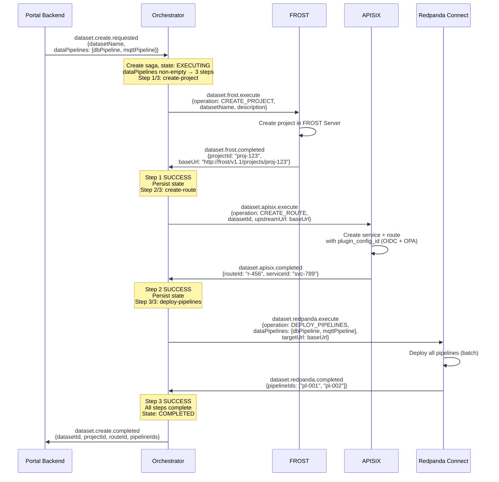
```mermaid
sequenceDiagram
    participant PB as Portal Backend
    participant O as Orchestrator
    participant FROST
    participant APISIX
    participant RP as Redpanda Connect

    PB->>O: dataset.create.requested<br/>{datasetName,<br/>dataPipelines: [dbPipeline, mqttPipeline]}
    Note over O: Create saga, state: EXECUTING<br/>dataPipelines non-empty → 3 steps<br/>Step 1/3: create-project

    O->>FROST: dataset.frost.execute<br/>{operation: CREATE_PROJECT,<br/>datasetName, description}
    FROST->>FROST: Create project in FROST Server
    FROST->>O: dataset.frost.completed<br/>{projectId: "proj-123",<br/>baseUrl: "http://frost/v1.1/projects/proj-123"}

    Note over O: Step 1 SUCCESS<br/>Persist state<br/>Step 2/3: create-route

    O->>APISIX: dataset.apisix.execute<br/>{operation: CREATE_ROUTE,<br/>datasetId, upstreamUrl: baseUrl}
    APISIX->>APISIX: Create service + route<br/>with plugin_config_id (OIDC + OPA)
    APISIX->>O: dataset.apisix.completed<br/>{routeId: "r-456", serviceId: "svc-789"}

    Note over O: Step 2 SUCCESS<br/>Persist state<br/>Step 3/3: deploy-pipelines

    O->>RP: dataset.redpanda.execute<br/>{operation: DEPLOY_PIPELINES,<br/>dataPipelines: [dbPipeline, mqttPipeline],<br/>targetUrl: baseUrl}
    RP->>RP: Deploy all pipelines (batch)
    RP->>O: dataset.redpanda.completed<br/>{pipelineIds: ["pl-001", "pl-002"]}

    Note over O: Step 3 SUCCESS<br/>All steps complete<br/>State: COMPLETED

    O->>PB: dataset.create.completed<br/>{datasetId, projectId, routeId, pipelineIds}
```

### 6.2 Success: Without Pipelines (2 Steps)

If the dataset event contains no pipelines (`dataPipelines` is empty or absent), the Redpanda step is skipped. The saga completes after FROST + APISIX.

```mermaid
sequenceDiagram
    participant PB as Portal Backend
    participant O as Orchestrator
    participant FROST
    participant APISIX

    PB->>O: dataset.create.requested<br/>{datasetName,<br/>dataPipelines: []}
    Note over O: Create saga, state: EXECUTING<br/>dataPipelines empty → 2 steps<br/>Step 1/2: create-project

    O->>FROST: dataset.frost.execute<br/>{operation: CREATE_PROJECT,<br/>datasetName, description}
    FROST->>O: dataset.frost.completed<br/>{projectId: "proj-123",<br/>baseUrl: "http://frost/v1.1/projects/proj-123"}

    Note over O: Step 1 SUCCESS<br/>Step 2/2: create-route

    O->>APISIX: dataset.apisix.execute<br/>{operation: CREATE_ROUTE,<br/>datasetId, upstreamUrl: baseUrl}
    APISIX->>APISIX: Create service + route<br/>WITH plugin_config_id<br/>(OIDC + OPA — always protected;<br/>open data is an OPA per-request decision)
    APISIX->>O: dataset.apisix.completed<br/>{routeId: "r-456", serviceId: "svc-789"}

    Note over O: Step 2 SUCCESS<br/>No more steps (no pipelines)<br/>State: COMPLETED

    O->>PB: dataset.create.completed<br/>{datasetId, projectId, routeId,<br/>pipelineIds: []}
```

### 6.3 Open Data Access (decided by OPA, not by the route)

Open data is **not** a route variant. Regardless of `openDataAccess`, APISIX creates the route **with** `plugin_config_id` (OIDC + OPA) — routes are always protected. Anonymous read access for an open dataset is granted by **OPA at request time**:
- OIDC runs with `unauth_action: pass`, so an anonymous request continues to OPA (instead of a 401 at the gateway).
- OPA reads the dataset's `openDataAccess` flag from the AuthZ Repository and, for a flagged dataset, allows the anonymous **payload** read (ABAC). Writes and protected datasets are denied.
- The FROST project itself stays **private**; APISIX reaches it with the upstream credential. There is no public FROST project anymore.

### 6.4 Failure at Step 1 (FROST) — No Compensation Needed

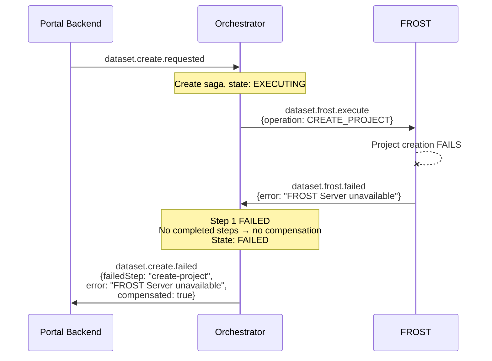
```mermaid
sequenceDiagram
    participant PB as Portal Backend
    participant O as Orchestrator
    participant FROST

    PB->>O: dataset.create.requested
    Note over O: Create saga, state: EXECUTING

    O->>FROST: dataset.frost.execute<br/>{operation: CREATE_PROJECT}
    FROST--xFROST: Project creation FAILS
    FROST->>O: dataset.frost.failed<br/>{error: "FROST Server unavailable"}

    Note over O: Step 1 FAILED<br/>No completed steps → no compensation<br/>State: FAILED

    O->>PB: dataset.create.failed<br/>{failedStep: "create-project",<br/>error: "FROST Server unavailable",<br/>compensated: true}
```

### 6.5 Failure at Step 2 (APISIX) — Compensate FROST

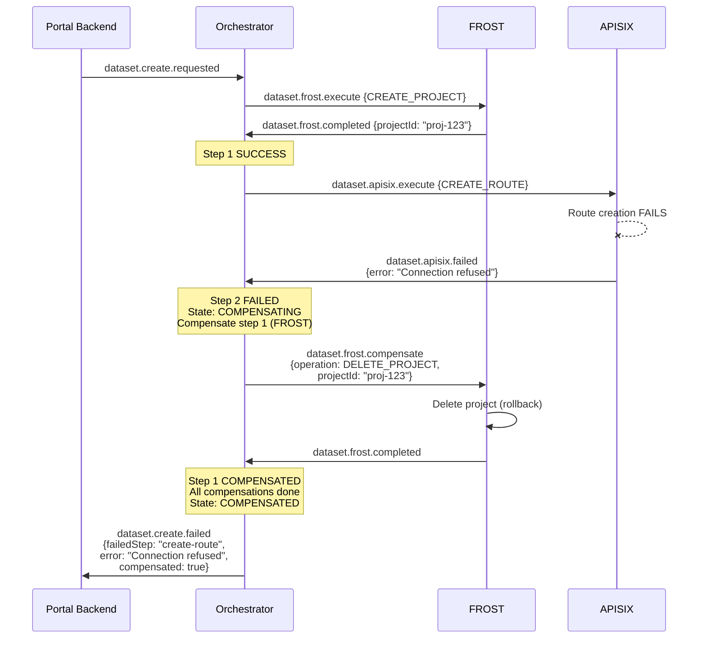
```mermaid
sequenceDiagram
    participant PB as Portal Backend
    participant O as Orchestrator
    participant FROST
    participant APISIX

    PB->>O: dataset.create.requested

    O->>FROST: dataset.frost.execute {CREATE_PROJECT}
    FROST->>O: dataset.frost.completed {projectId: "proj-123"}
    Note over O: Step 1 SUCCESS

    O->>APISIX: dataset.apisix.execute {CREATE_ROUTE}
    APISIX--xAPISIX: Route creation FAILS
    APISIX->>O: dataset.apisix.failed<br/>{error: "Connection refused"}

    Note over O: Step 2 FAILED<br/>State: COMPENSATING<br/>Compensate step 1 (FROST)

    O->>FROST: dataset.frost.compensate<br/>{operation: DELETE_PROJECT,<br/>projectId: "proj-123"}
    FROST->>FROST: Delete project (rollback)
    FROST->>O: dataset.frost.completed

    Note over O: Step 1 COMPENSATED<br/>All compensations done<br/>State: COMPENSATED

    O->>PB: dataset.create.failed<br/>{failedStep: "create-route",<br/>error: "Connection refused",<br/>compensated: true}
```

### 6.6 Failure at Step 3 (Redpanda) — Compensate APISIX, then FROST

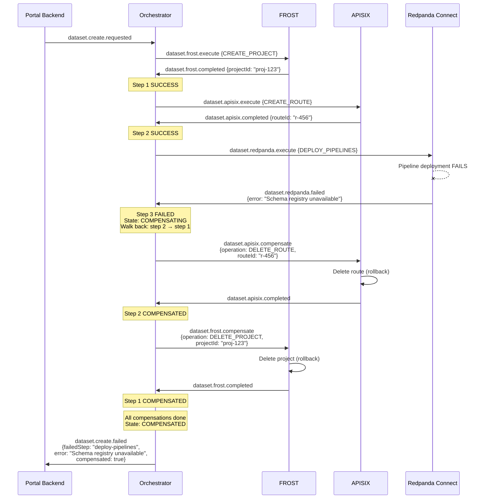
```mermaid
sequenceDiagram
    participant PB as Portal Backend
    participant O as Orchestrator
    participant FROST
    participant APISIX
    participant RP as Redpanda Connect

    PB->>O: dataset.create.requested

    O->>FROST: dataset.frost.execute {CREATE_PROJECT}
    FROST->>O: dataset.frost.completed {projectId: "proj-123"}
    Note over O: Step 1 SUCCESS

    O->>APISIX: dataset.apisix.execute {CREATE_ROUTE}
    APISIX->>O: dataset.apisix.completed {routeId: "r-456"}
    Note over O: Step 2 SUCCESS

    O->>RP: dataset.redpanda.execute {DEPLOY_PIPELINES}
    RP--xRP: Pipeline deployment FAILS
    RP->>O: dataset.redpanda.failed<br/>{error: "Schema registry unavailable"}

    Note over O: Step 3 FAILED<br/>State: COMPENSATING<br/>Walk back: step 2 → step 1

    O->>APISIX: dataset.apisix.compensate<br/>{operation: DELETE_ROUTE,<br/>routeId: "r-456"}
    APISIX->>APISIX: Delete route (rollback)
    APISIX->>O: dataset.apisix.completed
    Note over O: Step 2 COMPENSATED

    O->>FROST: dataset.frost.compensate<br/>{operation: DELETE_PROJECT,<br/>projectId: "proj-123"}
    FROST->>FROST: Delete project (rollback)
    FROST->>O: dataset.frost.completed
    Note over O: Step 1 COMPENSATED

    Note over O: All compensations done<br/>State: COMPENSATED

    O->>PB: dataset.create.failed<br/>{failedStep: "deploy-pipelines",<br/>error: "Schema registry unavailable",<br/>compensated: true}
```

### 6.7 Compensation Failure — Best-Effort Cleanup

If a compensation step fails, the orchestrator **does not stop**. It continues compensating all remaining steps to clean up as much as possible. The final result event reports exactly which steps are clean and which are stale.

Example: Redpanda fails at step 3. During compensation, APISIX compensation fails but FROST compensation succeeds.

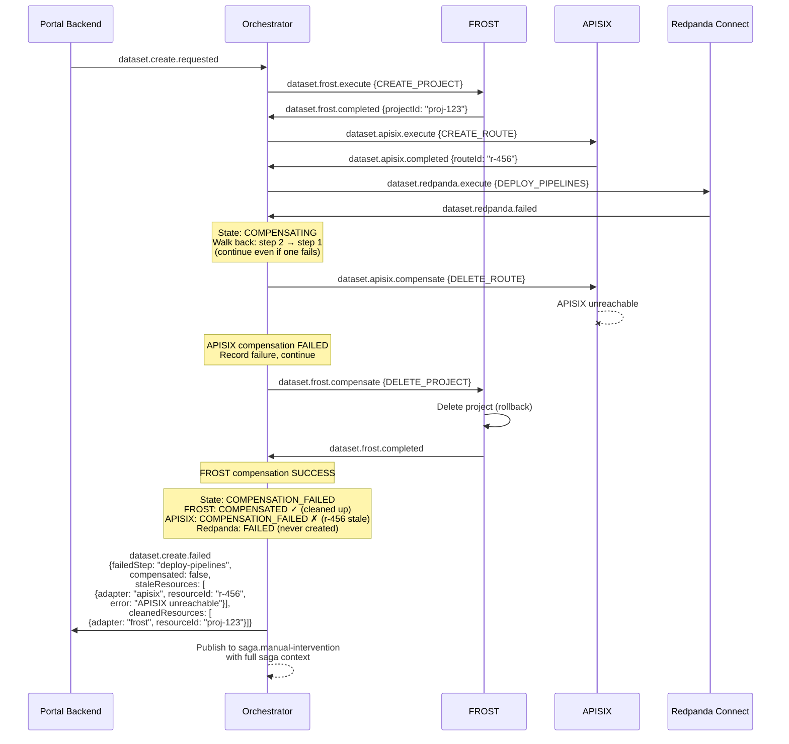
```mermaid
sequenceDiagram
    participant PB as Portal Backend
    participant O as Orchestrator
    participant FROST
    participant APISIX
    participant RP as Redpanda Connect

    PB->>O: dataset.create.requested

    O->>FROST: dataset.frost.execute {CREATE_PROJECT}
    FROST->>O: dataset.frost.completed {projectId: "proj-123"}

    O->>APISIX: dataset.apisix.execute {CREATE_ROUTE}
    APISIX->>O: dataset.apisix.completed {routeId: "r-456"}

    O->>RP: dataset.redpanda.execute {DEPLOY_PIPELINES}
    RP->>O: dataset.redpanda.failed

    Note over O: State: COMPENSATING<br/>Walk back: step 2 → step 1<br/>(continue even if one fails)

    O->>APISIX: dataset.apisix.compensate {DELETE_ROUTE}
    APISIX--xAPISIX: APISIX unreachable
    Note over O: APISIX compensation FAILED<br/>Record failure, continue

    O->>FROST: dataset.frost.compensate {DELETE_PROJECT}
    FROST->>FROST: Delete project (rollback)
    FROST->>O: dataset.frost.completed
    Note over O: FROST compensation SUCCESS

    Note over O: State: COMPENSATION_FAILED<br/>FROST: COMPENSATED ✓ (cleaned up)<br/>APISIX: COMPENSATION_FAILED ✗ (r-456 stale)<br/>Redpanda: FAILED (never created)

    O->>PB: dataset.create.failed<br/>{failedStep: "deploy-pipelines",<br/>compensated: false,<br/>staleResources: [<br/>  {adapter: "apisix", resourceId: "r-456",<br/>   error: "APISIX unreachable"}],<br/>cleanedResources: [<br/>  {adapter: "frost", resourceId: "proj-123"}]}
    O-->>O: Publish to saga.manual-intervention<br/>with full saga context
```

The backend receives a precise report:
- **`staleResources`**: Resources that still exist and need manual cleanup (compensation failed)
- **`cleanedResources`**: Resources that were successfully rolled back
- **`failedStep`**: The original step that triggered compensation

### 6.8 Timeout — Adapter Never Responds

The orchestrator tracks when each command was sent. If the configured timeout expires before a reply, the step is treated as failed.

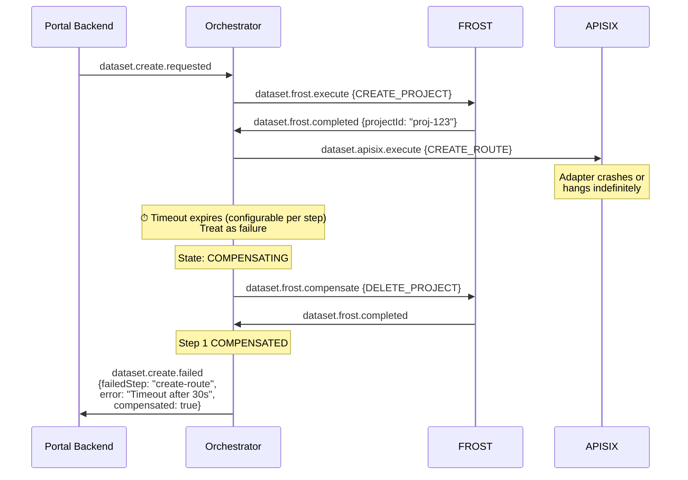
```mermaid
sequenceDiagram
    participant PB as Portal Backend
    participant O as Orchestrator
    participant FROST
    participant APISIX

    PB->>O: dataset.create.requested

    O->>FROST: dataset.frost.execute {CREATE_PROJECT}
    FROST->>O: dataset.frost.completed {projectId: "proj-123"}

    O->>APISIX: dataset.apisix.execute {CREATE_ROUTE}
    Note over APISIX: Adapter crashes or<br/>hangs indefinitely

    Note over O: ⏱ Timeout expires (configurable per step)<br/>Treat as failure

    Note over O: State: COMPENSATING

    O->>FROST: dataset.frost.compensate {DELETE_PROJECT}
    FROST->>O: dataset.frost.completed
    Note over O: Step 1 COMPENSATED

    O->>PB: dataset.create.failed<br/>{failedStep: "create-route",<br/>error: "Timeout after 30s",<br/>compensated: true}
```

---

## 7. Dataset Update

Update follows the **same step order** as create (FROST → APISIX → Redpanda). Each adapter receives the full current dataset definition and updates what is relevant to it. If nothing changed for an adapter, it returns SUCCESS immediately.

The same conditional logic applies: the **Redpanda step is only executed if `dataPipelines[]` is non-empty**. A change to `openDataAccess` does **not** reconfigure the route — UPDATE_ROUTE re-applies the same protected shape, and OPA simply reads the new flag value live on the next request.

**Compensation for update = restore previous state.** Each adapter saves its state before modifying it. The saved state is returned in the step's `compensation` data.

### 7.1 Success: All Steps Complete

```mermaid
sequenceDiagram
    participant PB as Portal Backend
    participant O as Orchestrator
    participant FROST
    participant APISIX
    participant RP as Redpanda Connect

    PB->>O: dataset.update.requested<br/>{datasetId: "ds-001", datasetName,<br/>dataPipelines[]}
    Note over O: Create saga, state: EXECUTING<br/>Step 1/3: update-project

    O->>FROST: dataset.frost.execute<br/>{operation: UPDATE_PROJECT,<br/>datasetId: "ds-001", datasetName}
    FROST->>FROST: Update project metadata
    FROST->>O: dataset.frost.completed<br/>{projectId: "proj-123",<br/>baseUrl: "http://frost/v1.1/projects/proj-123"}

    Note over O: Step 1 SUCCESS<br/>Step 2/3: update-route

    O->>APISIX: dataset.apisix.execute<br/>{operation: UPDATE_ROUTE,<br/>datasetId: "ds-001"}
    APISIX->>APISIX: Re-apply protected route config<br/>(always plugin_config_id + STA credential;<br/>open-data is an OPA per-request decision)
    APISIX->>O: dataset.apisix.completed<br/>{routeId: "r-456"}

    Note over O: Step 2 SUCCESS<br/>Step 3/3: update-pipelines

    O->>RP: dataset.redpanda.execute<br/>{operation: UPDATE_PIPELINES,<br/>datasetId: "ds-001",<br/>dataPipelines[], targetUrl: baseUrl}
    RP->>RP: Redeploy pipelines with new config
    RP->>O: dataset.redpanda.completed<br/>{pipelineIds: ["pl-003", "pl-004"]}

    Note over O: Step 3 SUCCESS<br/>State: COMPLETED

    O->>PB: dataset.update.completed<br/>{datasetId: "ds-001"}
```

### 7.2 Failure at Step 1 (FROST) — No Compensation Needed

Same pattern as [6.4](#64-failure-at-step-1-frost--no-compensation-needed). FROST update fails, no steps to compensate.

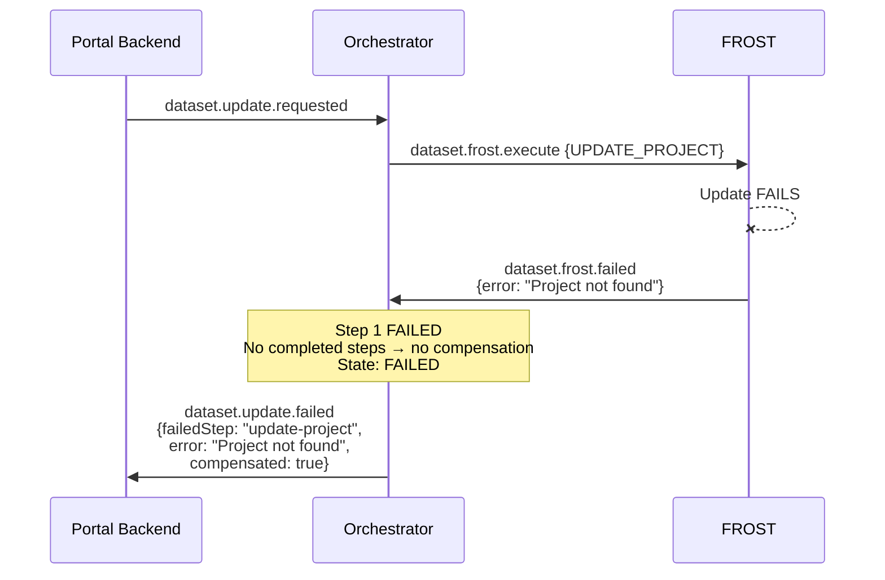
```mermaid
sequenceDiagram
    participant PB as Portal Backend
    participant O as Orchestrator
    participant FROST

    PB->>O: dataset.update.requested

    O->>FROST: dataset.frost.execute {UPDATE_PROJECT}
    FROST--xFROST: Update FAILS
    FROST->>O: dataset.frost.failed<br/>{error: "Project not found"}

    Note over O: Step 1 FAILED<br/>No completed steps → no compensation<br/>State: FAILED

    O->>PB: dataset.update.failed<br/>{failedStep: "update-project",<br/>error: "Project not found",<br/>compensated: true}
```

### 7.3 Failure at Step 2 (APISIX) — Revert FROST

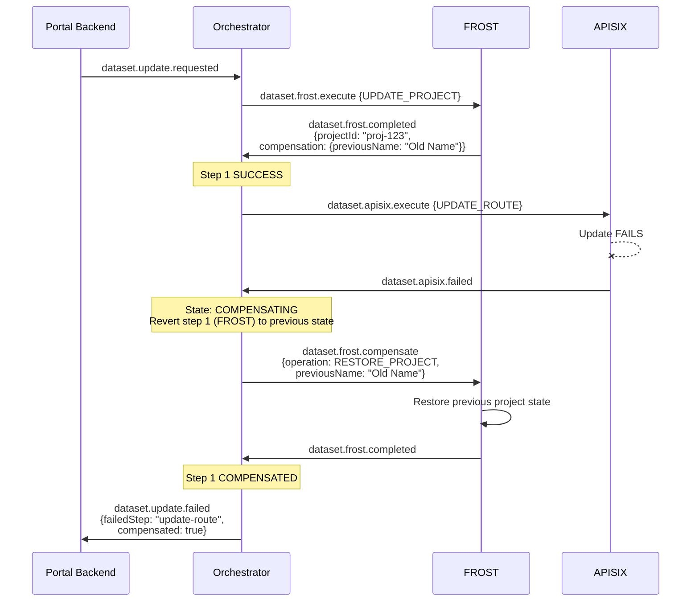
```mermaid
sequenceDiagram
    participant PB as Portal Backend
    participant O as Orchestrator
    participant FROST
    participant APISIX

    PB->>O: dataset.update.requested

    O->>FROST: dataset.frost.execute {UPDATE_PROJECT}
    FROST->>O: dataset.frost.completed<br/>{projectId: "proj-123",<br/>compensation: {previousName: "Old Name"}}
    Note over O: Step 1 SUCCESS

    O->>APISIX: dataset.apisix.execute {UPDATE_ROUTE}
    APISIX--xAPISIX: Update FAILS
    APISIX->>O: dataset.apisix.failed

    Note over O: State: COMPENSATING<br/>Revert step 1 (FROST) to previous state

    O->>FROST: dataset.frost.compensate<br/>{operation: RESTORE_PROJECT,<br/>previousName: "Old Name"}
    FROST->>FROST: Restore previous project state
    FROST->>O: dataset.frost.completed
    Note over O: Step 1 COMPENSATED

    O->>PB: dataset.update.failed<br/>{failedStep: "update-route",<br/>compensated: true}
```

### 7.4 Failure at Step 3 (Redpanda) — Revert APISIX, then FROST

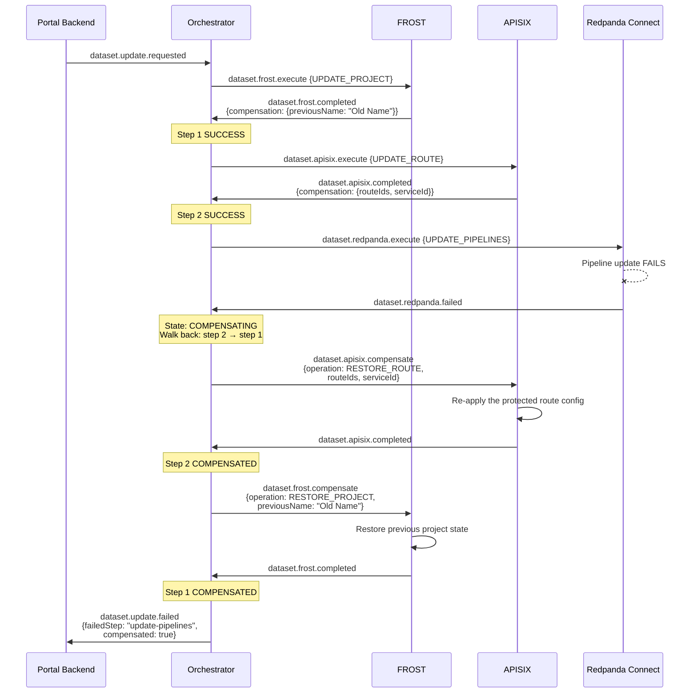
```mermaid
sequenceDiagram
    participant PB as Portal Backend
    participant O as Orchestrator
    participant FROST
    participant APISIX
    participant RP as Redpanda Connect

    PB->>O: dataset.update.requested

    O->>FROST: dataset.frost.execute {UPDATE_PROJECT}
    FROST->>O: dataset.frost.completed<br/>{compensation: {previousName: "Old Name"}}
    Note over O: Step 1 SUCCESS

    O->>APISIX: dataset.apisix.execute {UPDATE_ROUTE}
    APISIX->>O: dataset.apisix.completed<br/>{compensation: {routeIds, serviceId}}
    Note over O: Step 2 SUCCESS

    O->>RP: dataset.redpanda.execute {UPDATE_PIPELINES}
    RP--xRP: Pipeline update FAILS
    RP->>O: dataset.redpanda.failed

    Note over O: State: COMPENSATING<br/>Walk back: step 2 → step 1

    O->>APISIX: dataset.apisix.compensate<br/>{operation: RESTORE_ROUTE,<br/>routeIds, serviceId}
    APISIX->>APISIX: Re-apply the protected route config
    APISIX->>O: dataset.apisix.completed
    Note over O: Step 2 COMPENSATED

    O->>FROST: dataset.frost.compensate<br/>{operation: RESTORE_PROJECT,<br/>previousName: "Old Name"}
    FROST->>FROST: Restore previous project state
    FROST->>O: dataset.frost.completed
    Note over O: Step 1 COMPENSATED

    O->>PB: dataset.update.failed<br/>{failedStep: "update-pipelines",<br/>compensated: true}
```

---

## 8. Dataset Delete

Delete runs in **reverse order** compared to create: **Redpanda (conditional) → APISIX → FROST**. This ensures data flow stops first (pipelines), then routing is removed, then storage is cleaned up.

If the dataset has no pipelines, the Redpanda step is skipped and delete starts at APISIX.

**Best-effort execution**: If a delete step fails, the orchestrator **continues with the remaining steps** to clean up as much as possible. The final result event reports exactly which resources were deleted and which are stale.

**No compensation**: Recreating deleted resources is not feasible (data loss, pipeline state). Failed delete steps are reported for manual intervention — not rolled back.

### 8.1 Success: All Steps Complete

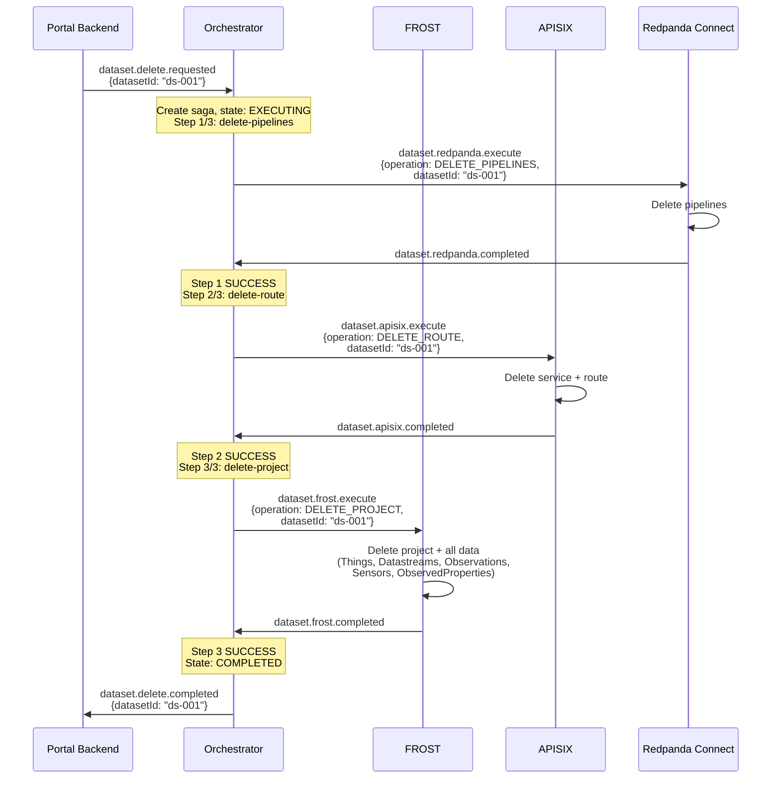
```mermaid
sequenceDiagram
    participant PB as Portal Backend
    participant O as Orchestrator
    participant FROST
    participant APISIX
    participant RP as Redpanda Connect

    PB->>O: dataset.delete.requested<br/>{datasetId: "ds-001"}
    Note over O: Create saga, state: EXECUTING<br/>Step 1/3: delete-pipelines

    O->>RP: dataset.redpanda.execute<br/>{operation: DELETE_PIPELINES,<br/>datasetId: "ds-001"}
    RP->>RP: Delete pipelines
    RP->>O: dataset.redpanda.completed

    Note over O: Step 1 SUCCESS<br/>Step 2/3: delete-route

    O->>APISIX: dataset.apisix.execute<br/>{operation: DELETE_ROUTE,<br/>datasetId: "ds-001"}
    APISIX->>APISIX: Delete service + route
    APISIX->>O: dataset.apisix.completed

    Note over O: Step 2 SUCCESS<br/>Step 3/3: delete-project

    O->>FROST: dataset.frost.execute<br/>{operation: DELETE_PROJECT,<br/>datasetId: "ds-001"}
    FROST->>FROST: Delete project + all data<br/>(Things, Datastreams, Observations,<br/>Sensors, ObservedProperties)
    FROST->>O: dataset.frost.completed

    Note over O: Step 3 SUCCESS<br/>State: COMPLETED

    O->>PB: dataset.delete.completed<br/>{datasetId: "ds-001"}
```

### 8.2 Failure at Step 1 (Redpanda) — Continue with APISIX and FROST

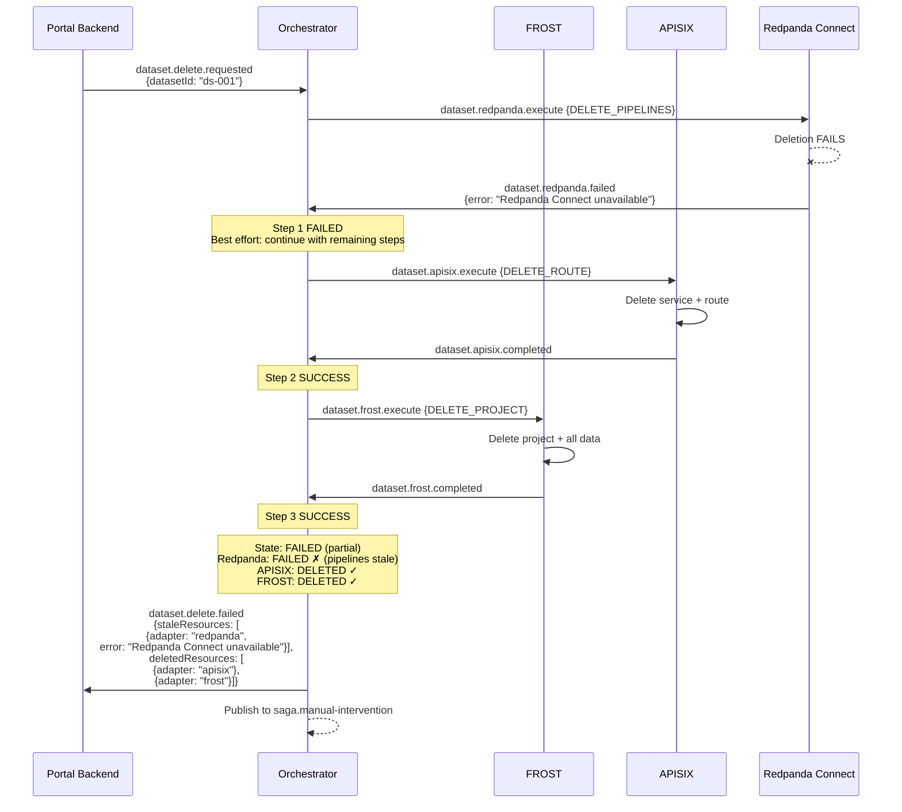
```mermaid
sequenceDiagram
    participant PB as Portal Backend
    participant O as Orchestrator
    participant FROST
    participant APISIX
    participant RP as Redpanda Connect

    PB->>O: dataset.delete.requested<br/>{datasetId: "ds-001"}

    O->>RP: dataset.redpanda.execute {DELETE_PIPELINES}
    RP--xRP: Deletion FAILS
    RP->>O: dataset.redpanda.failed<br/>{error: "Redpanda Connect unavailable"}

    Note over O: Step 1 FAILED<br/>Best effort: continue with remaining steps

    O->>APISIX: dataset.apisix.execute {DELETE_ROUTE}
    APISIX->>APISIX: Delete service + route
    APISIX->>O: dataset.apisix.completed
    Note over O: Step 2 SUCCESS

    O->>FROST: dataset.frost.execute {DELETE_PROJECT}
    FROST->>FROST: Delete project + all data
    FROST->>O: dataset.frost.completed
    Note over O: Step 3 SUCCESS

    Note over O: State: FAILED (partial)<br/>Redpanda: FAILED ✗ (pipelines stale)<br/>APISIX: DELETED ✓<br/>FROST: DELETED ✓

    O->>PB: dataset.delete.failed<br/>{staleResources: [<br/>  {adapter: "redpanda",<br/>   error: "Redpanda Connect unavailable"}],<br/>deletedResources: [<br/>  {adapter: "apisix"},<br/>  {adapter: "frost"}]}
    O-->>O: Publish to saga.manual-intervention
```

### 8.3 Failure at Step 2 (APISIX) — Continue with FROST

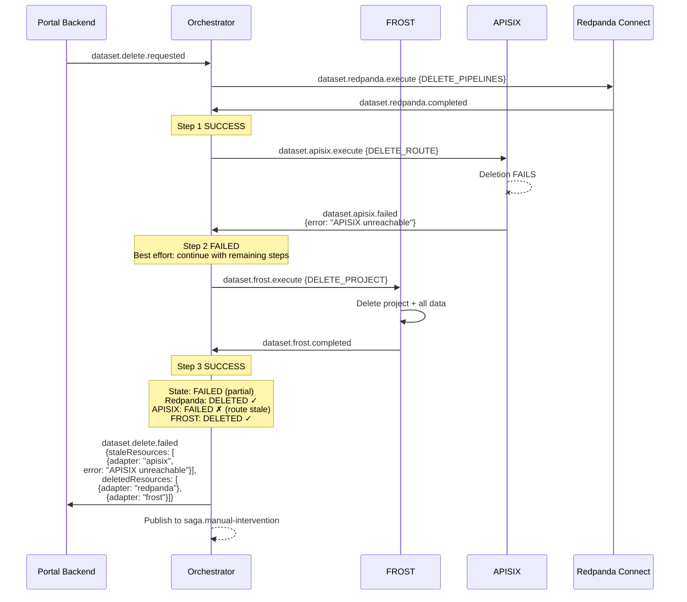
```mermaid
sequenceDiagram
    participant PB as Portal Backend
    participant O as Orchestrator
    participant FROST
    participant APISIX
    participant RP as Redpanda Connect

    PB->>O: dataset.delete.requested

    O->>RP: dataset.redpanda.execute {DELETE_PIPELINES}
    RP->>O: dataset.redpanda.completed
    Note over O: Step 1 SUCCESS

    O->>APISIX: dataset.apisix.execute {DELETE_ROUTE}
    APISIX--xAPISIX: Deletion FAILS
    APISIX->>O: dataset.apisix.failed<br/>{error: "APISIX unreachable"}

    Note over O: Step 2 FAILED<br/>Best effort: continue with remaining steps

    O->>FROST: dataset.frost.execute {DELETE_PROJECT}
    FROST->>FROST: Delete project + all data
    FROST->>O: dataset.frost.completed
    Note over O: Step 3 SUCCESS

    Note over O: State: FAILED (partial)<br/>Redpanda: DELETED ✓<br/>APISIX: FAILED ✗ (route stale)<br/>FROST: DELETED ✓

    O->>PB: dataset.delete.failed<br/>{staleResources: [<br/>  {adapter: "apisix",<br/>   error: "APISIX unreachable"}],<br/>deletedResources: [<br/>  {adapter: "redpanda"},<br/>  {adapter: "frost"}]}
    O-->>O: Publish to saga.manual-intervention
```

### 8.4 Failure at Step 3 (FROST) — Pipelines + Route Deleted, Project Remains

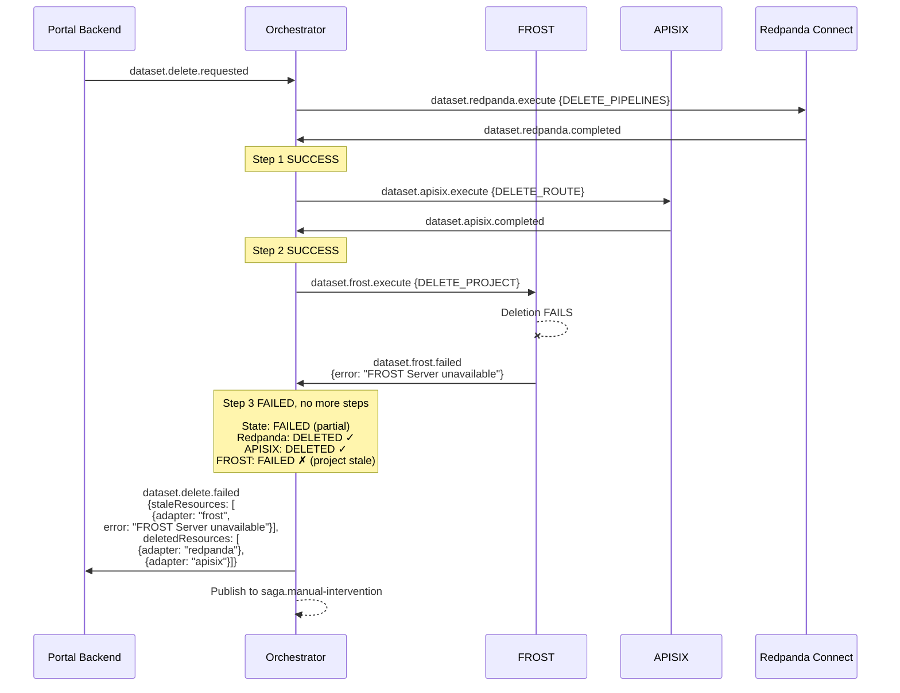
```mermaid
sequenceDiagram
    participant PB as Portal Backend
    participant O as Orchestrator
    participant FROST
    participant APISIX
    participant RP as Redpanda Connect

    PB->>O: dataset.delete.requested

    O->>RP: dataset.redpanda.execute {DELETE_PIPELINES}
    RP->>O: dataset.redpanda.completed
    Note over O: Step 1 SUCCESS

    O->>APISIX: dataset.apisix.execute {DELETE_ROUTE}
    APISIX->>O: dataset.apisix.completed
    Note over O: Step 2 SUCCESS

    O->>FROST: dataset.frost.execute {DELETE_PROJECT}
    FROST--xFROST: Deletion FAILS
    FROST->>O: dataset.frost.failed<br/>{error: "FROST Server unavailable"}

    Note over O: Step 3 FAILED, no more steps<br/><br/>State: FAILED (partial)<br/>Redpanda: DELETED ✓<br/>APISIX: DELETED ✓<br/>FROST: FAILED ✗ (project stale)

    O->>PB: dataset.delete.failed<br/>{staleResources: [<br/>  {adapter: "frost",<br/>   error: "FROST Server unavailable"}],<br/>deletedResources: [<br/>  {adapter: "redpanda"},<br/>  {adapter: "apisix"}]}
    O-->>O: Publish to saga.manual-intervention
```

### 8.5 Why No Compensation but Best-Effort Execution for Delete

Delete cannot compensate (undo) already deleted resources. But it **continues deleting** remaining resources even if one step fails — this is the best-effort approach.

| Aspect | Behavior |
|--------|----------|
| **Step fails** | Record failure, **continue with next step** |
| **No compensation** | Deleted resources cannot be recreated (data loss, pipeline state) |
| **Result** | Report `staleResources` (failed deletes) + `deletedResources` (successful deletes) |
| **Manual intervention** | Only needed for the stale resources reported in the result |

**Resolution path for stale resources:**
1. Short-term: Manual cleanup via the `saga.manual-intervention` topic (operator deletes remaining resources)
2. Long-term: Soft delete (disable/hide resources instead of removing them, hard-delete after a grace period)

---

## 9. Saga State Machine

### Saga-Level States

```
        ┌──────────┐
        │ PENDING  │
        └────┬─────┘
             │ first step started
             ▼
        ┌──────────┐
  ┌─────│EXECUTING │─────┐
  │     └──────────┘     │
  │ all steps done       │ step failed
  ▼                      ▼
┌─────────┐       ┌──────────────┐
│COMPLETED│       │ COMPENSATING │ ← tries ALL remaining steps
└─────────┘       └──────┬───────┘   (best effort, does not stop
                         │            on individual failure)
             ┌───────────┴───────────┐
             │                       │
             ▼                       ▼
      ┌────────────┐     ┌─────────────────────┐
      │COMPENSATED │     │ COMPENSATION_FAILED │
      │ (all clean)│     │(stale + clean report)│
      └────────────┘     └─────────────────────┘
```

### Step-Level States

```
PENDING → IN_PROGRESS → SUCCESS
                      → FAILED

SUCCESS → COMPENSATING → COMPENSATED
                       → COMPENSATION_FAILED
```

### State Transitions per Saga Type

| Event | Create / Update | Delete |
|-------|----------------|--------|
| Step succeeds, more steps | Advance to next step | Advance to next step |
| Step succeeds, last step | → `COMPLETED` | → `COMPLETED` |
| Step fails, no completed steps | → `FAILED` (no compensation) | **Record failure, continue next** (best effort) |
| Step fails, has completed steps | → `COMPENSATING` | **Record failure, continue next** (best effort) |
| Compensation succeeds, more to compensate | Compensate next (reverse) | n/a |
| Compensation fails, more to compensate | **Record failure, compensate next** (best effort) | n/a |
| All compensations done, all succeeded | → `COMPENSATED` | n/a |
| All compensations done, some failed | → `COMPENSATION_FAILED` (with stale resource details) | n/a |
| All delete steps done, all succeeded | n/a | → `COMPLETED` |
| All delete steps done, some failed | n/a | → `FAILED` (with stale + deleted resource details) |
| Timeout | Treated as step failure | Treated as step failure |

---

## 10. Saga State Persistence (Kafka)

The orchestrator persists saga state to a **Kafka compacted topic** (`de.civitascore.saga.state`). This avoids an external database dependency — the same Kafka cluster used for messaging doubles as the state store.

### Why Kafka Compacted Topic?

| Aspect | Kafka Compacted Topic | PostgreSQL |
|--------|----------------------|------------|
| **Infrastructure** | Already present (messaging) | Additional dependency |
| **Write pattern** | Append-only, keyed by `sagaId` | Transactional UPDATE |
| **Read pattern** | Full replay on startup → in-memory map | Query by `sagaId` |
| **Crash recovery** | Consumer replays topic from offset 0 | Query `WHERE status IN ('EXECUTING', 'COMPENSATING')` |
| **Compaction** | Kafka retains only the latest value per key | Manual cleanup / TTL |
| **Operational complexity** | Low (topic config) | Medium (schema, migrations, connection pool) |

Kafka compacted topics retain only the **latest record per key**. Older state transitions for the same `sagaId` are automatically removed by the log cleaner. This keeps the topic size proportional to the number of **active + recently completed** sagas, not to the total number of state transitions.

> **Trade-off**: Kafka state is not queryable via SQL. For dashboards or manual investigation, the orchestrator exposes saga state via a REST endpoint or structured logs. If queryable state becomes a requirement, migration to PostgreSQL is straightforward — only `SagaStateStore` needs a new implementation.

### Topic Configuration

```properties
# Topic: de.civitascore.saga.state
cleanup.policy    = compact
min.cleanable.dirty.ratio = 0.5
delete.retention.ms       = 86400000   # 24h tombstone retention
segment.ms                = 3600000    # 1h segments for faster compaction
num.partitions            = 3          # matches orchestrator instance count
replication.factor        = 3          # production HA
```

The `sagaId` is used as the Kafka record key. This ensures:
- All state transitions for one saga land on the same partition
- Compaction retains only the latest state per saga
- A tombstone record (`value = null`) can be written after saga completion to eventually free storage

### Write: Persisting State Transitions

Every state change in the orchestrator is written to the state topic **before** the next action is taken. This guarantees that a crash at any point can be recovered from the last persisted state.

```java
import org.apache.kafka.clients.producer.KafkaProducer;
import org.apache.kafka.clients.producer.ProducerRecord;

import com.fasterxml.jackson.databind.ObjectMapper;

/**
 * Persists SagaContext snapshots to a Kafka compacted topic.
 * Each write is keyed by sagaId — compaction retains only the latest state.
 */
public class SagaStateStore {

    private static final String STATE_TOPIC = "de.civitascore.saga.state";

    private final KafkaProducer<String, String> producer;
    private final ObjectMapper objectMapper;

    public SagaStateStore(KafkaProducer<String, String> producer,
                          ObjectMapper objectMapper) {
        this.producer = producer;
        this.objectMapper = objectMapper;
    }

    /**
     * Persist the current saga state. Called on every state transition
     * (step started, step completed, step failed, compensation started, etc.).
     */
    public void save(SagaContext saga) {
        try {
            String json = objectMapper.writeValueAsString(saga);
            var record = new ProducerRecord<>(STATE_TOPIC, saga.sagaId(), json);
            producer.send(record).get(); // synchronous — state must be persisted before proceeding
        } catch (Exception e) {
            throw new SagaStateException("Failed to persist saga state: " + saga.sagaId(), e);
        }
    }

    /**
     * Remove a completed saga from the state topic by writing a tombstone.
     * The compaction log cleaner will eventually remove the key entirely.
     */
    public void remove(String sagaId) {
        try {
            var tombstone = new ProducerRecord<String, String>(STATE_TOPIC, sagaId, null);
            producer.send(tombstone).get();
        } catch (Exception e) {
            throw new SagaStateException("Failed to remove saga state: " + sagaId, e);
        }
    }
}
```

### Read: Recovering State on Startup

On startup, the orchestrator replays the entire state topic to rebuild all in-flight sagas into an in-memory map. Completed sagas (with tombstones) are skipped.

```java
import java.time.Duration;
import java.time.Instant;
import java.util.Collections;
import java.util.Map;
import java.util.concurrent.ConcurrentHashMap;

import org.apache.kafka.clients.consumer.ConsumerRecords;
import org.apache.kafka.clients.consumer.KafkaConsumer;
import org.apache.kafka.common.TopicPartition;

import com.fasterxml.jackson.databind.ObjectMapper;

/**
 * Replays the saga state topic on startup to recover in-flight sagas.
 */
public class SagaStateRecovery {

    private final KafkaConsumer<String, String> consumer;
    private final ObjectMapper objectMapper;
    private final Duration stepTimeout;

    public SagaStateRecovery(KafkaConsumer<String, String> consumer,
                             ObjectMapper objectMapper,
                             Duration stepTimeout) {
        this.consumer = consumer;
        this.objectMapper = objectMapper;
        this.stepTimeout = stepTimeout;
    }

    /**
     * Replay the full state topic and return all active (non-completed) sagas.
     * Called once during orchestrator startup.
     */
    public Map<String, SagaContext> recover() {
        var activeSagas = new ConcurrentHashMap<String, SagaContext>();

        // Assign all partitions and seek to beginning
        var partitions = consumer.partitionsFor(SagaStateStore.STATE_TOPIC).stream()
                .map(info -> new TopicPartition(info.topic(), info.partition()))
                .toList();
        consumer.assign(partitions);
        consumer.seekToBeginning(partitions);

        // Replay until end of topic
        var endOffsets = consumer.endOffsets(partitions);
        boolean reachedEnd = false;

        while (!reachedEnd) {
            ConsumerRecords<String, String> records = consumer.poll(Duration.ofSeconds(1));
            for (var record : records) {
                String sagaId = record.key();

                if (record.value() == null) {
                    // Tombstone → saga was completed and cleaned up
                    activeSagas.remove(sagaId);
                    continue;
                }

                SagaContext saga = objectMapper.readValue(record.value(), SagaContext.class);

                if (saga.status() == SagaStatus.COMPLETED
                        || saga.status() == SagaStatus.COMPENSATED
                        || saga.status() == SagaStatus.COMPENSATION_FAILED) {
                    // Terminal state → not an in-flight saga
                    activeSagas.remove(sagaId);
                } else {
                    activeSagas.put(sagaId, saga);
                }
            }

            // Check if we've consumed up to the end offsets captured before replay
            reachedEnd = partitions.stream().allMatch(tp ->
                    consumer.position(tp) >= endOffsets.getOrDefault(tp, 0L));
        }

        // Handle expired sagas (were in-flight but timed out during downtime)
        Instant now = Instant.now();
        activeSagas.values().forEach(saga -> {
            // TODO: Check last transition timestamp against stepTimeout
            // If expired → trigger compensation for completed steps
        });

        return Collections.unmodifiableMap(activeSagas);
    }
}
```

### Orchestrator Lifecycle

```
Startup:
  1. SagaStateRecovery.recover() → Map<sagaId, SagaContext>
  2. For each recovered saga:
     - EXECUTING + timed out     → begin compensation
     - EXECUTING + not timed out → resume waiting for adapter reply
     - COMPENSATING              → resume compensation sequence
  3. Start consuming trigger topics (dataset.create/update/delete.requested)

Runtime (per saga state transition):
  1. Update in-memory SagaContext
  2. SagaStateStore.save(saga)     ← synchronous write
  3. Proceed with next action (send adapter command / send result to backend)

Completion:
  1. Send result event to backend (completed/failed)
  2. SagaStateStore.remove(sagaId) ← tombstone
  3. Remove from in-memory map
```

### State Topic in Topic Structure

The state topic is an **internal orchestrator topic** — no other component reads from or writes to it.

| Topic | Publisher | Subscriber | Purpose |
|-------|-----------|------------|---------|
| `de.civitascore.saga.state` | Orchestrator | Orchestrator (on startup) | Compacted topic for saga state persistence and crash recovery |

---

## 11. Cleanup Strategy and Implementation Abstraction

### Shared Pattern: Best-Effort Cleanup

Both **compensation** (rollback after create/update failure) and **delete execution** follow the **same pattern**:

1. Build a list of cleanup operations (each targeting one adapter)
2. Execute them sequentially
3. If one fails: **record the failure, continue with the next**
4. Collect per-step results (success or failure with error detail)
5. Report final result with `staleResources` + `cleanedResources`

The only difference is **where the list of operations comes from**:

| Scenario | Cleanup list source | Direction | Operation per step |
|----------|--------------------|-----------|--------------------|
| **Create failed** | Completed steps from the saga | Reverse order | Delete created resource |
| **Update failed** | Completed steps from the saga | Reverse order | Restore previous state |
| **Delete execution** | All delete steps in the saga | Forward order | Delete resource |

> **Implementation note:** This shared behavior should be implemented as a single reusable component (e.g. `BestEffortCleanupExecutor`). The orchestrator builds the cleanup step list and delegates execution to this component — regardless of whether the trigger was a rollback or a delete. The component handles sequencing, failure recording, and result aggregation.

```
┌─────────────────────────────────────────────────────┐
│                 BestEffortCleanupExecutor            │
│                                                     │
│  Input:  List<CleanupStep>                          │
│            - topic (where to send command)           │
│            - command (operation + payload)           │
│            - resourceId (for reporting)              │
│                                                     │
│  Behavior:                                          │
│    for each step:                                   │
│      send command → wait for reply                  │
│      if success → add to cleanedResources           │
│      if failure → add to staleResources, continue   │
│                                                     │
│  Output: CleanupResult                              │
│            - cleanedResources[]                      │
│            - staleResources[] (with error details)   │
│            - allSucceeded: boolean                   │
└─────────────────────────────────────────────────────┘
```

**Who calls it:**

```
Saga: DATASET_CREATE (step 3 failed)
  → Orchestrator builds cleanup list from completed steps [APISIX, FROST] (reverse)
  → BestEffortCleanupExecutor.execute(cleanupList)
  → Result: {cleaned: [FROST], stale: [APISIX]}

Saga: DATASET_DELETE
  → Orchestrator builds cleanup list from delete steps [Redpanda, APISIX, FROST] (forward)
  → BestEffortCleanupExecutor.execute(cleanupList)
  → Result: {cleaned: [Redpanda, FROST], stale: [APISIX]}
```

The orchestrator then wraps the `CleanupResult` into the appropriate result event (`dataset.create.failed` or `dataset.delete.failed`) and sends it to the backend.

### Cleanup Operations per Saga Type

| Saga Type | Cleanup Action | Steps |
|-----------|---------------|-------|
| **Dataset Create** (with pipelines) | Delete created resources | Reverse: Redpanda → APISIX → FROST |
| **Dataset Create** (no pipelines) | Delete created resources | Reverse: APISIX → FROST |
| **Dataset Update** | Restore previous state | Reverse of completed steps |
| **Dataset Delete** (with pipelines) | Delete resources | Forward: Redpanda → APISIX → FROST |
| **Dataset Delete** (no pipelines) | Delete resources | Forward: APISIX → FROST |

### Result Events

For all saga result event structures (success and failure), see [Section 5.5: Saga Result Events](#55-saga-result-events-orchestrator--backend).

### What Makes Each Cleanup Operation Idempotent

| Adapter | Delete (Create Compensation / Delete Saga) | Restore (Update Compensation) |
|---------|---------------------------------------------|-------------------------------|
| **FROST** | "Not found" on delete = success | Restore previous state by `datasetId`; "not found" = already compensated |
| **APISIX** | "Not found" on delete = success | Restore previous config by `datasetId`; idempotent PUT |
| **Redpanda** | "Not found" on delete = success | Redeploy previous pipeline config; idempotent deploy |

---

## 12. Adapter Implementation Details

Each adapter is a stateless command handler — it receives a command via Kafka, executes it against its target system, and returns a result. This section documents the internal responsibilities of each adapter in detail.

### 12.1 FROST Adapter

**Target system**: [FROST Server](https://github.com/FraunhoferIOSB/FROST-Server) — an OGC SensorThings API implementation.

**Concept: FROST Project**

A FROST project is an isolated data container within the FROST Server. Each dataset maps to exactly one FROST project. The project provides a dedicated REST endpoint and contains the full OGC SensorThings data model:

```
FROST Project (proj-123)
  └── Things
       └── Datastreams
            └── Observations
  └── Sensors
  └── ObservedProperties
  └── Locations
```

**Operations:**

| Operation | API Call | Input | Output |
|-----------|---------|-------|--------|
| `CREATE_PROJECT` | `POST /projects` | `datasetName`, `description` | `projectId`, `baseUrl` |
| `UPDATE_PROJECT` | `PUT /projects/{projectId}` | `datasetId`, `datasetName`, `description` | `projectId`, `baseUrl` |
| `DELETE_PROJECT` | `DELETE /projects/{projectId}` | `datasetId` or `projectId` | `status: SUCCESS` |

**Implicit knowledge produced:**

| Field | Example | Used by |
|-------|---------|---------|
| `projectId` | `"proj-123"` | Orchestrator (for compensation), Backend (for reference) |
| `baseUrl` | `"http://frost:8080/FROST-Server/v1.1/projects/proj-123"` | APISIX adapter (upstream URL), Redpanda adapter (`${FROST_BASE}` placeholder) |

The `baseUrl` is the key output — it becomes the upstream URL for the APISIX route and the target for all Redpanda pipelines writing data into the project.

**Compensation:**

| Saga Type | Compensation Action |
|-----------|-------------------|
| Create failed | `DELETE_PROJECT` — removes the project and all its data |
| Update failed | `RESTORE_PROJECT` — restores previous `name` and `description` from compensation data |

**Idempotency:** Delete returns success if the project is already gone ("not found" = success). Create checks for existing project by `datasetId` before creating.

---

### 12.2 APISIX Adapter

**Target system**: [Apache APISIX](https://apisix.apache.org/) — API Gateway.

**Concept: Route + Service + Plugin Config**

The APISIX adapter manages these resources per dataset:

1. **Service**: Defines the upstream (backend) target. One service per backend type (e.g. `svc-frost-server`). Shared across datasets using the same backend.
2. **Upstream**: One per dataset (the dataset's FROST project), shared by all of the dataset's routes.
3. **Route**: Maps an external URL path to a service. **One route per named API** (per concept #1311/#1379), not one per dataset. Each `NamedApi` slug gets its own route at `/v1/datasets/{datasetId}/{slug}` with a deterministic id `NamedApiHelper.derive(datasetId, slug)`. The CREATE_ROUTE step fans out over the dataset's `namedApis` and returns a **slug-keyed `routeIds` map** (`{slug: routeId}`); UPDATE/DELETE/RESTORE iterate that map. The portal-backend persists each route id onto the matching `NamedApi` entity. (A dataset with no named APIs falls back to a single dataset-level route — a legacy/edge path the production saga does not hit.)

Auth/AuthZ is **not** configured per route. Instead, a centralized **Plugin Config (id: `1`)** contains all auth plugins, and **every** route references it — routes are always protected. Open data is no longer a route variant; it is an OPA per-request decision (see §6.3).

```
Every route (regardless of openDataAccess):
┌────────────────────────────────┐
│ Route: /v1/datasets/ds-001/*   │
│   service_id: svc-frost-server │
│   plugin_config_id: 1  ← auth  │
└────────────────────────────────┘
         │
         ▼
┌──────────────────────────────────────────────┐
│ Plugin Config (id: 1)                          │
│   serverless-pre-function (strip X-Userinfo)   │
│   openid-connect (JWT, unauth_action: pass)    │
│   opa (with_service: true)                     │
│   request-id                                   │
└──────────────────────────────────────────────┘
```

**Plugin Config 1** contains (preconfigured, not managed by the adapter):
- **`serverless-pre-function`**: clears any client-supplied `X-Userinfo`/`X-Access-Token`/`X-Id-Token` in the rewrite phase **before** `openid-connect`, so a client cannot forge an identity now that anonymous requests reach OPA
- **`openid-connect`**: JWT validation against Keycloak. Runs with `unauth_action: pass` — an anonymous request continues to OPA instead of being rejected at the gateway; a present bearer token is still validated and its claims forwarded as `X-Userinfo`
- **`opa`**: Authorization via OPA with `with_service: true` — OPA uses the service name to dispatch the policy, and decides open-data access per request from the dataset's `openDataAccess` flag
- **`request-id`**: Adds a trace ID to every request

**Per-NamedApi route model (#1311/#1379):** the adapter provisions **one shared upstream per dataset** (keyed by `datasetId`, pointing at the dataset's FROST project) plus **one route per named API**. Each named API's route is bound to the path `/v1/datasets/{datasetId}/{slug}` with a deterministic id `NamedApiHelper.derive(datasetId, slug)` (a name-based UUID of `datasetId + "/" + slug`). The result is a **slug-keyed `routeIds` map** (`{slug: routeId}`) that the portal-backend persists onto each `NamedApi` entity. `apis` is a reserved slug so the discovery endpoint `/v1/datasets/{id}/apis` is never shadowed. (A command without `namedApis` falls back to a single dataset-level route at `/v1/datasets/{id}` — a legacy/edge path the production saga does not hit.)

**Operations:**

| Operation | What the adapter does | Auth |
|-----------|----------------------|------|
| `CREATE_ROUTE` | Create the shared dataset upstream + one route per `namedApis` slug at `/v1/datasets/{id}/{slug}` (id = `derive(id, slug)`); returns slug-keyed `routeIds` | always sets `plugin_config_id: 1` (+ STA upstream credential) |
| `UPDATE_ROUTE` | Iterate the slug-keyed `routeIds`; GET → re-apply protected shape → PUT each route | always protected (idempotent); `openDataAccess` is not consulted |
| `DELETE_ROUTE` | Delete each route in `routeIds`, then the shared upstream | n/a |

**Route JSON example** (named API `traffic` on dataset `ds-001`) — every route is protected:
```json
{
    "uris": ["/v1/datasets/ds-001/traffic", "/v1/datasets/ds-001/traffic/*"],
    "hosts": ["api.localhost"],
    "upstream_id": "ds-001",
    "service_id": "svc-frost-server",
    "plugin_config_id": 1
}
```

> Per-named-API saga routes bind to the dataset's backend via `upstream_id`. The `service_id` shown above is present on **every** route — `apisix.service.id` is **required** (the adapter fails fast at startup without it). It references the APISIX *Service* whose name OPA reads (`input.service.name`) to select the `frost_server` policy (see the naming note above); without it OPA cannot resolve the backend and rejects every dataset route as `unknown_backend`. Every route also references `plugin_config_id` (OIDC + OPA); STA routes additionally carry the FROST upstream-auth header in their `proxy-rewrite` (OWS routes do not). There is no "public" route variant — open data is decided by OPA per request. (`buildRouteBody` also sets `status: 1` and the `proxy-rewrite`/`regex_uri` rewrite, omitted here for brevity.)

**Path scheme**: each named API is reachable at `apisix.api.public.url` + `/v1/datasets/{datasetId}/{slug}` (pinned to the configured API virtual host `apisix.api.host`). Example: dataset `b7c8b5d4-…` with slug `traffic` → `/v1/datasets/b7c8b5d4-…/traffic`.

**Service naming convention**: The adapter creates APISIX services with a name like `"frost-server"`. OPA identifies the backend via `input.service.name` and converts dashes to underscores for its data file lookup (`frost-server` → `frost_server`).

**Routable standards — STA and OWS:** each named API carries a `standard` (decoded per slug into `RoutePayload.standardBySlug` and resolved via `RouteUpstreamKind.fromStandard`). Two kinds are routable: `STA` (FROST SensorThings) binds to the per-dataset FROST-project upstream (with the FROST upstream credential), and `OWS` (GeoServer WFS/WMS) binds to the per-dataset map-server upstream from `geoserver.url` (no upstream credential — GeoServer serves the workspace OWS endpoint itself). `CREATE_ROUTE` **fails fast** for any other standard (`CUSTOM`/unknown), which is not routable. On the OPA side both kinds are handled identically: every dataset route carries the same `service_id`, so OPA dispatches to the path-based `frost_server` policy (`/v1/datasets/{id}/...`) regardless of standard — no separate `geoserver` OPA provider is needed. (Anonymous OWS open data is exercised **end-to-end** by Bruno step `9g4` against a `geoserver-mock` HTTP stub in the api-test stack: APISIX → OIDC (`unauth_action: pass`) → OPA (open-data grant) → OWS upstream → 200. The stub stands in for a real GeoServer — an OWS named API provisions only the route to `geoserver.url`, not a workspace.)

**Implicit knowledge produced:**

| Field | Example | Used by |
|-------|---------|---------|
| `routeIds` | `{"traffic": "a1b2…", "weather": "c3d4…"}` (slug → derived routeId) | Orchestrator (per-slug compensation), Backend (persisted onto each `NamedApi`) |
| `serviceId` | `"ds-001"` (the shared dataset upstream id) | Orchestrator (for compensation / upstream teardown) |
| `publicUrl` | `"https://api.localhost:9080/v1/datasets/ds-001"` (dataset base; per-API URLs append the slug) | Backend (each `NamedApi.previewUrl` is built as base + `/{slug}`) |

**Compensation:**

| Saga Type | Compensation Action |
|-----------|-------------------|
| Create failed | `DELETE_ROUTE` (orchestrator) — plus the handler best-effort removes any routes + the upstream it already created in the failed step, so no partial state is orphaned |
| Update failed | `RESTORE_ROUTE` — re-applies the protected route config to each slug route. Routes are always protected, so there is no per-slug open/protected state to capture or restore. |

**Idempotency:** route ids/upstream id are deterministic, so PUTs are idempotent on retry. `DELETE_ROUTE`/`RESTORE_ROUTE` tolerate an already-absent route (404) so compensation re-runs are safe; a forward delete that finds none of its target routes logs a wholesale-miss warning (possible id mismatch).

See also: [Issue #936](https://gitlab.com/civitas-connect/civitas-core/civitas-core-v2/civitas-core-platform/-/issues/936), [APISIX Handoff](https://gitlab.com/civitas-connect/civitas-core/civitas-core-v2/civitas-core-platform/-/blob/8b6d06385256318ac8ece741a4f52b7d73af6d4a/docs/claude/handoff/TEAM1-APISIX-CONFIG-ADAPTER.md)

---

### 12.3 Redpanda Adapter

**Target system**: [Redpanda Connect](https://docs.redpanda.com/redpanda-connect/) — stream processing engine (Streams Mode).

**Concept: Streams API**

The Redpanda adapter manages pipelines via the [Streams API](https://docs.redpanda.com/redpanda-connect/guides/streams_mode/streams_api/) (default port `4195`). Pipeline IDs are **client-provided** — the `dataPipelines[].id` from the event is used directly as the stream identifier:

| Action | HTTP Method | Endpoint | Body |
|--------|-------------|----------|------|
| `ADD` | `POST` | `/streams/{id}` | Resolved pipeline config (YAML/JSON) |
| `UPDATE` | `PUT` | `/streams/{id}` | Resolved pipeline config (previous stream is shut down, new one starts) |
| `DELETE` | `DELETE` | `/streams/{id}` | — |
| List all | `GET` | `/streams` | — |

The adapter does **not** receive or generate IDs from Redpanda — it uses the IDs from the event payload. The orchestrator already knows all pipeline IDs after receiving the event.

**Placeholder Resolution**

Pipeline definitions in the event contain **placeholders** that the adapter must resolve before deploying to Redpanda Connect:

| Placeholder | Source | Resolution |
|-------------|--------|------------|
| `${DATASOURCE[0]}` | `datasources[0]` from the event | Adapter **builds a DSN/connection string** in Redpanda Connect format from the datasource properties (host, port, database, username, ssl, etc.). This is not a simple copy — it is a construction. |
| `${DATASOURCE[0].table}` | `datasources[0].table` from the event | Adapter extracts the specific property value from the referenced datasource |
| `${FROST_BASE}` | `baseUrl` returned by FROST adapter (step 1) | Orchestrator passes this as `targetUrl`. Adapter substitutes it into all pipeline definitions. Contains the project segment, e.g. `http://frost/v1.1/projects/proj-123` |

The index in `${DATASOURCE[n]}` references the position in the `datasources[]` array of the event. This allows pipelines to reference connection details without embedding credentials directly in the pipeline definition.

**Example resolution** for a PostgreSQL datasource:

```
Event datasources[0]:
  type: "postgresql"
  host: "pg-mobility.neustadt.de"
  port: 5432
  database: "mobility"
  username: "mobility_reader"
  ssl_mode: "require"

Placeholder ${DATASOURCE[0]} resolves to:
  "postgresql://mobility_reader@pg-mobility.neustadt.de:5432/mobility?sslmode=require"
```

The exact DSN format depends on the Redpanda Connect driver (e.g. `postgres` driver format). The adapter is responsible for constructing the correct format per datasource type.

**Pipeline Action Types**

Each entry in `dataPipelines[]` carries an `action` field. This is especially important for `dataset.update`, where the array can contain a **mix of different actions** — some pipelines are added, others modified, others removed:

| Action | `data` present? | Meaning | Typical context |
|--------|-----------------|---------|-----------------|
| `ADD` (default) | Yes | Deploy a new pipeline | `dataset.create` (all pipelines), `dataset.update` (new pipeline added) |
| `UPDATE` | Yes | Redeploy with changed configuration | `dataset.update` (pipeline config changed) |
| `DELETE` | No — only `id` and `action` | Remove an existing pipeline | `dataset.update` (pipeline removed from dataset) |

Example — a `dataset.update` event with mixed actions:

```json
"datapipelines": [
  {"id": "pl-new",      "version": "1", "action": "ADD",    "data": { ... }},
  {"id": "pl-existing", "version": "3", "action": "UPDATE", "data": { ... }},
  {"id": "pl-old",      "version": "2", "action": "DELETE"}
]
```

> **Note on `dataset.create`**: All pipelines implicitly have `action: "ADD"`. On `dataset.delete`, the orchestrator sends a `DELETE_PIPELINES` command (by `datasetId`) — the adapter removes all pipelines for that dataset; individual pipeline actions are not relevant.

**Batch Processing**

The adapter receives the full `dataPipelines[]` array and processes all entries sequentially within a single saga step:

1. Resolve all placeholders (`${DATASOURCE[n]}`, `${FROST_BASE}`) in the `data` object
2. For each pipeline entry, execute the corresponding HTTP call against the Streams API
3. If any individual pipeline operation fails, the entire step is reported as failed

**Input from orchestrator:**

The orchestrator must provide all data needed for placeholder resolution:

| Field | Source | Purpose |
|-------|--------|---------|
| `dataPipelines[]` | Original event | Pipeline definitions with action types |
| `datasources[]` | Original event | Connection definitions for `${DATASOURCE[n]}` resolution |
| `targetUrl` | FROST adapter result (step 1) | FROST base URL for `${FROST_BASE}` resolution |

**Compensation:**

| Saga Type | Compensation Action |
|-----------|-------------------|
| Create failed | `DELETE` each deployed pipeline by ID via `DELETE /streams/{id}` |
| Update failed | Redeploy previous pipeline configs (saved before update) |

**Idempotency:** Delete returns success if stream is already gone ("not found" = success). Deploy (`POST`) with an existing ID is rejected — use `PUT` for updates.

A full example pipeline event is available in [`examples/dataset-event.json`](./examples/dataset-event.json).

---

## References

- [ADR 030: Orchestrated Saga for Multi-Adapter Provisioning](https://gitlab.com/civitas-connect/civitas-core/civitas-core-v2/civitas-core-platform/-/issues/920)
- [Saga Orchestrator Design Proposal](./SAGA.md) — Full implementation specification
- [DFM Eventing: Dataset Create/Update/Delete](https://docs.core.civitasconnect.digital/review-feat-communication-flows/docs_v2/Architecture/Communication_Flows/Dataflow_Management/DFM_Eventing) — Current event flow (to be replaced)
- [Issue #936: OpenData Attribute](https://gitlab.com/civitas-connect/civitas-core/civitas-core-v2/civitas-core-platform/-/issues/936) — original `openDataAccess`→route-config design (**superseded**: open data is now an OPA per-request decision; routes are always protected)
- [APISIX Config Adapter Handoff](https://gitlab.com/civitas-connect/civitas-core/civitas-core-v2/civitas-core-platform/-/blob/8b6d06385256318ac8ece741a4f52b7d73af6d4a/docs/claude/handoff/TEAM1-APISIX-CONFIG-ADAPTER.md) — APISIX Plugin Config / Service architecture
- [Redpanda Connect Streams API](https://docs.redpanda.com/redpanda-connect/guides/streams_mode/streams_api/) — Pipeline management REST API
