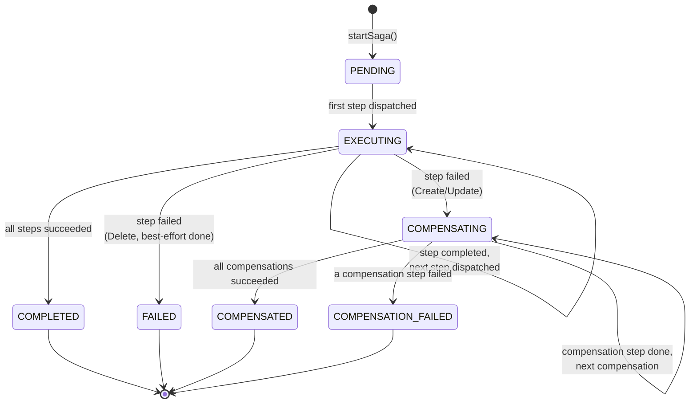
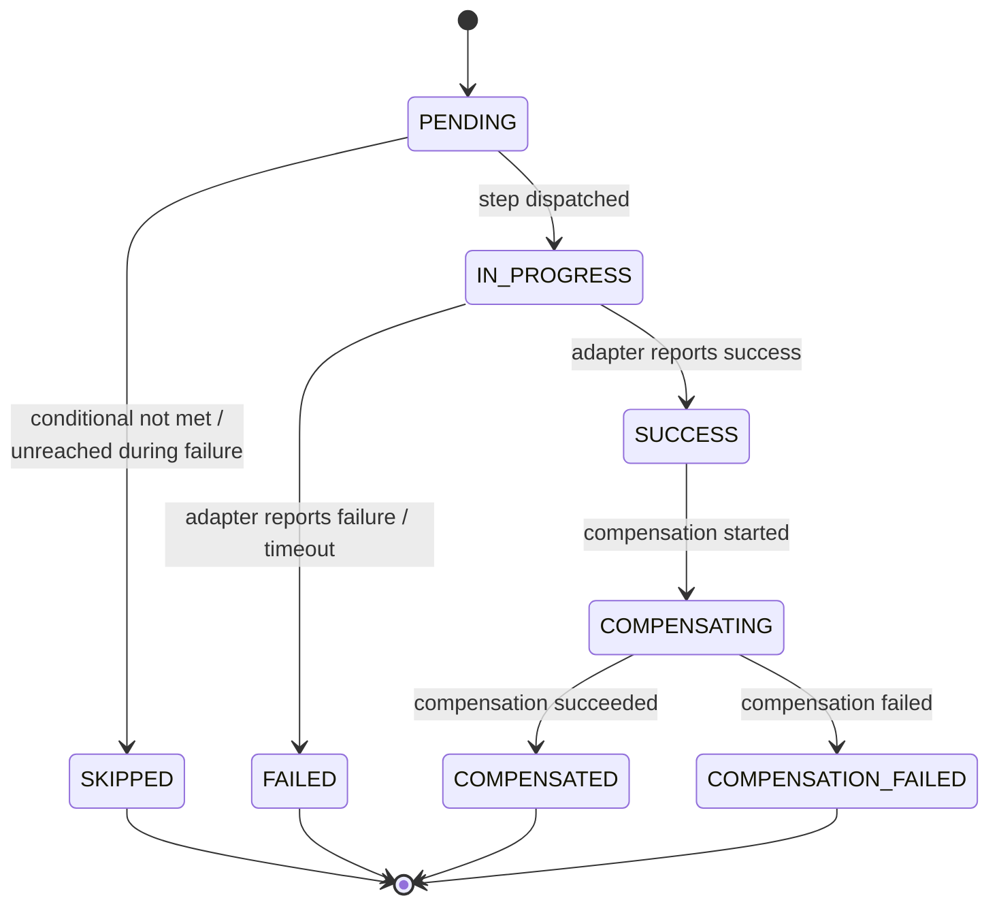
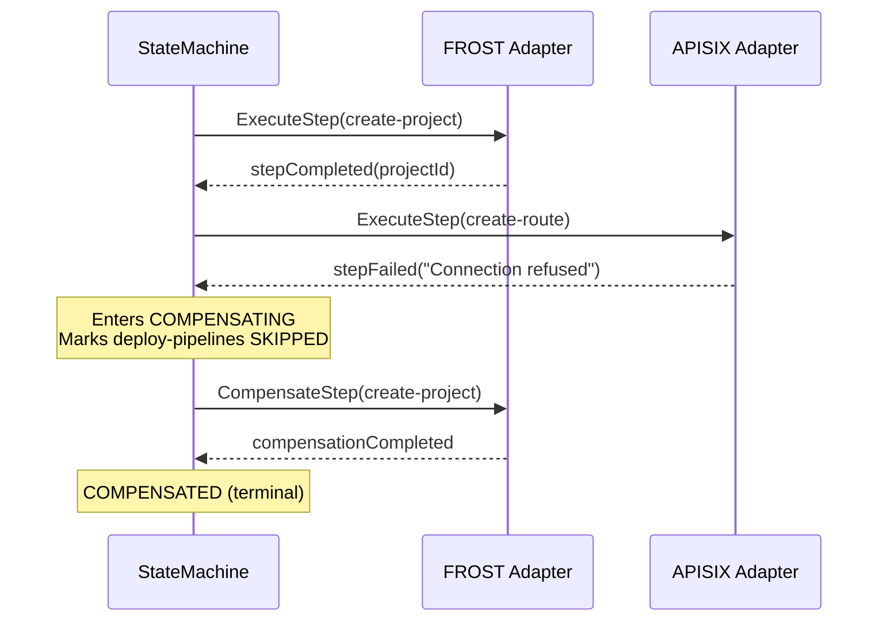
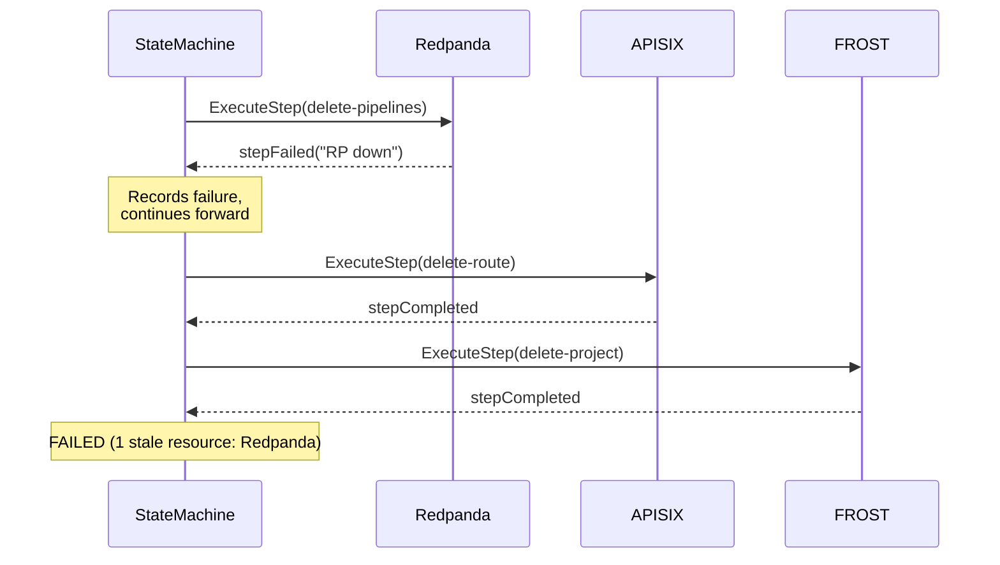
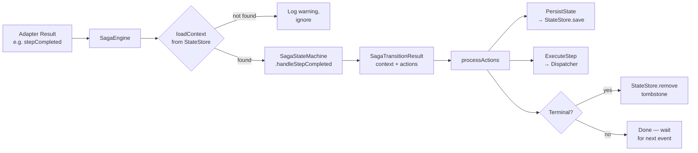
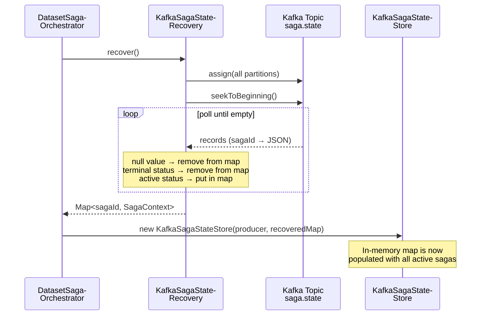
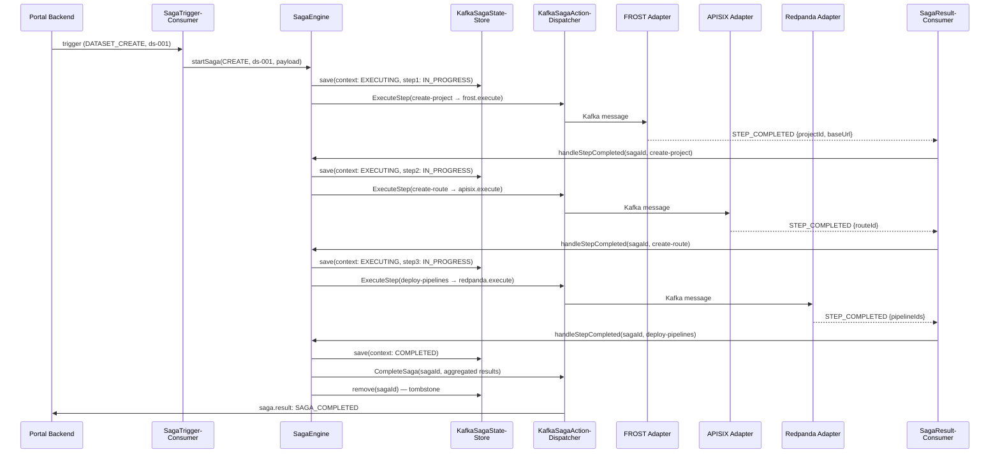
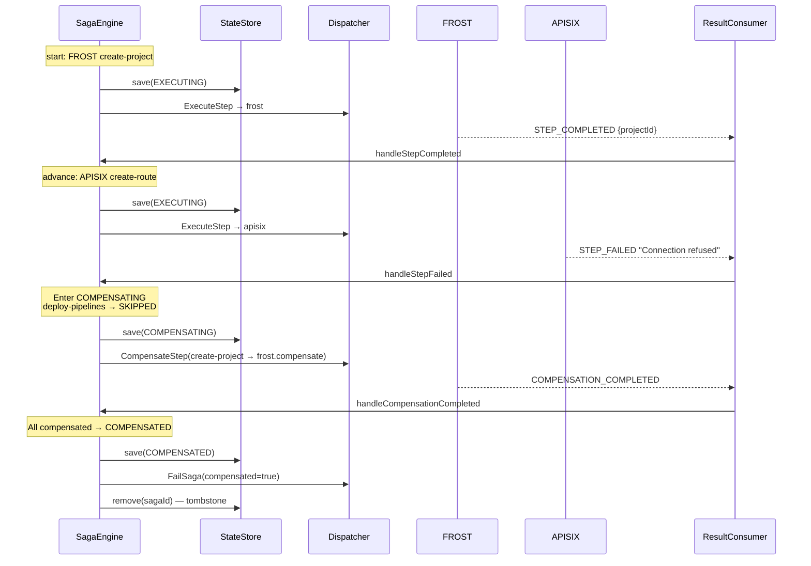

# Saga Orchestrator — Architecture & Developer Guide

> **Module**: `config-adapter-orchestrator`
> **Java**: 21 (Records, Sealed Interfaces, Pattern Matching, Virtual Threads)
> **Related**: [ADR 030](./adr30-saga.md) | [Dataset Use Cases](./SAGA-DATASET-USE-CASES.md)

---

## 1. Design Philosophy

The orchestrator separates **pure logic** from **I/O** into two distinct layers:

| Layer | Package | Depends on Kafka? | Testable with JUnit? |
|-------|---------|-------------------|---------------------|
| Engine (core logic) | `orchestrator.engine` | No | Yes — with `InMemorySagaStateStore` + test dispatcher |
| Kafka integration | `orchestrator.kafka` | Yes | Via Testcontainers |

The `SagaStateMachine` is a **pure function**: it takes the current state and an event, and returns the new state plus a list of actions. It has zero knowledge of Kafka, JSON, or any I/O. This makes it trivially testable — all 57 state machine tests run without any infrastructure.

---

## 2. Component Overview

```
┌─────────────────────────────────────────────────────────────────────┐
│                    DatasetSagaOrchestrator                          │
│                    (wiring + lifecycle)                              │
│                                                                     │
│  ┌─────────────────────────────────────────────────────────────┐   │
│  │                       SagaEngine                             │   │
│  │              (facade — Kafka-free, testable)                 │   │
│  │                                                              │   │
│  │  ┌──────────────┐  ┌──────────────┐  ┌──────────────────┐  │   │
│  │  │ SagaState-   │  │ SagaState-   │  │ SagaAction-      │  │   │
│  │  │ Machine      │  │ Store        │  │ Dispatcher       │  │   │
│  │  │ (pure logic) │  │ (interface)  │  │ (interface)      │  │   │
│  │  └──────────────┘  └──────┬───────┘  └────────┬─────────┘  │   │
│  └───────────────────────────┼───────────────────┼─────────────┘   │
│                              │                   │                  │
│  ┌───────────────────────────┼───────────────────┼─────────────┐   │
│  │  Kafka Layer              │                   │              │   │
│  │                           ▼                   ▼              │   │
│  │  ┌──────────────────┐  ┌──────────────────────────────┐     │   │
│  │  │ KafkaSagaState-  │  │ KafkaSagaActionDispatcher    │     │   │
│  │  │ Store            │  │                              │     │   │
│  │  │ + Recovery       │  │ ExecuteStep  → adapter topic │     │   │
│  │  │                  │  │ CompleteSaga → result topic  │     │   │
│  │  │ Write: Kafka     │  │ FailSaga    → result topic  │     │   │
│  │  │ Read: In-Memory  │  │ ManualInt.  → alert topic   │     │   │
│  │  └──────────────────┘  └──────────────────────────────┘     │   │
│  │                                                              │   │
│  │  ┌──────────────────┐  ┌──────────────────┐                 │   │
│  │  │ SagaResult-      │  │ SagaTrigger-     │                 │   │
│  │  │ Consumer         │  │ Consumer         │                 │   │
│  │  │ (adapter→engine) │  │ (portal→engine)  │                 │   │
│  │  └──────────────────┘  └──────────────────┘                 │   │
│  └──────────────────────────────────────────────────────────────┘   │
└─────────────────────────────────────────────────────────────────────┘
```

---

## 3. The SagaStateMachine

### 3.1 Contract

```
Input:   SagaContext  +  Event  +  SagaDefinition
Output:  SagaTransitionResult { SagaContext, List<SagaAction> }
```

The state machine is a pure function. It never reads from a database, never publishes to Kafka, never calls the clock (the caller passes `Instant now`). It receives the current saga state, applies the event, and returns:

- A **new** `SagaContext` (the old one is immutable — Java records)
- An ordered list of `SagaAction` values describing what the engine should do

### 3.2 Action Types (Sealed Interface)

```java
sealed interface SagaAction {
    record PersistState(SagaContext)              // Save state — always first
    record ExecuteStep(stepId, adapter, topic, …) // Send command to adapter
    record CompensateStep(stepId, adapter, …)     // Send undo command
    record SkipStep(stepId, reason)               // Log conditional skip
    record CompleteSaga(sagaId, resultPayload)    // Saga succeeded
    record FailSaga(sagaId, …, staleResources)    // Saga failed
    record PublishManualIntervention(sagaId, ctx)  // Operator alert
}
```

`PersistState` is **always emitted as the first action** in the list. This guarantees that the engine persists the new state before it sends any command to an adapter. If the process crashes after persisting but before dispatching, recovery will find the saga in the correct state.

### 3.3 Saga Status State Diagram



### 3.4 Step Status State Diagram



### 3.5 Three Execution Modes

#### Create / Update — Forward Execution with Compensation

Steps execute sequentially. On failure, the state machine:

1. Marks the failed step as `FAILED`
2. Marks all unreached `PENDING` steps as `SKIPPED` (clean final state)
3. Transitions to `COMPENSATING`
4. Compensates completed steps in **reverse** order
5. Best-effort: if a compensation fails, continues with remaining compensations



#### Delete — Best-Effort Forward Execution

Steps execute sequentially, but failure does **not** trigger compensation. Instead, the next step is dispatched regardless. The final status depends on whether any step failed:

- All succeeded → `COMPLETED`
- Any failed → `FAILED` + `PublishManualIntervention` with stale resource list



#### Conditional Steps

Steps can be declared as `conditional` in their `SagaStepDefinition`. The `SagaStateMachine` receives a `Predicate<Map<String, Object>>` at construction time. During forward execution, the predicate is evaluated against the trigger payload. If it returns `false`, the step is marked `SKIPPED` and the machine advances to the next step.

**Current predicate**: `HAS_PIPELINES` — checks if `triggerPayload.dataPipelines` is a non-empty list. This controls the Redpanda step in all three saga types.

---

## 4. The SagaEngine

The `SagaEngine` is the **facade** that connects the pure state machine with stateful infrastructure. It is Kafka-free itself — it depends only on the `SagaStateStore` and `SagaActionDispatcher` interfaces.

### 4.1 Responsibilities

| Concern | How |
|---------|-----|
| Duplicate detection | `stateStore.existsForDataset(datasetId)` before starting |
| State transitions | Delegates to `SagaStateMachine`, passes result to `processActions()` |
| Persistence | `PersistState` actions → `stateStore.save()` |
| Dispatching | All other actions → `dispatcher.dispatch()` |
| Cleanup | Terminal sagas → `stateStore.remove(sagaId)` (tombstone) |
| Recovery | `recoverActiveSagas()` queries the store on startup |

### 4.2 processActions() — The Core Loop

```java
private void processActions(SagaTransitionResult result) {
    for (SagaAction action : result.actions()) {
        if (action instanceof SagaAction.PersistState persist) {
            stateStore.save(persist.sagaContext());   // ← always first
        } else {
            dispatcher.dispatch(action);
        }
    }
    if (result.context().status().isTerminal()) {
        stateStore.remove(result.context().sagaId()); // ← tombstone
    }
}
```

The ordering guarantee is critical:

1. **PersistState** is always the first action emitted by the state machine
2. The engine processes actions sequentially
3. Therefore: state is persisted **before** any command is sent
4. If the process crashes after persist but before dispatch, recovery replays the persisted state

### 4.3 Event Flow Through the Engine



---

## 5. State Persistence & Crash Recovery

### 5.1 Architecture: Write-Ahead Log + Read Cache

The `KafkaSagaStateStore` uses a **dual-write** architecture:

```
                    ┌──────────────┐
     save(ctx) ───► │ Kafka Topic  │  (write-ahead log, compacted)
                    │ saga.state   │
                    └──────┬───────┘
                           │ sync write (producer.send().get())
                           │
                           ▼
                    ┌──────────────┐
     findById() ◄── │ ConcurrentH- │  (read cache, in-memory)
     existsFor() ◄─ │ ashMap       │
                    └──────────────┘
```

**Write path** (`save`): The saga context is serialized to JSON and written to the Kafka compacted topic `core.civitas.saga.state` with `sagaId` as the message key. The write is **synchronous** (`producer.send().get(timeout)`) — the method blocks until Kafka acknowledges. Only after the Kafka write succeeds is the in-memory map updated. If the Kafka write fails, an `IllegalStateException` is thrown, preventing the engine from dispatching further actions on inconsistent state.

**Read path** (`findById`, `existsForDataset`, `findActiveSagas`): All reads go against the in-memory `ConcurrentHashMap`. No Kafka consumer is involved at read time. This makes reads O(1) and lock-free.

**Remove path** (`remove`): Writes a **tombstone** record (key = sagaId, value = null) to the Kafka topic. Kafka log compaction will eventually remove all prior records for that key. The in-memory map entry is removed immediately.

### 5.2 Startup Recovery

On startup, the in-memory map is empty. The `KafkaSagaStateRecovery` class replays the entire compacted state topic to rebuild it:



The recovery process:

1. Creates a **dedicated consumer** with a unique group ID (not shared with the runtime consumer)
2. Manually assigns all partitions of the state topic
3. Seeks to the beginning of each partition
4. Polls in a loop until 3 consecutive empty polls (signals end of topic)
5. For each record:
   - **Tombstone** (null value) → removes the entry from the map
   - **Terminal status** (COMPLETED, FAILED, etc.) → removes the entry (compaction may not have run yet)
   - **Active status** → puts/updates the entry in the map
6. Returns an unmodifiable map of recovered active sagas
7. Closes the dedicated consumer

The `DatasetSagaOrchestrator.initialize()` passes this recovered map to the `KafkaSagaStateStore` constructor, which uses it as the initial state of the in-memory cache:

```java
Map<String, SagaContext> recoveredState = recovery.recover();
SagaStateStore stateStore = new KafkaSagaStateStore(producer, timeout, recoveredState);
```

### 5.3 Kafka Topic Configuration

| Topic | Type | Key | Value | Purpose |
|-------|------|-----|-------|---------|
| `core.civitas.saga.state` | Compacted | sagaId | SagaContext JSON / null (tombstone) | Saga state persistence |
| `core.civitas.saga.result` | Standard | sagaId | CompleteSaga / FailSaga JSON | Final saga result for portal-backend |
| `core.civitas.saga.manual-intervention` | Standard | sagaId | SagaContext JSON | Operator alert for compensation failures |
| `core.civitas.dataset.saga.trigger` | Standard | datasetId | Trigger payload JSON | Portal-backend → Orchestrator |
| `core.civitas.dataset.{adapter}.execute` | Standard | sagaId | Step command JSON | Orchestrator → Adapter |
| `core.civitas.dataset.{adapter}.compensate` | Standard | sagaId | Compensation command JSON | Orchestrator → Adapter |
| `core.civitas.dataset.{adapter}.result` | Standard | sagaId | Step result JSON | Adapter → Orchestrator |

Where `{adapter}` is one of: `frost`, `apisix`, `redpanda`.

### 5.4 Crash Recovery Guarantees

| Scenario | Behavior |
|----------|----------|
| Crash after `PersistState`, before `ExecuteStep` | Recovery finds the saga in `EXECUTING` with the step in `IN_PROGRESS`. The adapter never received the command. **Requires re-dispatch** (not yet implemented — see Section 8). |
| Crash after `ExecuteStep`, before adapter responds | Same as above from the orchestrator's perspective. The adapter may have received and processed the command. Adapters must be **idempotent**. |
| Crash after adapter responds, before `PersistState` of next transition | The adapter result is lost. Recovery finds the saga in the state before the response. The adapter result topic still contains the message — re-consuming it will trigger the transition again. |
| Crash after `CompleteSaga` / `FailSaga` | The saga is terminal. `stateStore.remove()` may not have been called. Recovery skips terminal sagas. The tombstone will be written on next startup if needed. |

---

## 6. Saga Definitions & Workflows

### 6.1 Structure

Each saga type is defined as a `SagaDefinition`: an ordered list of `SagaStepDefinition` records:

```java
record SagaStepDefinition(
    String stepId,          // "create-project"
    String adapter,         // "frost"
    String operation,       // "CREATE_PROJECT"
    String compensationOp,  // "DELETE_PROJECT" (null for delete sagas)
    String executeTopic,    // "core.civitas.dataset.frost.execute"
    String compensateTopic, // "core.civitas.dataset.frost.compensate"
    boolean conditional     // false for mandatory, true for pipelines
)
```

### 6.2 Registered Workflows

#### DATASET_CREATE

| # | Step ID | Adapter | Operation | Compensation | Conditional |
|---|---------|---------|-----------|--------------|-------------|
| 1 | `create-project` | frost | CREATE_PROJECT | DELETE_PROJECT | No |
| 2 | `create-route` | apisix | CREATE_ROUTE | DELETE_ROUTE | No |
| 3 | `deploy-pipelines` | redpanda | DEPLOY_PIPELINES | DELETE_PIPELINES | Yes (HAS_PIPELINES) |

#### DATASET_UPDATE

| # | Step ID | Adapter | Operation | Compensation | Conditional |
|---|---------|---------|-----------|--------------|-------------|
| 1 | `update-project` | frost | UPDATE_PROJECT | RESTORE_PROJECT | No |
| 2 | `update-route` | apisix | UPDATE_ROUTE | RESTORE_ROUTE | No |
| 3 | `update-pipelines` | redpanda | UPDATE_PIPELINES | RESTORE_PIPELINES | Yes (HAS_PIPELINES) |

#### DATASET_DELETE (reverse order, no compensation)

| # | Step ID | Adapter | Operation | Compensation | Conditional |
|---|---------|---------|-----------|--------------|-------------|
| 1 | `delete-pipelines` | redpanda | DELETE_PIPELINES | — | Yes (HAS_PIPELINES) |
| 2 | `delete-route` | apisix | DELETE_ROUTE | — | No |
| 3 | `delete-project` | frost | DELETE_PROJECT | — | No |

---

## 7. Data Flow — End-to-End

### 7.1 Dataset Create Happy Path



### 7.2 Dataset Create with Failure and Compensation



---

## 8. Model Classes (config-adapter-api)

All model classes live in `com.civitas.configadapter.model.saga` in the `config-adapter-api` module, so they are available to both the orchestrator and the adapters.

| Class | Type | Purpose |
|-------|------|---------|
| `SagaContext` | Record | Full saga state: ID, type, datasetId, steps, failure, triggerPayload, timestamps. Immutable — `with*()` methods return new instances. |
| `SagaStep` | Record | Individual step state: stepId, adapter, operation, status, result, compensationData, error. Transition methods: `asInProgress()`, `asSucceeded()`, `asFailed()`, `asSkipped()`, `asCompensating()`, `asCompensated()`, `asCompensationFailed()`. |
| `SagaFailure` | Record | Captures where and why a saga failed: stepId, adapter, error, errorCode. |
| `SagaType` | Enum | `DATASET_CREATE`, `DATASET_UPDATE`, `DATASET_DELETE` |
| `SagaStatus` | Enum | Overall saga status with `isTerminal()` method. |
| `SagaStepStatus` | Enum | Individual step status. |
| `SagaContextHelper` | Utility | Static helpers: `findStep()`, `findStepIndex()`, `getNextStepToCompensate()`, `hasCompensationFailure()`, etc. |

---

## 9. Testing Strategy

### 9.1 Layer Separation

| Test Class | Tests | What It Tests | Infrastructure |
|------------|-------|---------------|----------------|
| `SagaStateMachineTest` | 57 | Pure state transitions for all saga types, all step positions, all event types (success, failure, timeout), compensation, conditional skipping | None — pure unit test |
| `SagaEngineTest` | 14 | Engine facade: duplicate detection, state persistence, dispatcher routing, terminal cleanup, recovery | `InMemorySagaStateStore` + `CollectingDispatcher` (no mocks) |
| `SagaKafkaIT` | 5 | Kafka round-trips: state store write/read, recovery, dispatcher publishing, result consumer routing | Testcontainers (real Kafka broker) |

### 9.2 StateMachine Test Coverage

The state machine tests cover every combination of:

- **Saga type**: Create (16), Update (12), Delete (16)
- **Event at each step**: success, failure, timeout
- **Compensation**: success, failure, mixed
- **Conditional steps**: with pipelines, without pipelines
- **Structural guarantees** (13): PersistState ordering, saga ID preservation, unknown stepId handling, compensation order

### 9.3 Running Tests

```bash
# All orchestrator tests (unit + integration)
mvn test -pl config-adapter-orchestrator -am \
    -Dtest="SagaStateMachineTest,SagaEngineTest,SagaKafkaIT" \
    -Dsurefire.failIfNoSpecifiedTests=false

# Unit tests only (fast, no Docker)
mvn test -pl config-adapter-orchestrator -am \
    -Dtest="SagaStateMachineTest,SagaEngineTest" \
    -Dsurefire.failIfNoSpecifiedTests=false

# Single test method
mvn test -pl config-adapter-orchestrator -am \
    -Dtest="SagaStateMachineTest#createFullHappyPath" \
    -Dsurefire.failIfNoSpecifiedTests=false
```

---

## 10. Known Limitations & Future Work

| Area | Current State | Planned |
|------|--------------|---------|
| **Recovery re-dispatch** | Recovered sagas are counted but not re-dispatched. The adapter never receives the command if the crash happened between `PersistState` and `ExecuteStep`. | Inspect `currentStepId` + step status on recovery and re-dispatch `IN_PROGRESS` steps. |
| **Timeout scheduler** | `handleStepTimeout()` exists in the engine but no scheduler invokes it. Timeouts must currently be triggered externally. | `ScheduledExecutorService` that checks step timestamps against configurable timeout durations. |
| **2-arg StateStore constructor** | `KafkaSagaStateStore(producer, timeout)` creates an empty in-memory map. If used without prior recovery, all persisted sagas are invisible to the read path. | Remove or mark as `@VisibleForTesting`. Enforce recovery-first initialization. |
| **Adapter saga handlers** | Adapters don't yet have saga-aware handlers that understand the orchestrator's message format. | Each adapter gets a `*SagaHandler` class that deserializes saga commands and publishes structured results with `sagaId`/`stepId`. |
| **Application.java integration** | The orchestrator is not yet discovered via ServiceLoader in the main application bootstrap. | Register `DatasetSagaOrchestrator` via ServiceLoader, integrate into `Application.run()`. |
