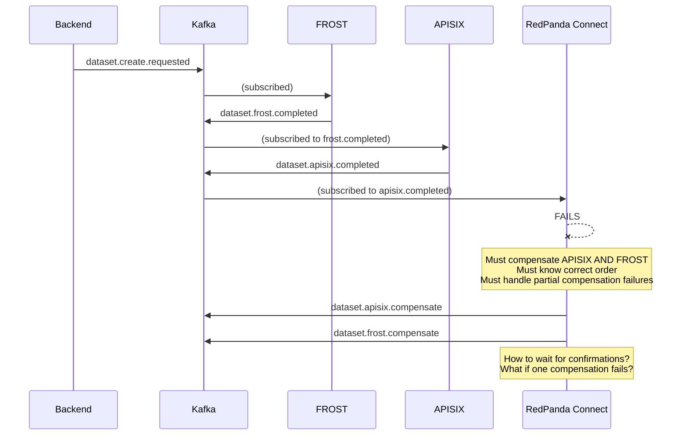
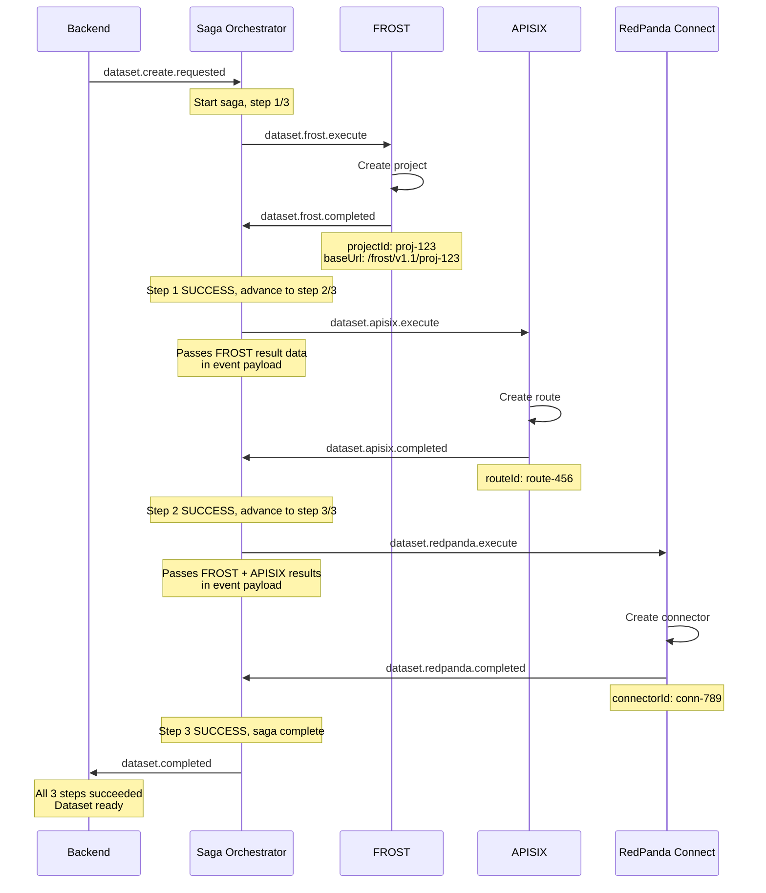
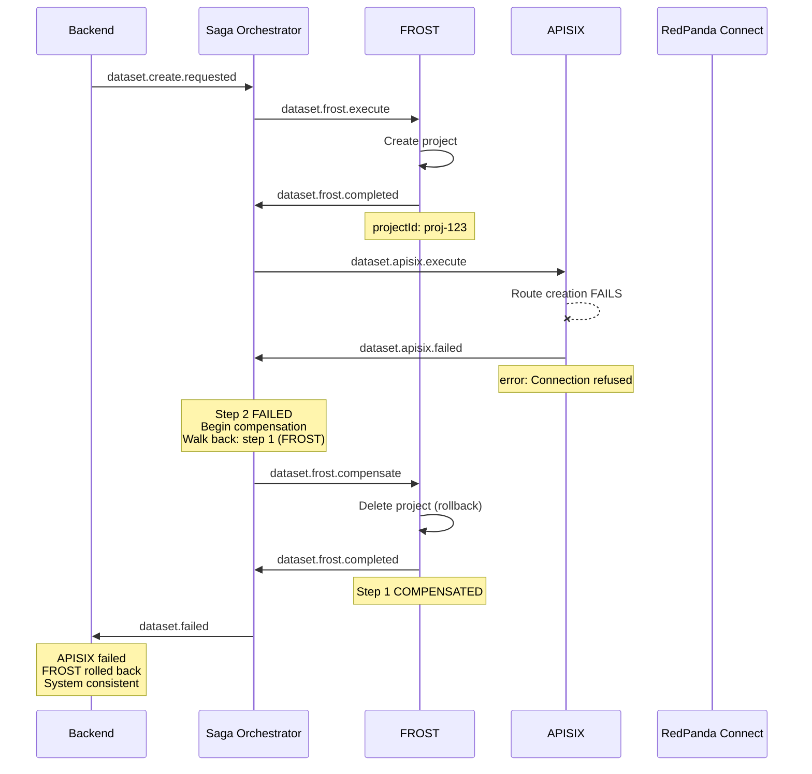
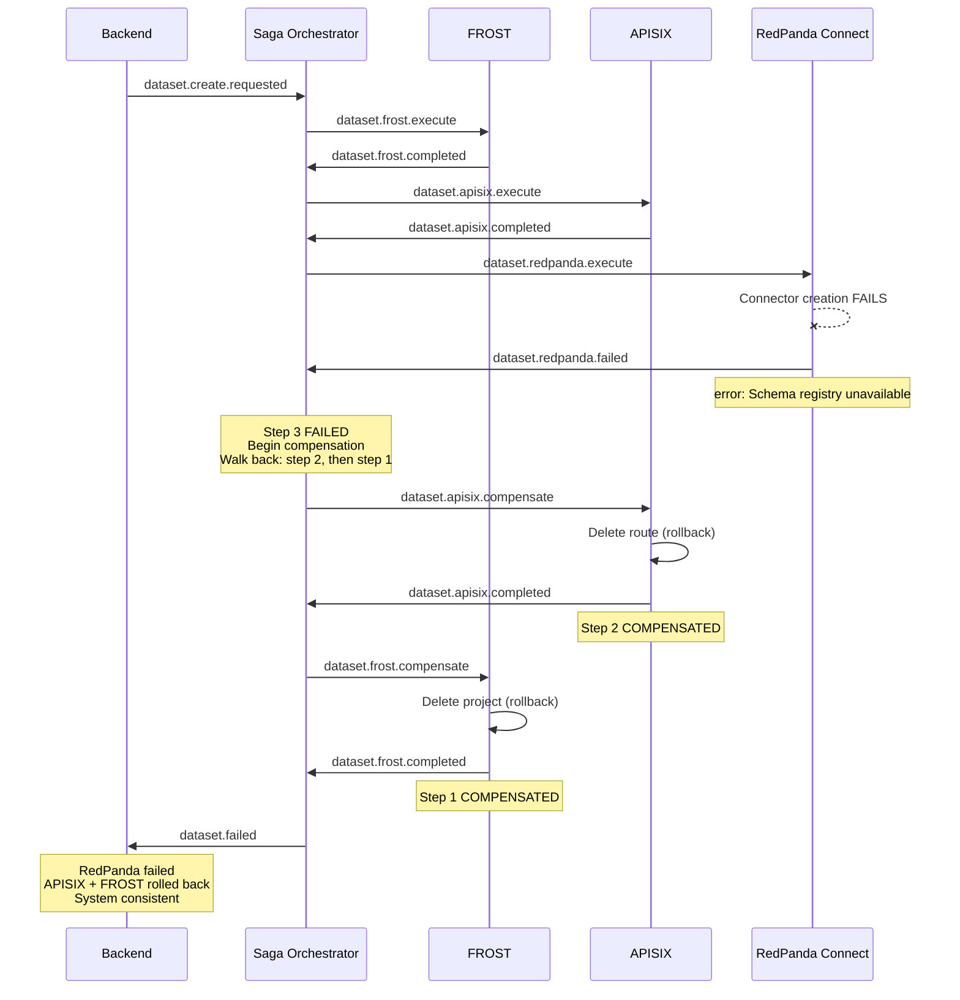
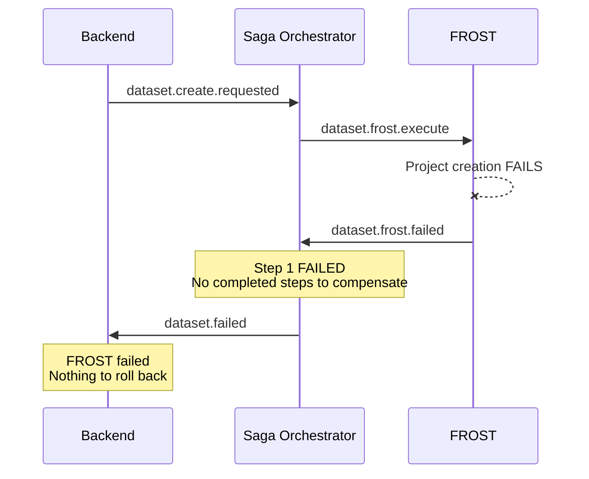
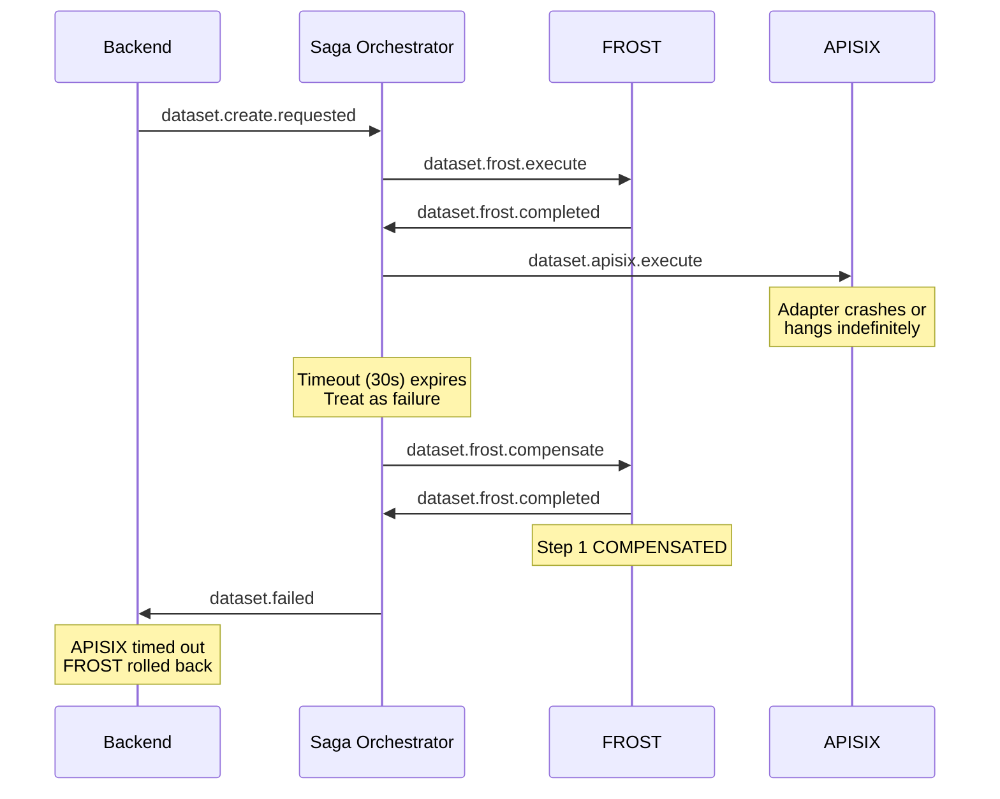

# Saga Orchestrator Design Proposal

> **Status**: Proposal for team discussion (updated with team review feedback)
> **Goal**: Implement distributed configuration workflows across multiple adapters (FROST, APISIX, RedPanda Connect) using a central saga orchestrator

---

## Table of Contents

1. [Problem Statement](#problem-statement)
2. [Why Not Choreography?](#why-not-choreography)
3. [Approach Comparison: Java Orchestrator vs RedPanda Connect](#approach-comparison)
4. [Proposed Design: Java Saga Orchestrator](#proposed-design)
5. [Changes to Existing Code](#changes-to-existing-code)
6. [Topic Structure](#topic-structure)
7. [Event Flows (3 Adapters)](#event-flows)
8. [Contract for New Adapters](#contract-for-new-adapters)
9. [Error Handling and Resilience](#error-handling-and-resilience)
10. [Observability](#observability)
11. [Implementation Plan](#implementation-plan)
12. [Future Vision](#future-vision)

---

## Problem Statement

The platform has multiple configuration pipelines of varying complexity:

**Dataset creation** -- a multi-adapter pipeline:
1. **FROST adapter**: Create a project in the FROST server (OGC SensorThings API)
2. **APISIX adapter**: Create a route in the API gateway pointing to the FROST project
3. **RedPanda Connect adapter**: Create a data connector for the dataset (implemented by a colleague)

If step 2 or 3 fails after earlier steps have succeeded, those earlier changes must be **rolled back** (compensated) to maintain consistency across systems.

**User creation** -- a single-adapter pipeline:
1. **Keycloak adapter**: Create user in Keycloak (realm, roles, groups)

This is trivial from a saga perspective (no compensation needed -- if the single step fails, nothing needs rolling back). Single-adapter pipelines are **not routed through the orchestrator** in the initial implementation. The Keycloak adapter is prepared for saga participation (saga handler implemented) but user creation continues to use the current direct approach. If a second adapter is added to the user pipeline in the future, it can be wired into the orchestrator at that point.

### Current State

Today, each adapter operates independently:
- Subscribes to its own topics (Keycloak to IDM events, FROST to SensorThings events, APISIX to API events)
- Processes CRUD events (`ConfigEvent` with `metadata` + `payload`)
- Publishes results via `EventPublisher.publish()` as `ConfigResultEvent`
- No awareness of multi-step workflows

There is no saga support in the codebase. The `ConfigEvent` record has only `metadata` and `payload` fields. There are no saga-related topics in `Topics.java`, no saga model classes, and no cross-adapter coordination.

### What We Need

A mechanism to:
- Define pipelines with one or more adapters in a specific order
- Execute adapter operations in that order
- Track which steps have completed
- Roll back completed steps in reverse order if a later step fails
- Keep individual adapters decoupled from each other
- Support both complex pipelines (dataset: 3 adapters) and trivial ones (user: 1 adapter)

---

## Why Not Choreography?

In a choreography-based saga, each adapter listens for the previous adapter's completion event and triggers compensation on previous adapters if it fails. This works for 2 adapters but breaks down with 3+.

### Choreography with 3 Adapters

| Adapter | Would subscribe to | Must compensate on failure | Must know about |
|---------|-------------------|---------------------------|-----------------|
| FROST | `dataset.create.requested` | nothing | nothing |
| APISIX | `dataset.frost.completed` | FROST | FROST's compensation topic |
| RedPanda | `dataset.apisix.completed` | APISIX + FROST | Both compensation topics + ordering |

Problems:
- **The last adapter must know all previous adapters**: RedPanda Connect would need to trigger APISIX compensation, wait for it, then trigger FROST compensation
- **Compensation ordering is complex**: must compensate in reverse. Should RedPanda wait for APISIX compensation before triggering FROST? What if APISIX compensation fails?
- **Coupling grows as n*(n-1)/2**: adding a 4th adapter means it needs to know 3 compensation topics
- **Different teams maintain coupled code**: the RedPanda Connect colleague would need to understand FROST and APISIX internals



---

## Approach Comparison

### Java Orchestrator Module vs RedPanda Connect as Orchestrator

| Criterion | Java Orchestrator Module | RedPanda Connect Orchestrator |
|-----------|------------------------|-------------------------------|
| **Architecture** | New `saga-orchestrator` Maven module in config-adapter reactor | RedPanda Connect pipelines configured via YAML |
| **State management** | Orchestrator-owned saga state, persisted via Kafka compacted state topic | No built-in state; requires external store (Redis, database) for saga tracking |
| **Async request-reply** | Native: publish command to topic A, consume reply from topic B, correlate by sagaId | Not built-in: RedPanda Connect pipelines are single-direction stream processors. Would need multiple pipelines + external state to correlate request/reply pairs |
| **Compensation logic** | Java code: walk completed steps in reverse, send compensate commands, wait for replies | YAML pipeline: would need conditional routing + external state to track which steps need compensating. Essentially recreating orchestrator logic in a less capable language |
| **Error handling** | Full Java error handling: try/catch, retry with backoff, timeout handling, dead-letter routing | Limited: pipeline-level error handling, no per-step retry with different strategies |
| **Testability** | JUnit tests with mocked Kafka; same testing patterns as existing adapters | Pipeline integration tests; harder to unit test compensation flows |
| **Team familiarity** | Same tech stack as all other adapters (Java, Maven, ServiceLoader) | New tool for most team members; RedPanda Connect expertise concentrated in one person |
| **Deployment** | Deployed as part of the existing config-adapter application (ServiceLoader discovers it) | Separate deployment; additional infrastructure component to manage |
| **Future extensibility** | Can add REST/gRPC API for backend to trigger/query sagas directly | Would still need a Java/other service for API exposure |
| **Saga type flexibility** | Can define different step orderings per saga type (create vs delete vs update) | Each saga type would require a separate pipeline configuration |
| **Complexity** | ~5-8 new Java classes + tests | Multiple YAML pipelines + Redis/external state + glue code |

### Assessment: RedPanda Connect for Saga Orchestration

RedPanda Connect is a **stream processor** designed for data transformation and routing pipelines. It excels at:
- Transforming messages between formats (JSON, Avro, Protobuf)
- Routing messages between systems (Kafka, HTTP, databases)
- Fan-out / fan-in patterns for data pipelines

It is **not designed** for:
- Async request-reply workflows (send command, wait for response on different topic)
- Durable workflow state management (which step succeeded, which needs compensation)
- Conditional compensation logic (walk back completed steps in reverse order)
- Correlation of multiple asynchronous responses to a single workflow instance

Using RedPanda Connect as a saga orchestrator would require working around these limitations by adding external state (Redis), multiple coordinated pipelines, and custom logic that essentially re-implements the orchestrator pattern in YAML instead of Java.

### Recommendation

**Java Saga Orchestrator Module** is the recommended approach because:
1. It fits naturally into the existing architecture (ServiceLoader, Maven modules, shared model classes)
2. The team already works in Java; no new tooling or expertise needed
3. It enables future API exposure without additional components
4. It keeps RedPanda Connect focused on what it does best: stream processing

---

## Proposed Design

### Overview

A central `SagaOrchestrator` component manages multi-adapter workflows. It is **not** a `ConfigAdapter` -- it doesn't configure external systems. It coordinates execution order, tracks state, and handles compensation.

Each adapter only handles two command types from the orchestrator: **execute** (do your work) and **compensate** (undo your work). No adapter knows about any other adapter.

```
Orchestrator --> FROST.execute --> FROST replies completed/failed
Orchestrator --> APISIX.execute --> APISIX replies completed/failed
Orchestrator --> RedPanda.execute --> RedPanda replies completed/failed
                                      (on failure: Orchestrator walks back)
Orchestrator --> APISIX.compensate --> APISIX replies
Orchestrator --> FROST.compensate --> FROST replies
```

### Key Design Decisions

These decisions were made during the team review of the initial proposal:

| Decision | Choice | Rationale |
|----------|--------|-----------|
| **Source of truth** | Orchestrator owns saga state | Adapters return their result; orchestrator merges it into its internal state |
| **Data sent to adapters** | Orchestrator sends only what the adapter needs | Adapters must cope with receiving a full `SagaContext` but only read their own step's data |
| **Step identification** | Unique `stepId` strings | Stable across saga types and adapter reordering; no coupling to execution position |
| **State persistence** | Kafka compacted state topic | No external infrastructure; automatic recovery on restart |
| **Timeouts** | Orchestrator-side, configurable per step | Self-healing; detects stuck adapters |
| **Horizontal scaling** | Partition by `sagaId` | All events for a saga land on same partition; natural Kafka scaling |
| **Concurrent saga dedup** | Kafka partition by dataset ID + orchestrator rejects duplicates | Prevents two sagas for same dataset from racing |
| **Topic strategy** | Separate topics per adapter | Clear isolation, no filtering, independent monitoring |
| **User pipeline** | Not routed through orchestrator initially | Adapter is saga-ready but single-adapter pipelines don't need orchestration |
| **Idempotency** | Mandatory for all operations | Kafka at-least-once delivery guarantees duplicate messages |
| **Delete compensation** | Not supported initially; soft delete long-term | Delete is destructive; recreating resources reliably is not feasible for all external systems |

### New Interface: `SagaOrchestrator`

Defined in `config-adapter-api`:

```java
package de.civitascore.configadapter.orchestrator;

import de.civitascore.configadapter.configuration.AdapterConfig;
import de.civitascore.configadapter.messaging.EventPublisher;
import de.civitascore.configadapter.model.ConfigEvent;
import java.util.List;

/**
 * Central saga orchestrator that manages multi-adapter workflow execution.
 * Unlike ConfigAdapter, this component does not configure external systems --
 * it coordinates the execution order, tracks state, and handles compensation.
 *
 * Discovered via ServiceLoader<SagaOrchestrator>.
 */
public interface SagaOrchestrator {

    /** Process an incoming saga event (trigger, adapter reply, or timeout). */
    void processSagaEvent(String topic, ConfigEvent event);

    /** Topics this orchestrator subscribes to (triggers + all adapter reply topics). */
    List<String> getSubscribedTopics();

    /** Set the event publisher for sending commands to adapters. */
    void setEventPublisher(EventPublisher publisher);

    /** Initialize with application configuration. */
    void initialize(AdapterConfig config);

    /** Unique name for ServiceLoader discovery (e.g., "saga-orchestrator"). */
    String getName();
}
```

### Saga Model Classes

New package `de.civitascore.configadapter.model.saga` in `config-adapter-api`:

```java
// Saga workflow types
public enum SagaType {
    DATASET_CREATE,
    DATASET_DELETE,
    USER_CREATE,
    USER_DELETE
}

// Overall saga status
public enum SagaStatus {
    PENDING,
    IN_PROGRESS,
    SUCCESS,
    FAILED,
    COMPENSATING,
    COMPENSATED,
    COMPENSATION_FAILED
}

// Individual step status
public enum SagaStepStatus {
    PENDING,
    IN_PROGRESS,
    SUCCESS,
    FAILED,
    COMPENSATING,
    COMPENSATED,
    COMPENSATION_FAILED
}

// Tracks an individual adapter step within the saga
public record SagaStep(
    String stepId,                         // unique identifier (e.g., "create-project")
    String adapter,                        // adapter name for routing (e.g., "frost")
    String operation,                      // what to do (e.g., "CREATE_PROJECT")
    SagaStepStatus status,
    Map<String, Object> result,            // adapter-specific output (e.g. projectId, routeId)
    Map<String, Object> compensation       // data needed to undo this step
) {}

// Captures where and why the saga failed
public record SagaFailure(
    String stepId,
    String adapter,
    String error,
    String errorCode
) {}

// Full saga context, maintained by the orchestrator
public record SagaContext(
    String sagaId,
    SagaType sagaType,
    String currentStepId,
    int totalSteps,
    SagaStatus status,
    List<SagaStep> steps,
    SagaFailure failedAt
) {}
```

Steps are identified by `stepId` (a unique string like `"create-project"`) rather than positional numbers. This makes step references stable across saga types -- e.g., the APISIX adapter always reads from `findStep(saga, "create-project")` regardless of whether it's a create or delete pipeline, and regardless of whether new adapters are inserted between existing ones.

**Note on dynamic steps**: If a saga needs to invoke the same adapter multiple times (e.g., creating multiple datastreams in FROST), each invocation gets a distinct `stepId` (e.g., `"create-datastream-temperature"`, `"create-datastream-humidity"`). For truly dynamic/repeated steps where the count is not known at definition time, this requires a loop construct in the pipeline definition -- a future consideration for the EMF-based configurable pipelines.

### Extending `ConfigEvent`

The existing `ConfigEvent` record needs a new optional `saga` field:

```java
// Before (committed):
public record ConfigEvent(
    Metadata metadata,
    Payload payload
) {}

// After:
public record ConfigEvent(
    Metadata metadata,
    Payload payload,
    @JsonProperty("saga") SagaContext saga
) {
    /** Returns true if this event is part of a saga workflow. */
    public boolean isSagaEvent() {
        return saga != null;
    }
}
```

Non-saga events continue to work unchanged -- the `saga` field is simply `null`.

### Extending `EventPublisher`

The `EventPublisher` interface needs a new method to publish full `ConfigEvent` objects (with saga context) alongside the existing `publish()` for `ConfigResultEvent`:

```java
public interface EventPublisher extends EventBase {

    // Existing: publish result events
    void publish(String topic, ConfigResultEvent resultEvent);

    // New: publish full ConfigEvents (with saga context) between saga steps
    default void publishConfigEvent(
        String topic, ConfigEvent configEvent, String sourceAdapter, String eventType) {
        throw new FatalAdapterException(
            AdapterErrorCode.UNSUPPORTED_OPERATION, "publishConfigEvent");
    }
}
```

The `KafkaEventHandler` would implement this new method to serialize `ConfigEvent` as a CloudEvent. The `sagaId` MUST be used as the Kafka message key to ensure all events for a saga land on the same partition (required for horizontal scaling and concurrent saga deduplication).

### Extending `AbstractConfigAdapter`

Add a helper method for adapters to publish saga events:

```java
public abstract class AbstractConfigAdapter implements ConfigAdapter {

    // ... existing code ...

    /**
     * Publishes a saga event to the specified topic.
     */
    protected void publishSagaEvent(String topic, ConfigEvent event, String eventType) {
        if (getEventPublisher() == null) {
            return;
        }
        getEventPublisher().publishConfigEvent(topic, event, getAdapterSource(), eventType);
    }
}
```

### New Maven Module: `saga-orchestrator`

```
config-adapter/
  config-adapter-api/           # shared interfaces + model (existing)
  config-adapter-frost/         # FROST adapter (existing)
  config-adapter-apisix/        # APISIX adapter (existing)
  config-adapter-redpanda/      # RedPanda Connect adapter (new, by colleague)
  saga-orchestrator/            # NEW: saga orchestrator module
    src/main/java/.../
      DatasetSagaOrchestrator.java
      SagaStepDefinition.java
    src/main/resources/
      META-INF/services/
        de.civitascore.configadapter.orchestrator.SagaOrchestrator
    pom.xml                          # depends on config-adapter-api
  config-adapter-application/   # wires everything together (existing)
```

### ServiceLoader Discovery in `Application.java`

The `Application` class currently discovers `ConfigAdapter` implementations via ServiceLoader. It would additionally discover `SagaOrchestrator` implementations:

```java
// In Application.createConsumers() -- new block alongside adapter discovery:
ServiceLoader<SagaOrchestrator> orchestrators = ServiceLoader.load(SagaOrchestrator.class);
for (SagaOrchestrator orchestrator : orchestrators) {
    orchestrator.initialize(config);
    orchestrator.setEventPublisher(publisher);
    ConfigAdapter bridge = new OrchestratorAdapterBridge(orchestrator);
    EventConsumer consumer = createConsumer(config, consumerName, bridge);
    consumers.add(consumer);
}
```

Horizontal scaling is supported via Kafka consumer groups: multiple orchestrator instances can share the load. Because all saga events use `sagaId` as the Kafka message key, all events for a given saga are processed by the same partition and thus the same orchestrator instance.

### Orchestrator State Management

The orchestrator is the **single source of truth** for saga state. It maintains:

1. **Step definitions**: an ordered list of adapter steps per saga type
2. **Active saga state**: in-memory map of `sagaId -> SagaContext` for running sagas
3. **Persistent state**: every state transition is written to a Kafka compacted topic (`de.civitascore.saga.state`), keyed by `sagaId`

On startup, the orchestrator replays the state topic to rebuild all in-flight sagas. Combined with per-step timeouts, this means sagas that were in-flight during a crash are automatically recovered and either resumed or timed out.

The orchestrator sends adapters only the data they need (their step definition, relevant input from previous steps). Adapters return their result, and the orchestrator merges it into its internal state. Adapters must be designed to handle receiving a full `SagaContext` but should only read their own step's data via `SagaContextHelper.findStep()`.

### Orchestrator Configuration and Data Flow

#### Step Order: Defined in Code

Step definitions are hardcoded per saga type in the `DatasetSagaOrchestrator` for the initial implementation. This follows the same pattern as adapter topic subscriptions: the topics come from `application.properties`, but the processing logic lives in Java. A later version will make pipeline definitions configurable via an EMF model (see [Configurable Pipelines via EMF](#configurable-pipelines-via-emf)).

```java
// Dataset create pipeline (3 adapters):
private static final List<SagaStepDefinition> DATASET_CREATE_STEPS = List.of(
    new SagaStepDefinition("create-project",   "frost",    "CREATE_PROJECT",
        Topics.DATASET_FROST_EXECUTE,     Topics.DATASET_FROST_COMPENSATE),
    new SagaStepDefinition("create-route",     "apisix",   "CREATE_ROUTE",
        Topics.DATASET_APISIX_EXECUTE,    Topics.DATASET_APISIX_COMPENSATE),
    new SagaStepDefinition("create-connector", "redpanda", "CREATE_CONNECTOR",
        Topics.DATASET_REDPANDA_EXECUTE,  Topics.DATASET_REDPANDA_COMPENSATE)
);

// Dataset delete pipeline (reverse order):
private static final List<SagaStepDefinition> DATASET_DELETE_STEPS = List.of(
    new SagaStepDefinition("delete-connector", "redpanda", "DELETE_CONNECTOR",
        Topics.DATASET_REDPANDA_EXECUTE,  Topics.DATASET_REDPANDA_COMPENSATE),
    new SagaStepDefinition("delete-route",     "apisix",   "DELETE_ROUTE",
        Topics.DATASET_APISIX_EXECUTE,    Topics.DATASET_APISIX_COMPENSATE),
    new SagaStepDefinition("delete-project",   "frost",    "DELETE_PROJECT",
        Topics.DATASET_FROST_EXECUTE,     Topics.DATASET_FROST_COMPENSATE)
);

// User pipeline (single adapter -- not routed through orchestrator initially):
private static final List<SagaStepDefinition> USER_CREATE_STEPS = List.of(
    new SagaStepDefinition("create-user", "keycloak", "CREATE_USER",
        Topics.USER_KEYCLOAK_EXECUTE,     Topics.USER_KEYCLOAK_COMPENSATE)
);
```

Adding or reordering adapters means changing this Java code and redeploying. This is acceptable because adding a new adapter already requires code changes (new Maven module, new topic enum values, new saga handler).

#### Data Flow: Orchestrator Routes Data Between Steps

The orchestrator is **data-agnostic** -- it only manages state transitions and topic routing. Each adapter writes its results into its own `SagaStep.result` map, and the orchestrator passes relevant data from previous steps to the next adapter.

```
Step 1: Orchestrator sends execute to FROST
        Event payload: original request from backend
        SagaContext: "create-project" step data

Step 1: FROST replies completed
        Result: {projectId: "proj-123", baseUrl: "http://..."}

Step 2: Orchestrator sends execute to APISIX
        Includes FROST result data from "create-project" step
        APISIX reads: SagaContextHelper.findStep(saga, "create-project")
                        .result().get("projectId")

Step 2: APISIX replies completed
        Result: {routeId: "route-456"}

Step 3: Orchestrator sends execute to RedPanda
        Includes FROST and APISIX results
        RedPanda reads whatever it needs from "create-project" and "create-route" steps
```

Each adapter knows **which stepId** to read from (APISIX reads `"create-project"` = FROST's step), but not what FROST is or how it works. This coupling is minimal and documented in each adapter's saga handler.

Concretely, the APISIX saga handler would look like:

```java
// In ApisixSagaHandler.handleExecute():
SagaStep frostStep = SagaContextHelper.findStep(event.saga(), "create-project");
String projectId = String.valueOf(frostStep.result().get("projectId"));
String baseUrl = String.valueOf(frostStep.result().get("baseUrl"));
// Build the APISIX route config from these values
Map<String, Object> routeConfig = buildRouteConfigFromFrostResult(projectId, baseUrl);
```

For compensation, the same principle applies: each step's `SagaStep.compensation` map contains the data needed to undo that step (e.g., `{"operation": "DELETE_PROJECT", "projectId": "proj-123"}`). The orchestrator just forwards the context.

### Orchestrator Internal Design

When processing events, the orchestrator follows this logic:

```
receive event on topic:
  if trigger topic (dataset.create.requested):
    -> check for in-flight saga with same dataset ID; reject if exists
    -> look up step definitions for the saga type
    -> create SagaContext with all steps PENDING
    -> persist state to saga.state topic
    -> send execute command to first step
  if adapter.completed reply:
    -> merge adapter result into orchestrator's SagaContext
    -> if more steps: persist state, forward to next step's execute topic
    -> if last step: persist final state, publish dataset.completed
  if adapter.failed reply:
    -> merge failure into SagaContext
    -> begin compensation: walk back completed steps in reverse
    -> persist state, send compensate command to last completed step
  if compensation reply (adapter.completed with COMPENSATED status):
    -> merge compensation result into SagaContext
    -> if more steps to compensate: persist state, send compensate to next (going backward)
    -> if all compensated: persist final state, publish dataset.failed
  if timeout detected (periodic check):
    -> treat as adapter failure, begin compensation
```

### Timeout Handling

The orchestrator tracks when each command was sent and runs a periodic check (e.g., every 10 seconds) for expired steps.

Timeouts are configurable per step via application properties:

```properties
saga.timeout.default=30s
saga.timeout.frost=60s
saga.timeout.redpanda=120s
```

When a step times out:
1. The orchestrator treats it as a failure (same as receiving a `*.failed` reply)
2. Marks the step as `FAILED` with a timeout error
3. Begins compensation for completed steps

This ensures the system is self-healing -- stuck sagas don't require manual intervention to detect.

### Concurrent Saga Deduplication

To prevent race conditions from two simultaneous CREATE requests for the same dataset:

1. **Kafka partitioning**: The dataset ID is used as the Kafka message key for trigger events. All events for the same dataset land on the same partition, ensuring sequential processing within one orchestrator instance.
2. **Orchestrator-level check**: Before starting a new saga, the orchestrator checks if a saga for the same dataset is already in-flight. If so, the second request is rejected with an error.

This two-layer approach provides both infrastructure-level ordering and application-level safety.

### Saga Context Helper

A utility class for common saga context operations, used by both the orchestrator and adapter saga handlers:

```java
public final class SagaContextHelper {
    public static SagaStep findStep(SagaContext saga, String stepId);
    public static SagaContext markStepSuccess(SagaContext saga, String stepId, Map result, Map compensation, SagaStatus status);
    public static SagaContext markStepFailed(SagaContext saga, String stepId, SagaFailure failure);
    public static SagaContext markStepCompensated(SagaContext saga, String stepId);
    public static SagaContext markStepWithStatus(SagaContext saga, String stepId, SagaStepStatus status);
    public static SagaContext withCurrentStep(SagaContext saga, String currentStepId);
    public static Metadata createSagaMetadata(String source, ConfigEvent originalEvent);
}
```

---

## Changes to Existing Code

### Summary

| File | Change |
|------|--------|
| `ConfigEvent` | Add optional `saga` field (`SagaContext`), add `isSagaEvent()` method |
| `EventPublisher` | Add `publishConfigEvent()` default method |
| `AbstractConfigAdapter` | Add `publishSagaEvent()` helper method |
| `KafkaEventHandler` | Implement `publishConfigEvent()` -- serialize `ConfigEvent` as CloudEvent, use `sagaId` as message key |
| `Topics.java` | Add saga topics (see below) |
| `AdapterErrorCode` | Add saga error codes (e.g., `SAGA_STEP_FAILED`, `SAGA_COMPENSATION_FAILED`, `SAGA_INVALID_CONTEXT`) |
| `AdapterOperation` | Add saga operations (e.g., `SAGA_FROST_CREATE_PROJECT`, `SAGA_APISIX_CREATE_ROUTE`) |
| `FrostAdapter` | Add saga event routing in `doProcessConfigEvent()`, delegate to `FrostSagaHandler` |
| `ApisixAdapter` | Add saga event routing in `doProcessConfigEvent()`, delegate to `ApisixSagaHandler` |
| `KeycloakAdapter` | Add saga event routing in `doProcessConfigEvent()`, delegate to `KeycloakSagaHandler` |
| `Application.java` | Add ServiceLoader discovery for `SagaOrchestrator` |
| `application.properties` | Add orchestrator config and saga topics to adapter subscriptions |

### What Stays Unchanged

- `ConfigAdapter` interface
- All existing CRUD logic in `FrostAdapter`, `ApisixAdapter`, and `KeycloakAdapter`
- `ConfigResultEvent` and non-saga `publish()` method
- `KafkaEventHandler` existing consumer/retry/DLQ logic
- All existing topics and their handling

### Adapter Saga Handlers

Each adapter gets a package-private saga handler class that is separate from the main CRUD logic:

| Class | Module | Handles |
|-------|--------|---------|
| `FrostSagaHandler` | `config-adapter-frost` | `frost.execute` (create project, reply completed/failed) and `frost.compensate` (delete project, reply compensated) |
| `ApisixSagaHandler` | `config-adapter-apisix` | `apisix.execute` (create route, reply completed/failed) and `apisix.compensate` (delete route, reply compensated) |
| `KeycloakSagaHandler` | `config-adapter-keycloak` | `keycloak.execute` (create user, reply completed/failed) and `keycloak.compensate` (delete user, reply compensated) |

The main adapter routes saga events to the handler:

```java
// In FrostAdapter.doProcessConfigEvent():
if (event.isSagaEvent()) {
    sagaHandler.handle(topic, event);
    return;
}
// ... existing CRUD logic unchanged ...
```

---

## Topic Structure

Each adapter gets a pair of command topics (execute, compensate) and a pair of reply topics (completed, failed). The orchestrator subscribes to all trigger and reply topics. Each adapter only subscribes to its own execute and compensate topics.

Separate topics per adapter are used (rather than central `saga.commands` / `saga.replies` topics with header-based routing) for clear isolation, independent monitoring per adapter, and simpler adapter implementation (no message filtering needed).

### Dataset Pipeline Topics

| Topic | Direction | Purpose |
|-------|-----------|---------|
| **Saga triggers** | | |
| `de.civitascore.dataset.create.requested` | Backend -> Orchestrator | Start dataset create saga |
| **FROST adapter** | | |
| `de.civitascore.dataset.frost.execute` | Orchestrator -> FROST | Execute FROST step |
| `de.civitascore.dataset.frost.completed` | FROST -> Orchestrator | FROST success reply |
| `de.civitascore.dataset.frost.failed` | FROST -> Orchestrator | FROST failure reply |
| `de.civitascore.dataset.frost.compensate` | Orchestrator -> FROST | Compensate FROST |
| **APISIX adapter** | | |
| `de.civitascore.dataset.apisix.execute` | Orchestrator -> APISIX | Execute APISIX step |
| `de.civitascore.dataset.apisix.completed` | APISIX -> Orchestrator | APISIX success reply |
| `de.civitascore.dataset.apisix.failed` | APISIX -> Orchestrator | APISIX failure reply |
| `de.civitascore.dataset.apisix.compensate` | Orchestrator -> APISIX | Compensate APISIX |
| **RedPanda Connect adapter** | | |
| `de.civitascore.dataset.redpanda.execute` | Orchestrator -> RedPanda | Execute RedPanda step |
| `de.civitascore.dataset.redpanda.completed` | RedPanda -> Orchestrator | RedPanda success reply |
| `de.civitascore.dataset.redpanda.failed` | RedPanda -> Orchestrator | RedPanda failure reply |
| `de.civitascore.dataset.redpanda.compensate` | Orchestrator -> RedPanda | Compensate RedPanda |
| **Dataset saga results** | | |
| `de.civitascore.dataset.completed` | Orchestrator -> Backend | Dataset saga succeeded |
| `de.civitascore.dataset.failed` | Orchestrator -> Backend | Dataset saga failed (compensated) |
| **Orchestrator state** | | |
| `de.civitascore.saga.state` | Orchestrator (internal) | Compacted topic for saga state persistence and crash recovery |

### User Pipeline Topics

The user pipeline is **not routed through the orchestrator** in the initial implementation. The Keycloak adapter is saga-ready with the following topics prepared for future use:

| Topic | Direction | Purpose |
|-------|-----------|---------|
| `de.civitascore.user.keycloak.execute` | Orchestrator -> Keycloak | Execute Keycloak step |
| `de.civitascore.user.keycloak.completed` | Keycloak -> Orchestrator | Keycloak success reply |
| `de.civitascore.user.keycloak.failed` | Keycloak -> Orchestrator | Keycloak failure reply |
| `de.civitascore.user.keycloak.compensate` | Orchestrator -> Keycloak | Compensate Keycloak |

These topics will be activated when a second adapter is added to the user pipeline.

### Subscriptions

**Orchestrator** subscribes to:
```
# Dataset pipeline
de.civitascore.dataset.create.requested    (trigger)
de.civitascore.dataset.frost.completed     (reply)
de.civitascore.dataset.frost.failed        (reply)
de.civitascore.dataset.apisix.completed    (reply)
de.civitascore.dataset.apisix.failed       (reply)
de.civitascore.dataset.redpanda.completed  (reply)
de.civitascore.dataset.redpanda.failed     (reply)
de.civitascore.saga.state                  (internal: state recovery on startup)
```

**FROST adapter** subscribes to (saga topics added to existing FROST topics):
```
de.civitascore.dataset.frost.execute       (command)
de.civitascore.dataset.frost.compensate    (command)
```

**APISIX adapter** subscribes to (saga topics added to existing APISIX topics):
```
de.civitascore.dataset.apisix.execute      (command)
de.civitascore.dataset.apisix.compensate   (command)
```

**RedPanda Connect adapter** subscribes to:
```
de.civitascore.dataset.redpanda.execute    (command)
de.civitascore.dataset.redpanda.compensate (command)
```

**Keycloak adapter** subscribes to existing IDM topics only (saga topics prepared but not active).

---

## Event Flows

### Success: All 3 Adapters Succeed



### Failure at Step 2 (APISIX): Compensate FROST



### Failure at Step 3 (RedPanda): Compensate APISIX then FROST



### Failure at Step 1 (FROST): No Compensation Needed



### Timeout: Adapter Never Responds



### Key Design Property

In all scenarios, the **orchestrator** decides what to compensate and in what order. No adapter ever triggers another adapter's compensation. Each adapter is completely independent.

---

## Contract for New Adapters

This section defines what the RedPanda Connect adapter (or any future adapter) must implement to participate in orchestrated sagas.

### Minimum Requirements

1. **Subscribe to your execute and compensate topics**:
   ```properties
   redpanda.topics=de.civitascore.dataset.redpanda.execute,de.civitascore.dataset.redpanda.compensate
   ```

2. **Handle the execute command**: When receiving a `ConfigEvent` on `dataset.redpanda.execute`:
   - The orchestrator sends the data your adapter needs (which may include a `SagaContext` with previous step results)
   - Read data you need from previous steps via `SagaContextHelper.findStep(saga, "stepId")` -- e.g., if you need the FROST projectId, read it from `findStep(saga, "create-project").result().get("projectId")`. Which step IDs to read from are documented in the orchestrator's step definitions.
   - Perform your operation (create connector, etc.)
   - On success: update your step status via `SagaContextHelper.markStepSuccess()`, include a `result` map with output data (IDs, URLs, etc.) and a `compensation` map with data needed to undo your step. Publish to `dataset.redpanda.completed`.
   - On failure: update your step status via `SagaContextHelper.markStepFailed()`, publish to `dataset.redpanda.failed`

3. **Handle the compensate command**: When receiving a `ConfigEvent` on `dataset.redpanda.compensate`:
   - Read your step's result from the saga context (contains IDs/data from the original execute)
   - Undo your operation (delete connector, etc.)
   - On success: update status via `SagaContextHelper.markStepCompensated()`, publish to `dataset.redpanda.completed`
   - On failure: log CRITICAL error, throw exception (Kafka retry will re-attempt)

4. **All operations MUST be idempotent**: Kafka at-least-once delivery guarantees that duplicate messages will occur (consumer rebalancing, orchestrator timeout followed by late reply, adapter restarts). Before creating a resource, check if it already exists for the given `sagaId`. Before deleting during compensation, handle "not found" as success.

5. **Use saga utilities** from `config-adapter-api`:
   - `SagaContextHelper.findStep()` to find your step's data
   - `SagaContextHelper.markStepSuccess()` to record your result
   - `SagaContextHelper.markStepFailed()` to record your failure
   - `SagaContextHelper.markStepCompensated()` to record successful compensation
   - `SagaContextHelper.createSagaMetadata()` to create metadata for reply events

6. **Only read your own step's data**: Even if the `SagaContext` contains data from other steps, your adapter must only read from its own step and explicitly documented dependency steps. Do not depend on the presence or absence of other steps' data.

### What You Do NOT Need To Do

- Know about other adapters or their topics
- Decide what happens after your step (the orchestrator decides)
- Trigger compensation of other adapters
- Track the overall saga status
- Understand the step ordering

### Example: Minimal Saga Handler

```java
class RedPandaSagaHandler {

    void handle(String topic, ConfigEvent event) {
        if (topic.equals(Topics.DATASET_REDPANDA_EXECUTE.getValue())) {
            handleExecute(event);
        } else if (topic.equals(Topics.DATASET_REDPANDA_COMPENSATE.getValue())) {
            handleCompensate(event);
        }
    }

    private void handleExecute(ConfigEvent event) {
        // 1. Read input data from event payload or previous step results
        SagaStep frostStep = SagaContextHelper.findStep(event.saga(), "create-project");
        String projectId = String.valueOf(frostStep.result().get("projectId"));

        // 2. Create your resource (idempotent: check if already exists for this sagaId)
        // 3. On success:
        Map<String, Object> result = Map.of("connectorId", connectorId);
        Map<String, Object> compensation = Map.of("operation", "DELETE_CONNECTOR",
                                                    "connectorId", connectorId);
        SagaContext updated = SagaContextHelper.markStepSuccess(
            event.saga(), "create-connector", result, compensation, SagaStatus.IN_PROGRESS);
        Metadata metadata = SagaContextHelper.createSagaMetadata("de.civitascore.config-adapter.redpanda", event);
        ConfigEvent reply = new ConfigEvent(metadata, event.payload(), updated);
        // Publish reply to dataset.redpanda.completed

        // 4. On failure:
        // SagaFailure failure = new SagaFailure("create-connector", "redpanda", error, errorCode);
        // SagaContext failed = SagaContextHelper.markStepFailed(event.saga(), "create-connector", failure);
        // Publish reply to dataset.redpanda.failed
    }

    private void handleCompensate(ConfigEvent event) {
        // 1. Find your step's result data
        SagaStep myStep = SagaContextHelper.findStep(event.saga(), "create-connector");
        String connectorId = String.valueOf(myStep.result().get("connectorId"));
        // 2. Delete the connector (idempotent: handle "not found" as success)
        // 3. Mark compensated
        SagaContext compensated = SagaContextHelper.markStepCompensated(event.saga(), "create-connector");
        Metadata metadata = SagaContextHelper.createSagaMetadata("de.civitascore.config-adapter.redpanda", event);
        ConfigEvent reply = new ConfigEvent(metadata, event.payload(), compensated);
        // Publish reply to dataset.redpanda.completed with COMPENSATED status
    }
}
```

---

## Error Handling and Resilience

### Adapter-Level Retry

Each adapter can implement its own retry logic for transient errors (e.g., network timeouts) before reporting failure to the orchestrator:

```java
int maxRetries = config.getInt("saga.retry.max", 3);
for (int attempt = 1; attempt <= maxRetries; attempt++) {
    try {
        executeOperation();
        return; // success
    } catch (TransientException e) {
        if (attempt == maxRetries) {
            publishFailureReply(event, e);
        }
        Thread.sleep(backoffMs * attempt);
    }
}
```

### Compensation Failure

If compensation itself fails, the orchestrator handles it as follows:

1. **Kafka-level retry**: The Kafka consumer's built-in retry and DLQ mechanism handles transient failures (network issues, temporary unavailability). If the compensation message fails processing, Kafka retries it automatically.
2. **Persistent failure**: If compensation still fails after Kafka DLQ retries, the orchestrator marks the saga as `COMPENSATION_FAILED`. The saga state (persisted in the Kafka state topic) tracks exactly which steps are `COMPENSATED`, which are `COMPENSATION_FAILED`, and which are still `SUCCESS` (not yet compensated).
3. **Alerting**: The orchestrator publishes a detailed event to `de.civitascore.saga.manual-intervention` containing the full saga context -- saga ID, affected steps, resource IDs, and error details.
4. **Manual resolution** (via the future orchestrator API):
   - **Retry compensation**: Operator triggers a retry for the specific failed compensation step
   - **Skip and acknowledge**: Operator manually cleans up the resource and marks the step as compensated
   - **Escalate**: If the external system is down long-term, the saga stays in `COMPENSATION_FAILED` until resolved

No automatic retry of compensation is performed beyond the Kafka-level retry to avoid infinite loops.

### DATASET_DELETE Compensation

Compensating a delete operation (recreating a deleted resource) is **not supported** in the initial implementation. If a step in the `DATASET_DELETE` pipeline fails after earlier steps have deleted resources:
- The saga is marked as `COMPENSATION_FAILED` immediately
- Manual intervention is required to resolve the inconsistency
- The `manual-intervention` topic provides full context for operators

**Long-term goal**: Implement soft delete (disable/hide resources instead of actually removing them). A separate cleanup process hard-deletes after a grace period. This makes delete inherently reversible -- compensation simply re-enables the resource. This requires support from all external systems (FROST, APISIX, RedPanda Connect) and will be evaluated per system.

### Crash Recovery

The orchestrator persists every state transition to the Kafka compacted topic `de.civitascore.saga.state`, keyed by `sagaId`. On startup:

1. The orchestrator replays the state topic to rebuild all in-flight sagas
2. For each recovered saga, it checks the timestamp against the configured step timeout
3. Expired sagas are treated as timed out -- the orchestrator begins compensation for completed steps
4. Non-expired sagas resume waiting for the pending adapter reply

This provides automatic recovery with no external infrastructure beyond Kafka.

### Idempotency

All execute and compensate operations **MUST** be idempotent. This is a mandatory requirement, not optional. Duplicate messages are a guaranteed occurrence due to:
- Kafka at-least-once delivery and consumer rebalancing
- Orchestrator timeout firing followed by a late adapter reply
- Adapter restarts during processing

Each adapter is responsible for:
- Checking whether the operation has already been performed before executing (e.g., check if a project already exists for this `sagaId`)
- Treating "already exists" during execute as success (return the existing resource's data)
- Treating "not found" during compensate as success (the resource is already gone)

---

## Observability

### Saga State Topic as Audit Log

The Kafka compacted topic `de.civitascore.saga.state` serves dual purposes: crash recovery and audit trail. Tooling can consume this topic to visualize saga progress, build dashboards, and investigate failures.

### Structured Logging

All saga-related log entries include `sagaId` and `stepId` as MDC (Mapped Diagnostic Context) fields. This enables tracing a saga's lifecycle across orchestrator and adapter log files using standard log aggregation tools.

### Metrics

Key metrics to expose (implementation depends on deployment environment):
- Saga count by status (in-progress, completed, failed, compensated, compensation-failed)
- Step duration per adapter (p50, p95, p99)
- Timeout count per adapter
- Compensation count and success rate
- Active in-flight saga count

### Alerting

- `COMPENSATION_FAILED` events trigger alerts via the `de.civitascore.saga.manual-intervention` topic
- Timeout events are logged at WARN level
- High compensation rates indicate systemic adapter issues

### Future: Orchestrator API

The planned orchestrator REST/gRPC API (see [Future Vision](#future-vision)) will provide a built-in observability endpoint for querying saga status and history.

---

## State Machine

### Saga-Level Status

```
        PENDING
           |
        IN_PROGRESS
         /       \
     SUCCESS    FAILED
                   |
              COMPENSATING
               /       \
        COMPENSATED   COMPENSATION_FAILED
```

### Step-Level Status

Each step follows the same state machine independently, driven by the orchestrator.

---

## Implementation Plan

### Phase 1: Saga Foundation (`config-adapter-api`)

1. Create saga model package: `SagaContext`, `SagaStep`, `SagaStatus`, `SagaStepStatus`, `SagaFailure`, `SagaType`
2. Create `SagaContextHelper` utility class (using `stepId` for step identification)
3. Extend `ConfigEvent` with optional `saga` field and `isSagaEvent()` method
4. Add `publishConfigEvent()` default method to `EventPublisher`
5. Add `publishSagaEvent()` helper to `AbstractConfigAdapter`
6. Add saga topics to `Topics.java`
7. Add saga error codes to `AdapterErrorCode`
8. Add saga operations to `AdapterOperation`
9. Define `SagaOrchestrator` interface

### Phase 2: Kafka Support (`event-handler-kafka`)

1. Implement `publishConfigEvent()` in `KafkaEventHandler` (serialize `ConfigEvent` as CloudEvent, use `sagaId` as message key)

### Phase 3: Adapter Saga Handlers

1. Implement `FrostSagaHandler` -- handles `frost.execute` (create project, reply) and `frost.compensate` (delete project, reply)
2. Wire saga routing in `FrostAdapter.doProcessConfigEvent()` via `isSagaEvent()` check
3. Implement `ApisixSagaHandler` -- handles `apisix.execute` (create route, reply) and `apisix.compensate` (delete route, reply)
4. Wire saga routing in `ApisixAdapter.doProcessConfigEvent()` via `isSagaEvent()` check
5. Implement `KeycloakSagaHandler` -- handles `keycloak.execute` (create user, reply) and `keycloak.compensate` (delete user, reply)
6. Wire saga routing in `KeycloakAdapter.doProcessConfigEvent()` via `isSagaEvent()` check
7. Update `application.properties` with saga topic subscriptions for all adapters

### Phase 4: Saga Orchestrator Module

1. Create `saga-orchestrator` Maven module
2. Implement orchestrator with dataset pipeline definitions (FROST + APISIX, initially 2 steps)
3. Implement Kafka state topic persistence and replay-on-startup
4. Implement per-step timeout handling
5. Implement concurrent saga deduplication (dataset ID check)
6. Register via `META-INF/services/`
7. Update `Application.java` to discover and wire the orchestrator

### Phase 5a: Unit Tests

1. Unit tests for saga model classes and `SagaContextHelper`
2. Unit tests for `FrostSagaHandler` (success, failure, compensation, idempotency)
3. Unit tests for `ApisixSagaHandler` (success, failure, compensation, idempotency)
4. Unit tests for `KeycloakSagaHandler` (success, failure, compensation, idempotency)
5. Unit tests for orchestrator: dataset pipeline (full success, failure at each step, compensation ordering)
6. Unit tests for orchestrator: timeout handling, state persistence, crash recovery
7. Integration test: `KafkaEventHandler.publishConfigEvent()`

### Phase 5b: Integration Tests

Integration tests covering distributed edge cases (requires embedded Kafka or testcontainers):
1. Duplicate message handling (adapter receives same execute command twice)
2. Out-of-order replies (orchestrator receives reply after state recovery)
3. Adapter restart mid-saga (execute processed but reply lost, orchestrator times out)
4. Concurrent sagas for different datasets running in parallel
5. Saga state topic replay (orchestrator restart with in-flight sagas)
6. Duplicate saga rejection (two create requests for same dataset)

### Phase 6: Add RedPanda Connect Adapter

1. Colleague implements RedPanda Connect adapter following the [contract](#contract-for-new-adapters)
2. Add `redpanda` step definition to `DatasetSagaOrchestrator`
3. Add RedPanda topics to `Topics.java`
4. Test 3-adapter saga end-to-end

---

## Future Vision

### Orchestrator API for Backend

Once the orchestrator is in place, it can be extended to expose an API:

```
Backend --> Orchestrator API --Kafka--> Adapters
                   |
                   v
             Saga status DB
```

Benefits:
- **Synchronous saga triggering**: Backend calls `POST /sagas/dataset-create` instead of publishing to Kafka
- **Status queries**: Backend calls `GET /sagas/{sagaId}` to check progress
- **Retry/cancel**: Backend calls `POST /sagas/{sagaId}/retry` or `DELETE /sagas/{sagaId}`
- **Saga history**: Query completed/failed sagas for debugging
- **Manual intervention**: Retry failed compensation steps, skip steps, acknowledge manual cleanup

This is out of scope for the initial implementation but the orchestrator architecture enables it naturally.

### Configurable Pipelines via EMF

In the initial implementation, saga step definitions are hardcoded in Java (see [Step Order: Defined in Code](#step-order-defined-in-code)). In a later version, we plan to make the pipeline definitions configurable using the **Eclipse Modeling Framework (EMF)**:

- **EMF model for saga pipelines**: Define saga types, step ordering, adapter references, and data dependencies as an Ecore model. A `SagaPipeline` model would describe which adapters participate, in what order, and what data flows between them.
- **EMF for config-adapter models**: Replace the current Java records (`SagaContext`, `SagaStep`, `ConfigEvent`, `Payload`, etc.) with EMF-generated model classes. This gives us a formal schema, validation, and serialization for free.
- **Runtime configuration**: Pipeline definitions could be loaded from `.xmi` or JSON model instances at startup instead of being compiled into the orchestrator. Adding a new adapter to a pipeline would be a configuration change, not a code change.
- **Dynamic/repeated steps**: EMF can model loop constructs for sagas that invoke the same adapter multiple times (e.g., creating N datastreams in FROST).
- **Tooling**: EMF enables graphical pipeline editors and model validation, making it easier for non-developers to define and verify saga workflows.

This evolution path is why the current design keeps the orchestrator data-agnostic -- it already treats step definitions as a list it iterates over, making it straightforward to replace the hardcoded `List<SagaStepDefinition>` with an EMF-loaded model later.

### Soft Delete for Reversible Deletion

To enable compensation for `DATASET_DELETE` sagas, external systems would support soft delete:
- Delete operations mark resources as disabled/hidden rather than removing them
- A separate cleanup process hard-deletes after a configurable grace period
- Compensation re-enables the resource
- Requires per-system evaluation (FROST, APISIX, RedPanda Connect may not all support this)

### Additional Saga Types

The orchestrator manages different pipeline types with different adapters and step orderings:

| Saga type | Steps | Complexity |
|-----------|-------|------------|
| `DATASET_CREATE` | FROST -> APISIX -> RedPanda | 3 adapters, compensation needed |
| `DATASET_DELETE` | RedPanda -> APISIX -> FROST (reverse order) | 3 adapters, no compensation initially |
| `DATASET_UPDATE` | (future: may only update affected adapters) | variable |
| `USER_CREATE` | Keycloak (not orchestrated initially) | 1 adapter, direct approach |
| `USER_DELETE` | Keycloak (not orchestrated initially) | 1 adapter, direct approach |

---

## References

- [Saga Pattern - Microsoft](https://docs.microsoft.com/en-us/azure/architecture/reference-architectures/saga/saga)
- [Choreography vs Orchestration](https://microservices.io/patterns/data/saga.html)
- [Kafka for Event Sourcing](https://www.confluent.io/blog/event-sourcing-using-apache-kafka/)
