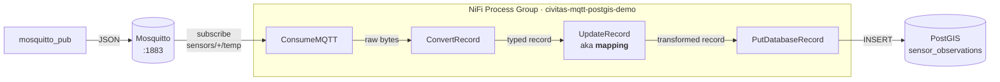

# NiFi Pipeline Demo

A small, runnable example of the Civitas pipeline concept on Apache NiFi 2.9.
A sensor publishes MQTT messages with `lat`/`lon`/`temperature`; NiFi parses
each message, applies a field-level mapping, and writes a row into PostGIS
with a real `geometry(Point, 4326)` value.

---

## How it works



The four processors inside the Process Group:

1. **ConsumeMQTT** subscribes to `sensors/+/temp` on the local Mosquitto broker.
2. **ConvertRecord** parses the JSON body into a typed record.
3. **UpdateRecord** (named `mapping`) rewrites the record using
   **RecordPath** — a small expression language NiFi understands natively.
   One expression per target field:

   ```jsonc
   {
     "/geom":             "concat('POINT(', /lon, ' ', /lat, ')')",
     "/measurement_time": "toDate(/ts, \"yyyy-MM-dd'T'HH:mm:ss'Z'\")",
     "/temperature":      "/temperature",
     "/station_id":       "/station_id"
   }
   ```

4. **PutDatabaseRecord** inserts the transformed record into the PostGIS
   `sensor_observations` table.

The whole flow is stored as a single JSON file
(`MQTT_TO_POSTGIS_demo.snapshot.json`) that NiFi can import in one upload.
The demo's job is to upload that file, finish setup (the DB password isn't
part of the file by design), and start the processors.

---

## Quick start

### 1. Start the containers

```bash
# NiFi itself
cd dev-environment/nifi && docker compose up -d
# Demo sidecars: Mosquitto + PostGIS
cd dev-environment/nifi/demo && docker compose up -d
```

This brings up:

| Service     | Where                           | Login                                    |
|-------------|---------------------------------|------------------------------------------|
| NiFi UI     | `https://localhost:8443/nifi`   | login via Keycloak (OIDC)                |
| Mosquitto   | `localhost:1883`                | anonymous                                |
| PostGIS     | `localhost:5435`, DB `nifi_demo`| `nifi` / `nifi-demo-password`            |

### 2. Deploy the pipeline

```bash
cd dev-environment/nifi/demo/bruno
npx --yes @usebruno/cli@3.3.0 run 01_deploy --env local --insecure
```

This runs 7 REST calls against NiFi: get auth token → find root group →
upload the snapshot → find the DB connection pool → set the password →
enable controller services → start the processors. Expect `7 Passed`.

(In Bruno Desktop: right-click the `01_deploy` folder → Run.)

### 3. Send a message

```bash
# Wait ~10s for ConsumeMQTT to subscribe, then publish:
sleep 10
docker exec civitas-nifi-demo-mosquitto mosquitto_pub -h localhost \
  -t "sensors/sensor-001/temp" \
  -m '{"lat":50.110,"lon":8.660,"temperature":21.3,"ts":"2026-05-21T08:00:00Z","station_id":"sensor-001"}'
```

For a continuous stream (rows landing every couple of seconds):

```bash
cd dev-environment/nifi/demo
./scripts/publish-loop.sh
```

### 4. See it arrive in PostGIS

```bash
docker exec -it -e PGPASSWORD=nifi-demo-password civitas-nifi-demo-postgis \
  psql -U nifi -d nifi_demo -c \
  "SELECT station_id, temperature, ST_AsText(geom), measurement_time FROM sensor_observations;"
```

Expected:

```
 station_id | temperature |      st_astext     |    measurement_time
------------+-------------+--------------------+------------------------
 sensor-001 |        21.3 |  POINT(8.66 50.11) | 2026-05-21 08:00:00+00
```

### 5. Tear down

```bash
cd dev-environment/nifi/demo/bruno
npx --yes @usebruno/cli@3.3.0 run 03_cleanup --env local --insecure
```

If the Bruno cleanup gets stuck (e.g. `HTTP 409 Queue not empty` because
messages are still in flight), use the shell fallback:

```bash
cd dev-environment/nifi/demo
./scripts/cleanup.sh
```

---

## Watching what's happening

| Want to see…             | Command                                                                                     |
|--------------------------|----------------------------------------------------------------------------------------------|
| MQTT messages live       | `docker exec -it civitas-nifi-demo-mosquitto mosquitto_sub -h localhost -t 'sensors/#' -v`   |
| PostGIS rows interactive | `docker exec -it -e PGPASSWORD=nifi-demo-password civitas-nifi-demo-postgis psql -U nifi -d nifi_demo` |
| Flow state in NiFi UI    | open `https://localhost:8443/nifi`, log in, right-click a processor → **View data provenance** |
| Pipeline health check    | `npx --yes @usebruno/cli@3.3.0 run 02_verify --env local --insecure` (5 Passed = healthy)    |

For a GUI DB browser: DBeaver / pgAdmin against `localhost:5435`,
user `nifi`, password `nifi-demo-password`, database `nifi_demo`.

---

## Things to watch out for

- **Run the whole folder, not single requests.** Each Bruno folder has a
  setup prelude that refreshes the runtime variables. Triggering a single
  `.bru` from Bruno Desktop skips the prelude and can hit stale data from a
  previous session. Details in
  [bruno/README-bruno-quirks.md](bruno/README-bruno-quirks.md).
- **Wait ~10 seconds between start and the first publish.** ConsumeMQTT
  only subscribes after processor startup; messages sent earlier get
  dropped at the broker.
- **Don't deploy twice without cleanup in between.** Two Process Groups
  with the same name both subscribe to the same MQTT topic, and which one
  receives a given message is undefined. If the Bruno cleanup ever stalls,
  `./scripts/cleanup.sh` is the robust fallback.
- **PostGIS sidecar is on port 5435**, not 5434 — port 5434 is already used
  by `dev-environment/geoserver`'s own database.

---

## Layout

```
demo/
├── docker-compose.yml             # Mosquitto + PostGIS sidecars
├── init/01-schema.sql             # PostGIS extension + the target table
├── mosquitto/mosquitto.conf       # broker config (anonymous, port 1883)
├── MQTT_TO_POSTGIS_demo.snapshot.json   # the flow as a single JSON file
├── scripts/
│   ├── cleanup.sh                 # robust teardown (recovery fallback)
│   ├── publish-loop.sh            # continuous synthetic publisher
│   ├── build-snapshot.sh          # snapshot regenerator (maintenance)
│   ├── provision-sta-datastream.sh  # FROST sink: pre-creates Datastreams (not needed for ThingTree)
│   └── publish-sta-loop.sh        # FROST sink: ThingTree record publisher
└── bruno/
    ├── collection.bru             # collection-level auth
    ├── environments/local.bru     # base URL, credentials, names
    ├── README-bruno-quirks.md     # auth / cookie / env-var pitfalls
    ├── 01_deploy/                 # deploy the flow
    ├── 02_verify/                 # check the flow is healthy
    └── 03_cleanup/                # tear down
```

`publish-sta-loop.sh` sends records for a FROST sink on the ThingTree port. That port creates the
Thing, its Location and its Datastream when they are missing, so no provisioning is needed first.
A sink on the Observations port only appends measurements and needs the Datastreams to exist.

---

## Regenerating the snapshot

If the NiFi version, bundle versions, or the flow topology changes:

```bash
cd dev-environment/nifi/demo
./scripts/build-snapshot.sh ./MQTT_TO_POSTGIS_demo.snapshot.json
```

This rebuilds the flow in NiFi via REST, downloads it as a fresh snapshot,
and removes the temporary Process Group. Needs a running NiFi.

---

## What this MVP demonstrates

Beyond just running, the demo establishes that:

- NiFi 2.x accepts a single-file snapshot upload and starts the resulting
  flow.
- A field-level mapping (built from RecordPath expressions like
  `concat(...)` and `toDate(...)`) is enough to bridge a source schema
  (`lat`, `lon`, …) to a sink schema (`geom`, `measurement_time`, …) — no
  custom code.
- Geometry handling works without a custom processor: a plain WKT string
  written into a `geometry(Point, 4326)` column gets the SRID from the
  column type, not from the value.
- Sensitive properties stay out of the snapshot file — the DB password is
  set via a separate REST call after upload — so the snapshot itself is
  safe to commit.

What's intentionally outside the MVP: building the snapshot programmatically
from raw inputs (template + parameters + mapping rules). The MVP ships a
finished snapshot; the build step is the next milestone.
